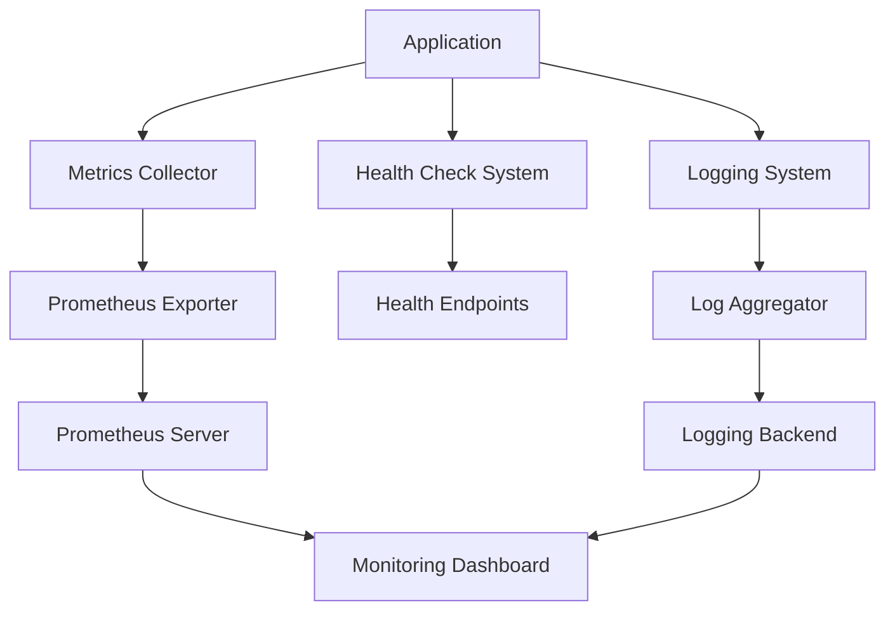

# Application Monitoring Specification

## Overview

This document outlines the technical specification for implementing comprehensive application monitoring in the Rangkai Edu backend system. The monitoring solution will integrate with Prometheus as the primary backend while maintaining flexibility for other monitoring systems.

## Current State Analysis

### Health Check Implementation

The application currently has a robust health check system implemented in `controllers/health_controller.go` with the following endpoints:

1. `/health` - Basic health check for load balancers
2. `/health/check` - Standard comprehensive health check
3. `/health/detailed` - Detailed health check with system information
4. `/health/database` - Database-specific health check
5. `/ping` - Legacy endpoint for backward compatibility

The health checks currently monitor:
- Application uptime and status
- Database connectivity
- Basic system metrics (memory usage, goroutines)
- Version information

### Logging Implementation

The application uses Go's standard `log` package for logging throughout the codebase. Logging is implemented in:
- Database operations
- Controller functions
- Authentication flows
- Error handling
- Provider management

### Configuration Management

The application uses a centralized configuration system in `config/config.go` with:
- Environment variable-based configuration
- Provider management system
- HTTPS configuration
- Database configuration

### Existing Metrics Interface

There is a minimal metrics interface defined in `utils/providers/provider_utils.go`:
```go
type ProviderMetricsCollector interface {
    CollectMetrics() map[string]interface{}
}
```

## Proposed Monitoring Architecture

### System Components



### Key Components

1. **Metrics Collection Layer**
   - HTTP request metrics (latency, count, status codes)
   - Database query metrics
   - Provider usage metrics
   - Custom business metrics
   - System resource metrics (CPU, memory, goroutines)

2. **Health Check Enhancement**
   - Integration with metrics collection
   - Detailed component health status
   - Dependency health checks

3. **Logging Enhancement**
   - Structured logging with context
   - Log level configuration
   - Error tracking and aggregation

4. **Alerting System**
   - Threshold-based alerts
   - Health check failure alerts
   - Performance degradation alerts

## Technical Implementation Details

### Metrics Collection

#### HTTP Metrics
- Request count by endpoint and status code
- Request latency distribution (histogram)
- Request size and response size
- Active request count (gauge)

#### Database Metrics
- Query count by operation type
- Query latency distribution
- Connection pool metrics
- Error count

#### Provider Metrics
- Provider usage count
- Provider success/failure rates
- Provider response time
- Provider error details

#### System Metrics
- Memory usage (heap, stack, GC stats)
- Goroutine count
- CPU usage
- File descriptor usage

### Health Check Enhancement

The existing health check system will be enhanced to:
1. Include metrics data in health responses
2. Add dependency health checks (external APIs, services)
3. Implement circuit breaker patterns for external dependencies
4. Add more granular health status reporting

### Configuration Structure

The monitoring configuration will be integrated into the existing config system:

```go
type MonitoringConfig struct {
    // Enable/disable monitoring
    Enabled bool `json:"enabled" mapstructure:"enabled"`
    
    // Metrics configuration
    Metrics MetricsConfig `json:"metrics" mapstructure:"metrics"`
    
    // Health check configuration
    Health HealthConfig `json:"health" mapstructure:"health"`
    
    // Logging configuration
    Logging LoggingConfig `json:"logging" mapstructure:"logging"`
    
    // Alerting configuration
    Alerting AlertingConfig `json:"alerting" mapstructure:"alerting"`
}

type MetricsConfig struct {
    // Enable metrics collection
    Enabled bool `json:"enabled" mapstructure:"enabled"`
    
    // Prometheus exporter configuration
    Prometheus PrometheusConfig `json:"prometheus" mapstructure:"prometheus"`
    
    // Collection interval in seconds
    CollectionInterval int `json:"collection_interval" mapstructure:"collection_interval"`
    
    // HTTP metrics configuration
    HTTP HTTPMetricsConfig `json:"http" mapstructure:"http"`
    
    // Database metrics configuration
    Database DatabaseMetricsConfig `json:"database" mapstructure:"database"`
}

type PrometheusConfig struct {
    // Enable Prometheus exporter
    Enabled bool `json:"enabled" mapstructure:"enabled"`
    
    // Port to expose metrics endpoint
    Port int `json:"port" mapstructure:"port"`
    
    // Endpoint path
    Endpoint string `json:"endpoint" mapstructure:"endpoint"`
    
    // Namespace for metrics
    Namespace string `json:"namespace" mapstructure:"namespace"`
}

type HealthConfig struct {
    // Enable enhanced health checks
    Enabled bool `json:"enabled" mapstructure:"enabled"`
    
    // Health check timeout in seconds
    Timeout int `json:"timeout" mapstructure:"timeout"`
    
    // Dependency health check configuration
    Dependencies []DependencyConfig `json:"dependencies" mapstructure:"dependencies"`
}

type DependencyConfig struct {
    // Dependency name
    Name string `json:"name" mapstructure:"name"`
    
    // Dependency type (database, api, service, etc.)
    Type string `json:"type" mapstructure:"type"`
    
    // Dependency endpoint
    Endpoint string `json:"endpoint" mapstructure:"endpoint"`
    
    // Health check timeout
    Timeout int `json:"timeout" mapstructure:"timeout"`
    
    // Required for application to be healthy
    Required bool `json:"required" mapstructure:"required"`
}

type LoggingConfig struct {
    // Log level (debug, info, warn, error)
    Level string `json:"level" mapstructure:"level"`
    
    // Log format (json, text)
    Format string `json:"format" mapstructure:"format"`
    
    // Enable structured logging
    Structured bool `json:"structured" mapstructure:"structured"`
}

type AlertingConfig struct {
    // Enable alerting
    Enabled bool `json:"enabled" mapstructure:"enabled"`
    
    // Alerting provider configuration
    Providers []AlertProviderConfig `json:"providers" mapstructure:"providers"`
    
    // Alert rules
    Rules []AlertRuleConfig `json:"rules" mapstructure:"rules"`
}

type AlertProviderConfig struct {
    // Provider name
    Name string `json:"name" mapstructure:"name"`
    
    // Provider type (slack, email, webhook, etc.)
    Type string `json:"type" mapstructure:"type"`
    
    // Provider configuration
    Config map[string]interface{} `json:"config" mapstructure:"config"`
}

type AlertRuleConfig struct {
    // Rule name
    Name string `json:"name" mapstructure:"name"`
    
    // Metric to monitor
    Metric string `json:"metric" mapstructure:"metric"`
    
    // Threshold value
    Threshold float64 `json:"threshold" mapstructure:"threshold"`
    
    // Comparison operator (gt, lt, eq, ne)
    Operator string `json:"operator" mapstructure:"operator"`
    
    // Duration for which threshold should be breached
    Duration string `json:"duration" mapstructure:"duration"`
    
    // Alert providers to notify
    Providers []string `json:"providers" mapstructure:"providers"`
}
```

### Environment Variables

The monitoring configuration will be controlled through environment variables:

```bash
# Monitoring enable/disable
MONITORING_ENABLED=true

# Metrics configuration
MONITORING_METRICS_ENABLED=true
MONITORING_METRICS_COLLECTION_INTERVAL=30

# Prometheus configuration
MONITORING_METRICS_PROMETHEUS_ENABLED=true
MONITORING_METRICS_PROMETHEUS_PORT=9090
MONITORING_METRICS_PROMETHEUS_ENDPOINT=/metrics
MONITORING_METRICS_PROMETHEUS_NAMESPACE=rangkaiedu

# Health check configuration
MONITORING_HEALTH_ENABLED=true
MONITORING_HEALTH_TIMEOUT=5

# Logging configuration
MONITORING_LOGGING_LEVEL=info
MONITORING_LOGGING_FORMAT=json
MONITORING_LOGGING_STRUCTURED=true

# Alerting configuration
MONITORING_ALERTING_ENABLED=true
```

### Integration Points

1. **Main Application Integration**
   - Initialize monitoring system in `main.go`
   - Add middleware for HTTP metrics collection
   - Integrate with database connection pool
   - Register metrics endpoint

2. **Controller Integration**
   - Add context to logging calls
   - Add custom business metrics
   - Use structured logging

3. **Provider Integration**
   - Implement `ProviderMetricsCollector` interface
   - Add metrics to provider operations
   - Track provider success/failure rates

4. **Health Check Integration**
   - Enhance existing health endpoints
   - Add dependency health checks
   - Include metrics in health responses

## Error Handling

### Metrics Collection Errors

- Metrics collection failures should not impact application functionality
- Failed metric collections should be logged but not cause panics
- Retry mechanisms for external metric storage backends
- Circuit breaker pattern for metrics exporters

### Health Check Errors

- Graceful degradation when dependencies are unhealthy
- Clear error messages for troubleshooting
- Timeout handling for external dependency checks
- Fallback mechanisms for critical health checks

### Logging Errors

- Log rotation and management
- Error handling for log storage backends
- Buffer management for high-volume logging
- Fallback to standard output when file logging fails

## Alerting Mechanisms

### Alert Types

1. **System Health Alerts**
   - Application downtime
   - Database connectivity issues
   - High error rates
   - Resource exhaustion (memory, CPU)

2. **Performance Alerts**
   - High request latency
   - High database query times
   - Low throughput
   - High resource usage

3. **Business Alerts**
   - Authentication failures
   - Payment processing issues
   - Critical business metric thresholds

### Alert Providers

1. **Slack Integration**
   - Webhook-based notifications
   - Rich message formatting
   - Channel routing

2. **Email Notifications**
   - SMTP-based delivery
   - Template-based messages
   - Group notifications

3. **Webhook Integration**
   - Generic HTTP endpoint notifications
   - JSON payload
   - Custom headers

### Alert Suppression

- Deduplication of similar alerts
- Alert grouping during incident periods
- Maintenance window configuration
- Rate limiting for noisy alerts

## Security Considerations

### Metrics Endpoint Security

- Authentication for metrics endpoints
- IP whitelisting for metrics access
- TLS encryption for metrics transmission
- Role-based access control

### Health Check Security

- Sanitization of health check responses
- Prevention of information disclosure
- Rate limiting for health check endpoints
- Authentication for detailed health checks

### Logging Security

- Avoid logging sensitive information
- Log data encryption at rest
- Access controls for log viewing
- Log retention policies

## Performance Considerations

### Metrics Collection Overhead

- Minimal impact on application performance
- Asynchronous metrics collection
- Efficient data structures for metrics storage
- Memory usage optimization

### Health Check Performance

- Fast response times for critical health checks
- Caching of health check results
- Parallel execution of dependency checks
- Timeout enforcement for all checks

### Logging Performance

- Non-blocking log operations
- Log buffering and batching
- Efficient serialization for structured logs
- Log level filtering to reduce overhead

## Deployment Considerations

### Container Deployment

- Prometheus metrics endpoint exposure
- Health check endpoint configuration
- Log output to stdout/stderr for container platforms
- Environment variable configuration

### Kubernetes Integration

- Kubernetes health check configuration
- Prometheus annotations for auto-discovery
- Resource limits for monitoring components
- Service monitor configuration

### Cloud Provider Integration

- Integration with cloud monitoring services
- Auto-scaling based on metrics
- Cloud-native alerting integration
- Cost optimization for monitoring infrastructure

## Monitoring Dashboard

### Key Metrics to Display

1. **Application Health**
   - Uptime percentage
   - Error rate
   - Response time
   - Throughput

2. **Resource Usage**
   - CPU utilization
   - Memory usage
   - Goroutine count
   - Database connection pool

3. **Business Metrics**
   - User registrations
   - Login success rate
   - API usage by endpoint
   - Provider success rates

### Dashboard Components

1. **Overview Dashboard**
   - High-level health status
   - Key performance indicators
   - Alert status
   - System resource usage

2. **Detailed Dashboards**
   - HTTP metrics breakdown
   - Database performance
   - Provider metrics
   - Error analysis

3. **Business Dashboards**
   - User activity metrics
   - Authentication metrics
   - Content usage metrics
   - Provider usage metrics

## Testing Strategy

### Unit Testing

- Metrics collection logic
- Health check functions
- Configuration validation
- Alert rule evaluation

### Integration Testing

- End-to-end metrics flow
- Health check endpoint responses
- Alerting system integration
- Logging integration

### Performance Testing

- Metrics collection overhead
- Health check response times
- Alerting system performance
- Logging throughput

## Rollout Plan

### Phase 1: Core Infrastructure

1. Implement metrics collection framework
2. Add Prometheus exporter
3. Enhance health check system
4. Add structured logging

### Phase 2: Integration

1. Integrate with HTTP middleware
2. Integrate with database operations
3. Integrate with provider system
4. Add business metrics

### Phase 3: Alerting

1. Implement alerting framework
2. Add alert providers
3. Configure alert rules
4. Test alerting system

### Phase 4: Monitoring

1. Deploy monitoring dashboards
2. Configure alerts
3. Performance tuning
4. Documentation

## Future Enhancements

### Advanced Features

1. **Distributed Tracing**
   - Request tracing across services
   - Performance bottleneck identification
   - Error tracing

2. **Anomaly Detection**
   - Machine learning-based anomaly detection
   - Automated threshold adjustment
   - Pattern recognition

3. **Predictive Analytics**
   - Resource usage prediction
   - Performance degradation prediction
   - Capacity planning

4. **Advanced Alerting**
   - Alert correlation
   - Alert escalation
   - Alert silencing

### Multi-backend Support

1. **DataDog Integration**
   - Native DataDog metrics export
   - APM integration
   - Log integration

2. **New Relic Integration**
   - New Relic metrics export
   - Infrastructure monitoring
   - Browser monitoring

3. **Custom Exporters**
   - Generic HTTP exporter
   - Kafka exporter
   - Custom database exporters