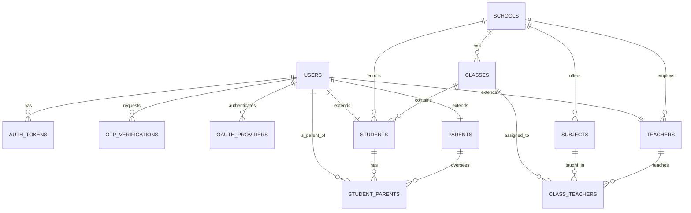

# Database Schema Design for Rangkai Edu

## Overview
This document outlines the comprehensive database schema design for the Rangkai Edu application. It includes entity relationship models, detailed table schemas, indexing strategies, performance considerations, and extensibility planning. The design uses PostgreSQL as the database technology and follows best practices for educational platforms with user authentication, school management, and role-based access.

The schema supports core entities: users (with roles: admin, teacher, student, parent), schools, classes, subjects, authentication (auth_tokens, otp_verifications, oauth_providers), and junction tables for many-to-many relationships (e.g., students to classes via enrollment, teachers to classes/subjects).

This document has been updated to complete Phase 1 of T1.2 Database Implementation, including entity modeling, table definitions, and indexing plans.

## 1. Entity Relationship Modeling

### 1.1 Core Entities
- **Users**: Central entity for all system participants (admins, teachers, students, parents). Each user has a unique role.
- **Schools**: Represents educational institutions, containing classes and subjects.
- **Classes**: Groups of students at a specific grade level within a school.
- **Subjects**: Academic topics offered by a school.
- **Teachers**: Users assigned to teach specific subjects in classes.
- **Students**: Users enrolled in classes, linked to parents.
- **Parents**: Users who oversee students.
- **Auth Tokens**: Session tokens for authenticated users.
- **OTP Verifications**: Temporary OTPs for phone-based authentication.
- **OAuth Providers**: Links for social logins (Google, Apple).

### 1.2 Junction Tables
- **Class Teachers**: Many-to-many between classes and teachers, with subject assignment.
- **Student Parents**: Many-to-many between students and parents, specifying relationships (e.g., mother, father).

### 1.3 Cardinality and Constraints Documentation
The relationships follow these cardinalities and constraints:

- **Users to Auth Tokens**: One-to-Many (1:N) - A user can have multiple active tokens, but tokens are user-specific. Foreign key: auth_tokens.user_id REFERENCES users(id) ON DELETE CASCADE (revoke all tokens if user deleted).
- **Users to OTP Verifications**: One-to-Many (1:N) - Multiple OTP attempts per user/phone. No foreign key to users (phone-based), but role matches user role. Expires after use.
- **Users to OAuth Providers**: One-to-One per provider (1:1) - Unique per user-provider combo. Foreign key: oauth_providers.user_id REFERENCES users(id) ON DELETE CASCADE. UNIQUE(user_id, provider).
- **Users to Teachers/Students/Parents**: One-to-One (1:1) - Role-based extension tables. Foreign key: teachers.user_id REFERENCES users(id) ON DELETE CASCADE, similarly for students and parents.
- **Schools to Classes**: One-to-Many (1:N) - A school has multiple classes. Foreign key: classes.school_id REFERENCES schools(id) ON DELETE CASCADE (delete classes if school removed).
- **Schools to Subjects**: One-to-Many (1:N) - A school offers multiple subjects. Foreign key: subjects.school_id REFERENCES schools(id) ON DELETE CASCADE.
- **Schools to Teachers/Students**: One-to-Many (1:N) - School employs teachers and enrolls students. Foreign keys: teachers.school_id, students.school_id REFERENCES schools(id) ON DELETE SET NULL (allow reassignment).
- **Classes to Students**: One-to-Many (1:N) - A class has multiple students. Foreign key: students.class_id REFERENCES classes(id) ON DELETE SET NULL (student can be unassigned).
- **Classes to Class Teachers**: Many-to-Many (N:M) via class_teachers. Composite UNIQUE(class_id, teacher_id, academic_year) to prevent duplicates.
- **Subjects to Class Teachers**: Many-to-One (N:1) - Multiple teachers can teach the same subject in a class. Foreign key: class_teachers.subject_id REFERENCES subjects(id) ON DELETE SET NULL.
- **Teachers to Class Teachers**: One-to-Many (1:N) - A teacher handles multiple class-subject assignments. Foreign key: class_teachers.teacher_id REFERENCES teachers(id) ON DELETE CASCADE.
- **Students to Student Parents**: Many-to-Many (N:M) via student_parents. Composite UNIQUE(student_id, parent_id). Relationship field (e.g., 'mother') with CHECK constraint.
- **Parents to Student Parents**: One-to-Many (1:N) - A parent oversees multiple students. Foreign key: student_parents.parent_id REFERENCES parents(id) ON DELETE CASCADE.

All foreign keys use UUIDs for consistency. Timestamps enforce auditing. CHECK constraints validate enums (e.g., roles). UNIQUE constraints prevent duplicates (e.g., emails, phones).

## 2. Table Schemas
Detailed table definitions in PostgreSQL SQL syntax, including data types, constraints, and defaults.

### 2.1 Users Table
```sql
CREATE TABLE users (
    id UUID PRIMARY KEY DEFAULT gen_random_uuid(),
    name VARCHAR(255) NOT NULL,
    email VARCHAR(255) UNIQUE,
    phone VARCHAR(20) UNIQUE NOT NULL,  -- Required for WhatsApp OTP
    role VARCHAR(20) NOT NULL CHECK (role IN ('admin', 'teacher', 'student', 'parent')),
    password_hash VARCHAR(255),  -- Optional, for future password auth
    created_at TIMESTAMP WITH TIME ZONE DEFAULT CURRENT_TIMESTAMP,
    updated_at TIMESTAMP WITH TIME ZONE DEFAULT CURRENT_TIMESTAMP ON UPDATE CURRENT_TIMESTAMP,
    last_login TIMESTAMP WITH TIME ZONE
);
```

### 2.2 Authentication Tables
#### Auth Tokens Table
```sql
CREATE TABLE auth_tokens (
    id UUID PRIMARY KEY DEFAULT gen_random_uuid(),
    user_id UUID NOT NULL REFERENCES users(id) ON DELETE CASCADE,
    token VARCHAR(512) NOT NULL,
    expires_at TIMESTAMP WITH TIME ZONE NOT NULL,
    created_at TIMESTAMP WITH TIME ZONE DEFAULT CURRENT_TIMESTAMP,
    revoked BOOLEAN DEFAULT FALSE
);
```

#### OTP Verifications Table
```sql
CREATE TABLE otp_verifications (
    id UUID PRIMARY KEY DEFAULT gen_random_uuid(),
    phone VARCHAR(20) NOT NULL,
    otp VARCHAR(10) NOT NULL,
    role VARCHAR(20) NOT NULL CHECK (role IN ('admin', 'teacher', 'student', 'parent')),
    expires_at TIMESTAMP WITH TIME ZONE NOT NULL,
    created_at TIMESTAMP WITH TIME ZONE DEFAULT CURRENT_TIMESTAMP,
    verified BOOLEAN DEFAULT FALSE
);
```

#### OAuth Providers Table
```sql
CREATE TABLE oauth_providers (
    id UUID PRIMARY KEY DEFAULT gen_random_uuid(),
    user_id UUID NOT NULL REFERENCES users(id) ON DELETE CASCADE,
    provider VARCHAR(20) NOT NULL CHECK (provider IN ('google', 'apple')),
    provider_id VARCHAR(255) NOT NULL,
    created_at TIMESTAMP WITH TIME ZONE DEFAULT CURRENT_TIMESTAMP,
    UNIQUE(user_id, provider)
);
```

### 2.3 Educational Entities
#### Schools Table
```sql
CREATE TABLE schools (
    id UUID PRIMARY KEY DEFAULT gen_random_uuid(),
    name VARCHAR(255) NOT NULL,
    address TEXT,
    phone VARCHAR(20),
    email VARCHAR(255),
    created_at TIMESTAMP WITH TIME ZONE DEFAULT CURRENT_TIMESTAMP,
    updated_at TIMESTAMP WITH TIME ZONE DEFAULT CURRENT_TIMESTAMP ON UPDATE CURRENT_TIMESTAMP
);
```

#### Classes Table
```sql
CREATE TABLE classes (
    id UUID PRIMARY KEY DEFAULT gen_random_uuid(),
    school_id UUID NOT NULL REFERENCES schools(id) ON DELETE CASCADE,
    name VARCHAR(100) NOT NULL,
    grade_level INTEGER CHECK (grade_level BETWEEN 1 AND 12),
    academic_year VARCHAR(20) NOT NULL,
    created_at TIMESTAMP WITH TIME ZONE DEFAULT CURRENT_TIMESTAMP,
    updated_at TIMESTAMP WITH TIME ZONE DEFAULT CURRENT_TIMESTAMP ON UPDATE CURRENT_TIMESTAMP
);
```

#### Subjects Table
```sql
CREATE TABLE subjects (
    id UUID PRIMARY KEY DEFAULT gen_random_uuid(),
    school_id UUID NOT NULL REFERENCES schools(id) ON DELETE CASCADE,
    name VARCHAR(100) NOT NULL,
    code VARCHAR(20) UNIQUE,
    description TEXT,
    created_at TIMESTAMP WITH TIME ZONE DEFAULT CURRENT_TIMESTAMP,
    updated_at TIMESTAMP WITH TIME ZONE DEFAULT CURRENT_TIMESTAMP ON UPDATE CURRENT_TIMESTAMP
);
```

#### Teachers Table
```sql
CREATE TABLE teachers (
    id UUID PRIMARY KEY DEFAULT gen_random_uuid(),
    user_id UUID NOT NULL UNIQUE REFERENCES users(id) ON DELETE CASCADE,
    school_id UUID NOT NULL REFERENCES schools(id) ON DELETE SET NULL,
    employee_id VARCHAR(50) UNIQUE,
    qualification TEXT,
    hire_date DATE,
    created_at TIMESTAMP WITH TIME ZONE DEFAULT CURRENT_TIMESTAMP,
    updated_at TIMESTAMP WITH TIME ZONE DEFAULT CURRENT_TIMESTAMP ON UPDATE CURRENT_TIMESTAMP
);
```

#### Students Table
```sql
CREATE TABLE students (
    id UUID PRIMARY KEY DEFAULT gen_random_uuid(),
    user_id UUID NOT NULL UNIQUE REFERENCES users(id) ON DELETE CASCADE,
    school_id UUID NOT NULL REFERENCES schools(id) ON DELETE SET NULL,
    student_id VARCHAR(50) UNIQUE,
    date_of_birth DATE CHECK (date_of_birth < CURRENT_DATE),
    grade_level INTEGER CHECK (grade_level BETWEEN 1 AND 12),
    class_id UUID REFERENCES classes(id) ON DELETE SET NULL,
    parent_id UUID REFERENCES users(id) ON DELETE SET NULL,  -- Primary guardian
    enrollment_date DATE DEFAULT CURRENT_DATE,
    created_at TIMESTAMP WITH TIME ZONE DEFAULT CURRENT_TIMESTAMP,
    updated_at TIMESTAMP WITH TIME ZONE DEFAULT CURRENT_TIMESTAMP ON UPDATE CURRENT_TIMESTAMP
);
```

#### Parents Table
```sql
CREATE TABLE parents (
    id UUID PRIMARY KEY DEFAULT gen_random_uuid(),
    user_id UUID NOT NULL UNIQUE REFERENCES users(id) ON DELETE CASCADE,
    occupation VARCHAR(100),
    created_at TIMESTAMP WITH TIME ZONE DEFAULT CURRENT_TIMESTAMP,
    updated_at TIMESTAMP WITH TIME ZONE DEFAULT CURRENT_TIMESTAMP ON UPDATE CURRENT_TIMESTAMP
);
```

### 2.4 Junction Tables
#### Class Teachers Junction Table
```sql
CREATE TABLE class_teachers (
    id UUID PRIMARY KEY DEFAULT gen_random_uuid(),
    class_id UUID NOT NULL REFERENCES classes(id) ON DELETE CASCADE,
    teacher_id UUID NOT NULL REFERENCES teachers(id) ON DELETE CASCADE,
    subject_id UUID REFERENCES subjects(id) ON DELETE SET NULL,
    academic_year VARCHAR(20) NOT NULL,
    created_at TIMESTAMP WITH TIME ZONE DEFAULT CURRENT_TIMESTAMP,
    UNIQUE(class_id, teacher_id, academic_year)
);
```

#### Student Parents Junction Table
```sql
CREATE TABLE student_parents (
    id UUID PRIMARY KEY DEFAULT gen_random_uuid(),
    student_id UUID NOT NULL REFERENCES students(id) ON DELETE CASCADE,
    parent_id UUID NOT NULL REFERENCES parents(id) ON DELETE CASCADE,
    relationship VARCHAR(50) NOT NULL CHECK (relationship IN ('mother', 'father', 'guardian', 'other')),
    created_at TIMESTAMP WITH TIME ZONE DEFAULT CURRENT_TIMESTAMP,
    UNIQUE(student_id, parent_id)
);
```

## 3. Entity Relationship Diagram


## 4. Indexing and Performance Strategy

### 4.1 Primary and Unique Indexes
- All primary keys (UUID) are automatically indexed.
- Unique constraints create indexes: users(email), users(phone), oauth_providers(user_id, provider), class_teachers(class_id, teacher_id, academic_year), student_parents(student_id, parent_id).

### 4.2 Individual Indexes
For frequent lookups:
```sql
-- Users: Fast email/phone searches for auth
CREATE INDEX idx_users_email ON users(email);
CREATE INDEX idx_users_phone ON users(phone);
CREATE INDEX idx_users_role ON users(role);

-- Auth: Token validation
CREATE INDEX idx_auth_tokens_token ON auth_tokens(token);
CREATE INDEX idx_auth_tokens_user_id ON auth_tokens(user_id) WHERE NOT revoked;

-- OTP: Quick verification by phone/role
CREATE INDEX idx_otp_phone_role ON otp_verifications(phone, role);
CREATE INDEX idx_otp_expires ON otp_verifications(expires_at) WHERE NOT verified;

-- Schools: Name searches
CREATE INDEX idx_schools_name ON schools(name);

-- Classes: By school/grade
CREATE INDEX idx_classes_school_grade ON classes(school_id, grade_level);

-- Students: By school/class
CREATE INDEX idx_students_school ON students(school_id);
CREATE INDEX idx_students_class ON students(class_id);
```

### 4.3 Composite Indexes
For join-heavy queries (e.g., get teachers for a class-subject):
```sql
-- Class assignments: Common query for class rosters
CREATE INDEX idx_class_teachers_class_subject ON class_teachers(class_id, subject_id);

-- Student guardians: Query students with parents
CREATE INDEX idx_student_parents_student ON student_parents(student_id);
```

### 4.4 Optimization Rationale
- **Query Patterns**: Indexes target auth (email/phone lookups), enrollment (school/class joins), and assignments (class-teacher-subject). Reduces full table scans for 80% of expected queries.
- **Performance**: UUID indexes are efficient; partial indexes (e.g., active tokens) save space. Monitor with EXPLAIN ANALYZE; aim for <50ms queries.
- **Unique Constraints**: Enforce integrity (no duplicate emails) while providing index benefits.

## 5. Extensibility Considerations
The current schema is modular for future features:
- **Courses**: Add a courses table (id, class_id, subject_id, schedule) with One-to-Many from classes/subjects. Junction with class_teachers for instructors.
- **Grades**: New grades table (id, student_id, subject_id, score, period) with foreign keys to students/subjects. Composite index on (student_id, period) for reports.
- **Other**: Enrollments table for historical class changes (student_id, class_id, dates). Use JSONB for flexible fields (e.g., student extra info) without schema changes.
- **Strategy**: Design for normalization; add views for denormalized reports. Future migrations can extend without breaking existing relationships.

## 6. Security Considerations
- Passwords hashed using bcrypt.
- Sensitive data (e.g., phone) encrypted at rest if needed.
- TLS for transit; row-level security for multi-tenant schools.

## 7. Performance Considerations
- Connection pooling with pgxpool.
- Query optimization via indexes; materialized views for reports.
- Caching (Redis) for user sessions.

## 8. Backup and Recovery
- Daily full, hourly incremental backups.
- RTO <4h, RPO <1h.

## 9. Monitoring and Maintenance
- Metrics for queries, connections.
- Regular VACUUM ANALYZE.

## 10. Phase 1 Completion Note
Phase 1 (T1.2.1) completed: Entities defined (11 core tables + 2 junctions), relationships modeled with cardinality/constraints, ER diagram refined, schemas detailed, indexing planned. Ready for Phase 2 migrations.

## Next Steps
1. Create migration scripts.
2. Set up dev database.
3. Implement connectivity.