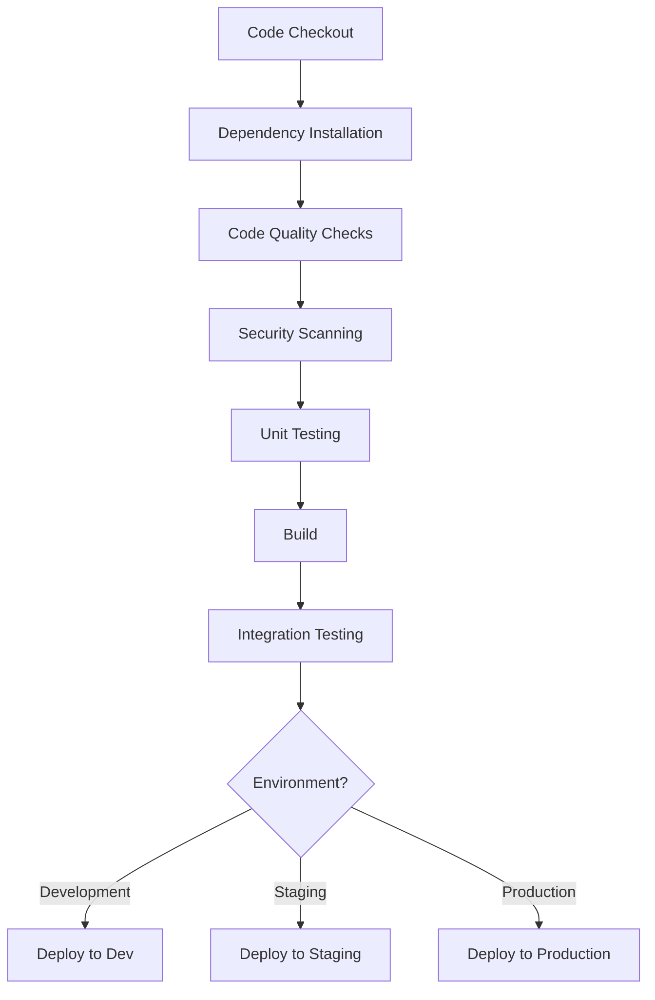
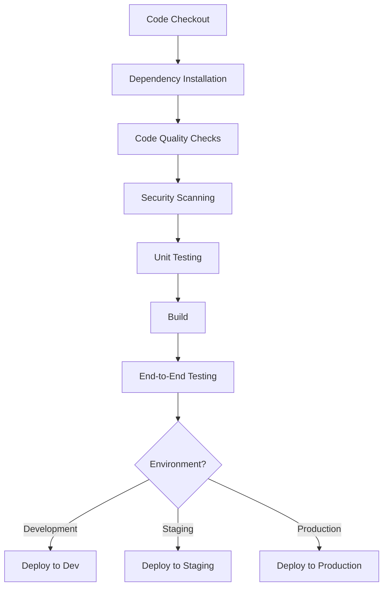

# DevOps Pipeline Configuration

## Overview
This document outlines the DevOps pipeline configuration for the Rangkai Edu application. It includes CI/CD pipeline structure, automated testing workflows, and deployment environment setup.

## 1. CI/CD Pipeline Structure

### 1.1 Backend Components (Go)

#### Pipeline Stages
1. **Code Checkout**: Retrieve source code from repository
2. **Dependency Installation**: Install Go dependencies using `go mod download`
3. **Code Quality Checks**: 
   - Run `golangci-lint` for linting
   - Run `go vet` for static analysis
   - Check code formatting with `go fmt`
4. **Security Scanning**: 
   - Run Go security scanners (gosec)
   - Check for vulnerable dependencies
5. **Unit Testing**: 
   - Run unit tests with `go test ./...`
   - Generate code coverage report
6. **Build**: 
   - Compile Go application for target platforms
   - Create Docker image
7. **Integration Testing**: 
   - Run integration tests against test database
8. **Deployment**: 
   - Deploy to target environment (development/staging/production)

#### Pipeline Visualization


### 1.2 Frontend Components (React/Vite)

#### Pipeline Stages
1. **Code Checkout**: Retrieve source code from repository
2. **Dependency Installation**: Install npm dependencies using `npm ci`
3. **Code Quality Checks**: 
   - Run ESLint for JavaScript/JSX linting
   - Run Prettier for code formatting
4. **Security Scanning**: 
   - Run npm audit for dependency vulnerabilities
5. **Unit Testing**: 
   - Run unit tests with Vitest
   - Generate code coverage report
6. **Build**: 
   - Create production build with Vite
   - Optimize assets
7. **End-to-End Testing**: 
   - Run Cypress tests against built application
8. **Deployment**: 
   - Deploy static assets to target environment

#### Pipeline Visualization


## 2. Automated Testing Workflows

### 2.1 Unit Tests

#### Backend (Go)
- **Framework**: Built-in Go testing package with testify for assertions
- **Execution**: `go test ./... -v`
- **Coverage**: Minimum 80% code coverage required
- **Parallelization**: Tests run in parallel where possible
- **Reporting**: JUnit XML reports for CI integration

#### Frontend (React/Vite)
- **Framework**: Vitest with React Testing Library
- **Execution**: `npm run test`
- **Coverage**: Minimum 70% code coverage required
- **Parallelization**: Tests run in parallel
- **Reporting**: JUnit XML reports for CI integration

### 2.2 Integration Tests

#### Backend
- **Database**: Test against isolated PostgreSQL instance
- **Execution**: `go test ./integration/... -v`
- **Data**: Use test fixtures and factories for consistent test data
- **Isolation**: Each test runs in a transaction that gets rolled back

#### Cross-Component
- **API Testing**: Test API endpoints with real database
- **Authentication**: Test full authentication flows
- **Execution**: Dedicated integration test suite

### 2.3 End-to-End Tests

#### Frontend
- **Framework**: Cypress
- **Execution**: `npm run cypress:run`
- **Coverage**: Critical user flows (login, navigation, core features)
- **Headless**: Run in headless mode in CI environment
- **Parallelization**: Tests distributed across multiple machines

## 3. Deployment Environments

### 3.1 Development Environment
- **Purpose**: Active development and feature testing
- **Infrastructure**: 
  - Local development machines
  - Shared development server
- **Database**: Shared development PostgreSQL instance
- **Deployment**: Automatic on every commit to `develop` branch
- **Access**: Development team only
- **Data**: Sample data with reset capability

### 3.2 Staging Environment
- **Purpose**: Pre-production testing and validation
- **Infrastructure**: 
  - Cloud-based staging server
  - Isolated from production
- **Database**: Dedicated staging PostgreSQL instance
- **Deployment**: Automatic on every commit to `staging` branch
- **Access**: QA team, product owners, select stakeholders
- **Data**: Production-like data (anonymized)

### 3.3 Production Environment
- **Purpose**: Live application serving real users
- **Infrastructure**: 
  - High availability cloud setup
  - Load balancers
  - Multiple server instances
- **Database**: Production PostgreSQL cluster
- **Deployment**: Manual promotion from staging
- **Access**: All users
- **Data**: Real user data with full security measures

## 4. CI/CD Tooling

### 4.1 GitHub Actions
Primary CI/CD platform for automated workflows:

#### Backend Workflow (`.github/workflows/backend.yml`)
```yaml
name: Backend CI/CD
on:
  push:
    branches: [ develop, staging, main ]
  pull_request:
    branches: [ develop ]

jobs:
  test:
    runs-on: ubuntu-latest
    steps:
    - uses: actions/checkout@v3
    - name: Set up Go
      uses: actions/setup-go@v4
      with:
        go-version: '1.19'
    - name: Install dependencies
      run: go mod download
    - name: Run linters
      run: |
        go install github.com/golangci/golangci-lint/cmd/golangci-lint@latest
        golangci-lint run
    - name: Run tests
      run: go test -v ./...
  
  build:
    needs: test
    runs-on: ubuntu-latest
    steps:
    - uses: actions/checkout@v3
    - name: Set up Go
      uses: actions/setup-go@v4
      with:
        go-version: '1.19'
    - name: Build
      run: go build -o backend-app .
    - name: Docker build
      run: docker build -t backend-app .
```

#### Frontend Workflow (`.github/workflows/frontend.yml`)
```yaml
name: Frontend CI/CD
on:
  push:
    branches: [ develop, staging, main ]
  pull_request:
    branches: [ develop ]

jobs:
  test:
    runs-on: ubuntu-latest
    steps:
    - uses: actions/checkout@v3
    - name: Use Node.js
      uses: actions/setup-node@v3
      with:
        node-version: '18.x'
        cache: 'npm'
        cache-dependency-path: ../frontend-app/package-lock.json
    - name: Install dependencies
      run: npm ci
      working-directory: ../frontend-app
    - name: Run linters
      run: npm run lint
      working-directory: ../frontend-app
    - name: Run tests
      run: npm run test
      working-directory: ../frontend-app
  
  build:
    needs: test
    runs-on: ubuntu-latest
    steps:
    - uses: actions/checkout@v3
    - name: Use Node.js
      uses: actions/setup-node@v3
      with:
        node-version: '18.x'
        cache: 'npm'
        cache-dependency-path: ../frontend-app/package-lock.json
    - name: Install dependencies
      run: npm ci
      working-directory: ../frontend-app
    - name: Build
      run: npm run build
      working-directory: ../frontend-app
```

### 4.2 Docker Configuration

#### Backend Dockerfile
```dockerfile
FROM golang:1.19-alpine AS builder
WORKDIR /app
COPY go.mod go.sum ./
RUN go mod download
COPY . .
RUN CGO_ENABLED=0 GOOS=linux go build -a -installsuffix cgo -o main .

FROM alpine:latest
RUN apk --no-cache add ca-certificates
WORKDIR /root/
COPY --from=builder /app/main .
CMD ["./main"]
```

#### Frontend Dockerfile
```dockerfile
FROM node:18-alpine AS builder
WORKDIR /app
COPY package*.json ./
RUN npm ci
COPY . .
RUN npm run build

FROM nginx:alpine
COPY --from=builder /app/dist /usr/share/nginx/html
COPY nginx.conf /etc/nginx/nginx.conf
EXPOSE 80
CMD ["nginx", "-g", "daemon off;"]
```

## 5. Environment Configuration

### 5.1 Environment Variables
Each environment has its own set of configuration files:

#### Development (.env.development)
```env
# Database
DB_HOST=localhost
DB_PORT=5432
DB_USER=dev_user
DB_PASSWORD=dev_password
DB_NAME=rangkai_edu_dev

# API
API_PORT=8080
JWT_SECRET=dev_jwt_secret

# Frontend
VITE_API_URL=http://localhost:8080
```

#### Staging (.env.staging)
```env
# Database
DB_HOST=staging-db.rangkaiedu.com
DB_PORT=5432
DB_USER=staging_user
DB_PASSWORD=staging_password
DB_NAME=rangkai_edu_staging

# API
API_PORT=8080
JWT_SECRET=staging_jwt_secret

# Frontend
VITE_API_URL=https://staging-api.rangkaiedu.com
```

#### Production (.env.production)
```env
# Database
DB_HOST=prod-db.rangkaiedu.com
DB_PORT=5432
DB_USER=prod_user
DB_PASSWORD=prod_password
DB_NAME=rangkai_edu_prod

# API
API_PORT=8080
JWT_SECRET=prod_jwt_secret

# Frontend
VITE_API_URL=https://api.rangkaiedu.com
```

### 5.2 Configuration Management
- Use GitHub Secrets for sensitive environment variables
- Environment-specific configuration files in repository
- Configuration validation in application startup

## 6. Monitoring and Notifications

### 6.1 Pipeline Monitoring
- Real-time pipeline status dashboards
- Email notifications for failed builds
- Slack notifications for deployment events
- Metrics collection for build times and success rates

### 6.2 Deployment Monitoring
- Health checks for deployed services
- Rollback mechanisms for failed deployments
- Deployment metrics and performance tracking

## 7. Security Considerations

### 7.1 Pipeline Security
- Secure storage of secrets and credentials
- Regular security scanning of dependencies
- Access controls for pipeline configuration
- Audit logging for all pipeline activities

### 7.2 Deployment Security
- Zero-trust deployment model
- Security scanning of Docker images
- Network isolation between environments
- Regular security assessments

## 8. Performance Optimization

### 8.1 Pipeline Performance
- Caching of dependencies between builds
- Parallel execution of independent tasks
- Optimized Docker layer caching
- Resource allocation based on job requirements

### 8.2 Deployment Performance
- Blue-green deployment strategy
- Canary releases for major updates
- Load testing before production deployment
- Performance monitoring post-deployment

## 9. Disaster Recovery

### 9.1 Pipeline Recovery
- Backup of pipeline configurations
- Documentation of pipeline setup procedures
- Cross-training of team members
- Regular testing of recovery procedures

### 9.2 Deployment Recovery
- Automated rollback capabilities
- Database backup and recovery procedures
- Service health monitoring and alerting
- Incident response procedures

## 10. Next Steps

1. Implement GitHub Actions workflows for both backend and frontend
2. Set up Docker build processes for containerization
3. Configure environment-specific deployment scripts
4. Implement monitoring and alerting for pipeline health
5. Document deployment procedures and rollback processes
6. Set up security scanning in the CI pipeline
7. Configure automated testing in all environments
8. Establish performance benchmarks for build and deployment times