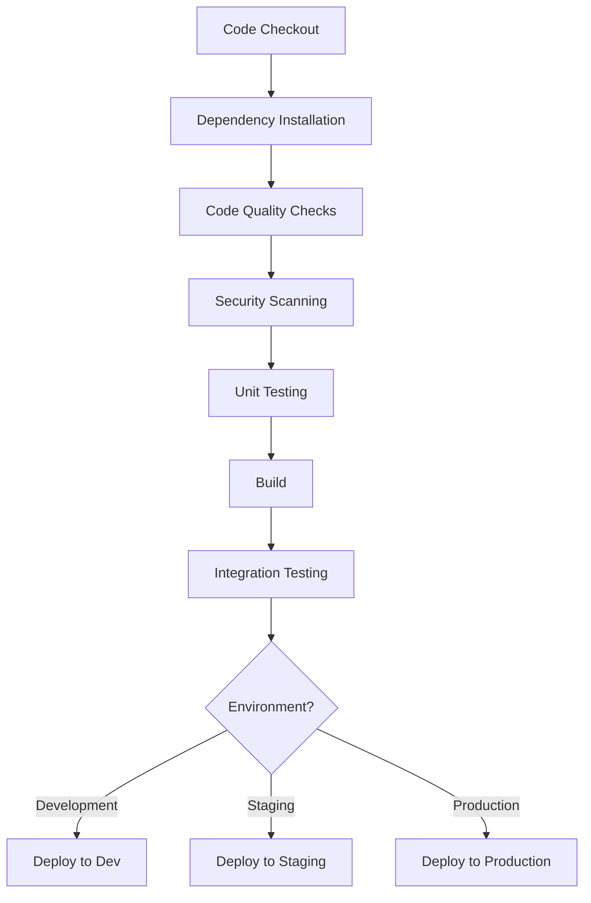
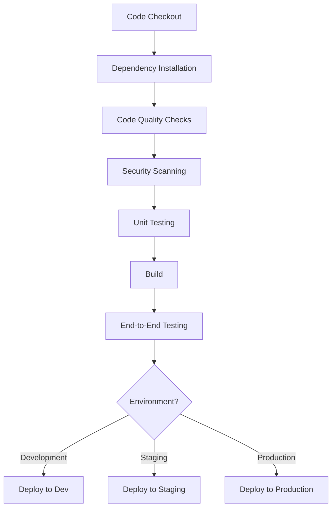

# DevOps Pipeline Configuration

## Overview
This document outlines the DevOps pipeline configuration for the Rangkai Edu application. It includes CI/CD pipeline structure, automated testing workflows, and deployment environment setup.

## 1. CI/CD Pipeline Structure

### 1.1 Backend Components (Go)

#### Pipeline Stages
1. **Code Checkout**: Retrieve source code from repository
2. **Dependency Installation**: Install Go dependencies using `go mod download`
3. **Code Quality Checks**: 
   - Run `golangci-lint` for linting
   - Run `go vet` for static analysis
   - Check code formatting with `go fmt`
4. **Security Scanning**: 
   - Run Go security scanners (gosec)
   - Check for vulnerable dependencies
5. **Unit Testing**: 
   - Run unit tests with `go test ./...`
   - Generate code coverage report
6. **Build**: 
   - Compile Go application for target platforms
   - Create Docker image
7. **Integration Testing**: 
   - Run integration tests against test database
8. **Deployment**: 
   - Deploy to target environment (development/staging/production)

#### Pipeline Visualization

```mermaid
graph TD
    A[Code Checkout] --> B[Dependency Installation]
    B --> C[Code Quality Checks]
    C --> D[Security Scanning]
    D --> E[Unit Testing]
    E --> F[Build]
    F --> G[Integration Testing]
    G --> H{Environment?}
    H -->|Development| I[Deploy to Dev]
    H -->|Staging| J[Deploy to Staging]
    H -->|Production| K[Deploy to Production]
```

### 1.2 Frontend Components (React/Vite)

#### Pipeline Stages
1. **Code Checkout**: Retrieve source code from repository
2. **Dependency Installation**: Install npm dependencies using `npm ci`
3. **Code Quality Checks**: 
   - Run ESLint for JavaScript/JSX linting
   - Run Prettier for code formatting
4. **Security Scanning**: 
   - Run npm audit for dependency vulnerabilities
5. **Unit Testing**: 
   - Run unit tests with Vitest
   - Generate code coverage report
6. **Build**: 
   - Create production build with Vite
   - Optimize assets
7. **End-to-End Testing**: 
   - Run Cypress tests against built application
8. **Deployment**: 
   - Deploy static assets to target environment

#### Pipeline Visualization

```mermaid
graph TD
    A[Code Checkout] --> B[Dependency Installation]
    B --> C[Code Quality Checks]
    C --> D[Security Scanning]
    D --> E[Unit Testing]
    E --> F[Build]
    F --> G[End-to-End Testing]
    G --> H{Environment?}
    H -->|Development| I[Deploy to Dev]
    H -->|Staging| J[Deploy to Staging]
    H -->|Production| K[Deploy to Production]
```

## 2. Automated Testing Workflows

### 2.1 Unit Tests

#### Backend (Go)
- **Framework**: Built-in Go testing package with testify for assertions
- **Execution**: `go test ./... -v`
- **Coverage**: Minimum 80% code coverage required
- **Parallelization**: Tests run in parallel where possible
- **Reporting**: JUnit XML reports for CI integration

#### Frontend (React/Vite)
- **Framework**: Vitest with React Testing Library
- **Execution**: `npm run test`
- **Coverage**: Minimum 70% code coverage required
- **Parallelization**: Tests run in parallel
- **Reporting**: JUnit XML reports for CI integration

### 2.2 Integration Tests

#### Backend
- **Database**: Test against isolated PostgreSQL instance
- **Execution**: `go test ./integration/... -v`
- **Data**: Use test fixtures and factories for consistent test data
- **Isolation**: Each test runs in a transaction that gets rolled back

#### Cross-Component
- **API Testing**: Test API endpoints with real database
- **Authentication**: Test full authentication flows
- **Execution**: Dedicated integration test suite

### 2.3 End-to-End Tests

#### Frontend
- **Framework**: Cypress
- **Execution**: `npm run cypress:run`
- **Coverage**: Critical user flows (login, navigation, core features)
- **Headless**: Run in headless mode in CI environment
- **Parallelization**: Tests distributed across multiple machines

## 3. Deployment Environments

### 3.1 Development Environment
- **Purpose**: Active development and feature testing
- **Infrastructure**: 
  - Local development machines
  - Shared development server
- **Database**: Shared development PostgreSQL instance
- **Deployment**: Automatic on every commit to `develop` branch
- **Access**: Development team only
- **Data**: Sample data with reset capability

### 3.2 Staging Environment
- **Purpose**: Pre-production testing and validation
- **Infrastructure**: 
  - Cloud-based staging server
  - Isolated from production
- **Database**: Dedicated staging PostgreSQL instance
- **Deployment**: Automatic on every commit to `staging` branch
- **Access**: QA team, product owners, select stakeholders
- **Data**: Production-like data (anonymized)

### 3.3 Production Environment
- **Purpose**: Live application serving real users
- **Infrastructure**: 
  - High availability cloud setup
  - Load balancers
  - Multiple server instances
- **Database**: Production PostgreSQL cluster
- **Deployment**: Manual promotion from staging
- **Access**: All users
- **Data**: Real user data with full security measures

## 4. CI/CD Tooling

### 4.1 GitHub Actions
Primary CI/CD platform for automated workflows:

#### CI Workflow (`.github/workflows/ci.yml`)
```yaml
name: CI/CD Pipeline

on:
  push:
    branches: [ develop, staging, main ]
  pull_request:
    branches: [ develop, staging, main ]

jobs:
  backend-ci:
    # Backend continuous integration pipeline
    # - Code quality checks
    # - Security scanning
    # - Unit testing
    # - Docker image building
  
  frontend-ci:
    # Frontend continuous integration pipeline
    # - Code quality checks
    # - Security scanning
    # - Unit testing
    # - Docker image building
  
  push-images:
    # Push Docker images to GHCR
    # - Only on push to develop, staging, or main branches
    # - Tag images appropriately for each environment
  
  deploy-staging:
    # Deploy to staging environment
    # - Only on push to develop branch
    # - Environment-specific configurations
```

#### CD Workflow (`.github/workflows/cd.yml`)
```yaml
name: CD Pipeline

on:
  workflow_run:
    workflows: ["CI/CD Pipeline"]
    types:
      - completed
    branches: [ develop, staging, main ]

jobs:
  deploy-staging:
    # Deploy to staging environment
    # - Only on successful CI workflow on develop branch
    # - Environment-specific configurations
  
  deploy-production:
    # Deploy to production environment
    # - Only on successful CI workflow on main branch
    # - Environment-specific configurations
```

#### Security Workflow (`.github/workflows/security.yml`)
```yaml
name: Security Scanning

on:
  schedule:
    # Run daily at 2 AM UTC
    - cron: '0 2 * * *'
  workflow_dispatch:

jobs:
  security-scan:
    # Scheduled security scanning
    # - Go security scanning with gosec
    # - npm audit for frontend dependencies
    # - Docker image vulnerability scanning
```

### 4.2 Docker Configuration

#### Backend Dockerfile
```dockerfile
# Multi-stage Dockerfile for Go backend application

# Build stage
FROM golang:1.24.7-alpine AS builder

# Install git and other dependencies needed for building
RUN apk add --no-cache git gcc musl-dev

# Set working directory
WORKDIR /app

# Copy go mod and sum files
COPY go.mod go.sum ./

# Download dependencies (cached if go.mod and go.sum unchanged)
RUN go mod download

# Copy source code
COPY . .

# Build the application
RUN CGO_ENABLED=0 GOOS=linux go build -a -installsuffix cgo -o backend-app .

# Final stage
FROM alpine:latest

# Install ca-certificates for HTTPS requests
RUN apk --no-cache add ca-certificates wget

# Create a non-root user
RUN adduser -D -s /bin/sh appuser

# Set working directory
WORKDIR /app

# Copy the binary from builder stage
COPY --from=builder /app/backend-app .

# Copy config files if they exist
COPY --from=builder /app/config/.env.example ./config/.env.example

# Change ownership to non-root user
RUN chown -R appuser:appuser /app

# Switch to non-root user
USER appuser

# Expose port
EXPOSE 8080

# Health check
HEALTHCHECK --interval=30s --timeout=3s --start-period=5s --retries=3 \
  CMD wget --quiet --tries=1 --spider http://localhost:8080/ || exit 1

# Command to run the application
ENTRYPOINT ["./backend-app"]
```

#### Frontend Dockerfile
```dockerfile
# Multi-stage Dockerfile for React/Vite frontend application

# Build stage
FROM node:20-alpine AS builder

# Set working directory
WORKDIR /app

# Copy package files
COPY package*.json ./

# Install dependencies with caching
RUN npm ci --prefer-offline --no-audit --no-fund

# Copy application code
COPY . .

# Build arguments for environment variables (Vite variables must be available at build time)
ARG VITE_BACKEND_URL=https://api.rangkaiedu.com/api
ARG VITE_APP_ENV=production

# Set environment variables for build
ENV VITE_BACKEND_URL=$VITE_BACKEND_URL
ENV VITE_APP_ENV=$VITE_APP_ENV

# Create production build
RUN npm run build

# Production stage
FROM nginx:alpine AS production

# Set working directory
WORKDIR /usr/share/nginx/html

# Remove default nginx static assets
RUN rm -rf ./*

# Copy built assets from builder stage
COPY --from=builder /app/dist .

# Copy nginx configuration
COPY nginx.conf /etc/nginx/nginx.conf

# Expose port
EXPOSE 80

# Start nginx server
CMD ["nginx", "-g", "daemon off;"]
```

## 5. Environment Configuration

### 5.1 Environment Variables
Each environment has its own set of configuration files:

#### Development (.env.development)
```env
# Database
DB_HOST=localhost
DB_PORT=5432
DB_USER=dev_user
DB_PASSWORD=dev_password
DB_NAME=rangkai_edu_dev

# API
API_PORT=8080
JWT_SECRET=dev_jwt_secret

# Frontend
VITE_API_URL=http://localhost:8080
```

#### Staging (.env.staging)
```env
# Database
DB_HOST=staging-db.rangkaiedu.com
DB_PORT=5432
DB_USER=staging_user
DB_PASSWORD=staging_password
DB_NAME=rangkai_edu_staging

# API
API_PORT=8080
JWT_SECRET=staging_jwt_secret

# Frontend
VITE_API_URL=https://staging-api.rangkaiedu.com
```

#### Production (.env.production)
```env
# Database
DB_HOST=prod-db.rangkaiedu.com
DB_PORT=5432
DB_USER=prod_user
DB_PASSWORD=prod_password
DB_NAME=rangkai_edu_prod

# API
API_PORT=8080
JWT_SECRET=prod_jwt_secret

# Frontend
VITE_API_URL=https://api.rangkaiedu.com
```

### 5.2 Configuration Management
- Use GitHub Secrets for sensitive environment variables
- Environment-specific configuration files in repository
- Configuration validation in application startup

## 6. Monitoring and Notifications

### 6.1 Pipeline Monitoring
- Real-time pipeline status dashboards
- Email notifications for failed builds
- Slack notifications for deployment events
- Metrics collection for build times and success rates

### 6.2 Deployment Monitoring
- Health checks for deployed services
- Rollback mechanisms for failed deployments
- Deployment metrics and performance tracking

## 7. Security Considerations

### 7.1 Pipeline Security
- Secure storage of secrets and credentials
- Regular security scanning of dependencies
- Access controls for pipeline configuration
- Audit logging for all pipeline activities

### 7.2 Deployment Security
- Zero-trust deployment model
- Security scanning of Docker images
- Network isolation between environments
- Regular security assessments

## 8. Performance Optimization

### 8.1 Pipeline Performance
- Caching of dependencies between builds
- Parallel execution of independent tasks
- Optimized Docker layer caching
- Resource allocation based on job requirements

### 8.2 Deployment Performance
- Blue-green deployment strategy
- Canary releases for major updates
- Load testing before production deployment
- Performance monitoring post-deployment

## 9. Disaster Recovery

### 9.1 Pipeline Recovery
- Backup of pipeline configurations
- Documentation of pipeline setup procedures
- Cross-training of team members
- Regular testing of recovery procedures

### 9.2 Deployment Recovery
- Automated rollback capabilities
- Database backup and recovery procedures
- Service health monitoring and alerting
- Incident response procedures

## 10. Next Steps

1. Implement GitHub Actions workflows for both backend and frontend
2. Set up Docker build processes for containerization
3. Configure environment-specific deployment scripts
4. Implement monitoring and alerting for pipeline health
5. Document deployment procedures and rollback processes
6. Set up security scanning in the CI pipeline
7. Configure automated testing in all environments
8. Establish performance benchmarks for build and deployment times

## 11. Implementation Status

### 11.1 Completed
- ✅ GitHub Actions CI/CD pipeline implementation
- ✅ Automated testing for both frontend and backend
- ✅ Docker image building and pushing to GHCR
- ✅ Security scanning and quality checks
- ✅ Environment-specific configurations
- ✅ Deployment workflows for staging and production

### 11.2 Workflow Files
- `.github/workflows/ci.yml` - Continuous Integration pipeline
- `.github/workflows/cd.yml` - Continuous Deployment pipeline
- `.github/workflows/security.yml` - Scheduled security scanning

### 11.3 Features Implemented
- Parallel execution of backend and frontend CI pipelines
- Docker image building with Buildx for better caching
- Automated security scanning with Trivy
- Code coverage reporting with Codecov
- Environment-specific deployments
- Scheduled security scanning
- Proper error handling and notifications