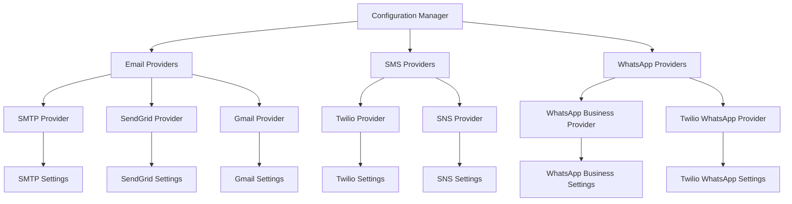
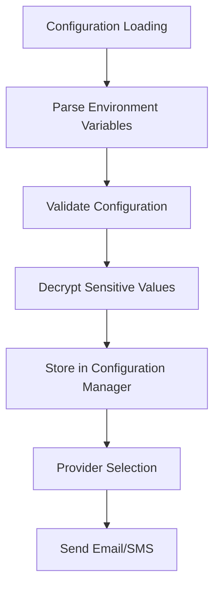

# Email and SMS Configuration Summary

## Overview

This document provides a comprehensive summary of the analysis, design, and implementation plan for configuring and managing SMTP email services and Twilio SMS services in the Rangkai Edu backend application. It consolidates the findings from the technical specification, configuration design, and setup guide.

## Current Implementation Analysis

### Email Service (SMTP)

The current email implementation in [`utils/email/email.go`](utils/email/email.go:1-43) uses Go's built-in `net/smtp` package with the following characteristics:

1. **Configuration**: SMTP settings loaded from environment variables (`SMTP_HOST`, `SMTP_PORT`, `SMTP_USER`, `SMTP_PASS`)
2. **Implementation**: Basic SMTP authentication with plain text email sending
3. **Usage**: Sending OTP codes during registration and authentication flows
4. **Limitations**: Single provider support, no encryption for credentials, basic error handling

### SMS Service (Twilio)

### SMS Service (Twilio)
The current SMS implementation in [`utils/sms/sms.go`](utils/sms/sms.go:1-36) uses the Twilio Go SDK:
1. **Configuration**: Twilio settings loaded from environment variables (`TWILIO_ACCOUNT_SID`, `TWILIO_AUTH_TOKEN`, `TWILIO_SENDER_PHONE`)
2. **Implementation**: Official Twilio client library with basic error handling
3. **Usage**: Sending OTP codes as an alternative to email
4. **Limitations**: Single provider support, no encryption for credentials, basic error handling

### WhatsApp Service
The WhatsApp implementation in [`utils/whatsapp/whatsapp.go`](utils/whatsapp/whatsapp.go:1-344) supports multiple WhatsApp providers:
1. **Configuration**: WhatsApp settings loaded from environment variables with multi-provider support
2. **Implementation**: Supports both WhatsApp Business API and Twilio WhatsApp with provider-specific settings
3. **Usage**: Sending OTP codes via WhatsApp as an alternative to email/SMS
4. **Limitations**: Single provider support in current implementation, no encryption for credentials, basic error handling

### Configuration Management

The configuration system in [`config/config.go`](config/config.go:1-157) uses `github.com/joho/godotenv` to load `.env` files with:

1. **Environment Variable Loading**: Simple key-value mapping with default values
2. **Credential Storage**: Plain text environment variables with no encryption
3. **Validation**: Basic validation for required database fields only

## Proposed Technical Specification

### Enhanced Configuration Structure

The new design supports multiple providers with a flexible configuration system:

1. **Provider Interface**: Common interface for all service providers with validation and priority management
2. **Email Providers**: Support for SMTP, SendGrid, and Gmail with provider-specific settings
3. **SMS Providers**: Support for Twilio and Amazon SNS with provider-specific settings
4. **Secure Credentials**: Encrypted storage and secret management integration

### Security Improvements

1. **Credential Encryption**: All sensitive values are encrypted at rest
2. **Secret Management**: Integration with enterprise secret management systems
3. **Credential Rotation**: Support for hot reloading of credentials without application restart
4. **Access Control**: Principle of least privilege with audit logging

### Monitoring and Observability

1. **Delivery Metrics**: Success rate tracking, latency monitoring, and cost tracking
2. **Error Handling**: Enhanced error categorization with retry mechanisms and circuit breakers
3. **Health Checks**: Provider health checks with detailed status reporting

## Configuration Design

### Multi-Provider Architecture

```

### Environment Variable Mapping

The new configuration system supports backward compatibility while enabling advanced features:
```env
# Primary SMTP provider (backward compatibility)
EMAIL_PROVIDER_0_TYPE=smtp
EMAIL_PROVIDER_0_NAME=primary-smtp
EMAIL_PROVIDER_0_ENABLED=true
EMAIL_PROVIDER_0_PRIORITY=0
EMAIL_PROVIDER_0_SETTINGS_HOST=smtp.gmail.com
EMAIL_PROVIDER_0_SETTINGS_PORT=587
EMAIL_PROVIDER_0_SETTINGS_USERNAME=your_email@gmail.com
EMAIL_PROVIDER_0_SETTINGS_PASSWORD=encrypted_password_here
EMAIL_PROVIDER_0_SETTINGS_FROM_EMAIL=your_email@gmail.com
EMAIL_PROVIDER_0_SETTINGS_FROM_NAME=Rangkai Edu
EMAIL_PROVIDER_0_SETTINGS_USE_TLS=true
EMAIL_PROVIDER_0_SETTINGS_USE_STARTTLS=true

# Primary WhatsApp provider (WhatsApp Business API)
WHATSAPP_PROVIDER_0_TYPE=whatsapp_business
WHATSAPP_PROVIDER_0_NAME=primary-whatsapp
WHATSAPP_PROVIDER_0_ENABLED=true
WHATSAPP_PROVIDER_0_PRIORITY=0
WHATSAPP_PROVIDER_0_SETTINGS_PHONE_ID_NUMBER=your_phone_number_id
WHATSAPP_PROVIDER_0_SETTINGS_BUSINESS_ACCOUNT_ID=your_business_account_id
WHATSAPP_PROVIDER_0_SETTINGS_ACCESS_TOKEN=your_access_token
WHATSAPP_PROVIDER_0_SETTINGS_API_VERSION=v18.0

# Alternative WhatsApp provider (Twilio WhatsApp)
WHATSAPP_PROVIDER_1_TYPE=twilio_whatsapp
WHATSAPP_PROVIDER_1_NAME=backup-whatsapp
WHATSAPP_PROVIDER_1_ENABLED=false
WHATSAPP_PROVIDER_1_PRIORITY=1
WHATSAPP_PROVIDER_1_SETTINGS_ACCOUNT_SID=your_account_sid
WHATSAPP_PROVIDER_1_SETTINGS_AUTH_TOKEN=your_auth_token
WHATSAPP_PROVIDER_1_SETTINGS_WHATSAPP_NUMBER=your_whatsapp_number
```
```

### Secure Credential Management



## Implementation Plan

### Phase 1: Configuration Structure Enhancement

1. **Refactor Configuration Loading**:
   - Create provider-specific configuration structures
   - Implement configuration validation
   - Add support for multiple providers

2. **Secure Credential Storage**:
   - Implement encryption for sensitive values
   - Add support for secret management systems
   - Create credential rotation mechanisms

### Phase 2: Service Implementation Enhancement

1. **Email Service Improvements**:
   - Add support for multiple email providers
   - Implement retry mechanisms
   - Add circuit breaker pattern

2. **SMS Service Improvements**:
   - Add support for multiple SMS providers
   - Implement retry mechanisms
   - Add circuit breaker pattern

3. **WhatsApp Service Improvements**:
   - Add support for multiple WhatsApp providers
   - Implement retry mechanisms
   - Add circuit breaker pattern

### Phase 3: Monitoring and Observability

1. **Metrics Collection**:
   - Implement delivery metrics
   - Add latency tracking
   - Create cost tracking for SMS

2. **Error Handling**:
   - Enhance error categorization
   - Implement alerting mechanisms
   - Add detailed logging

## Security Considerations

### Credential Security

1. **Storage**:
   - Never store plain text credentials in version control
   - Encrypt credentials at rest
   - Use secure secret management systems in production

2. **Transmission**:
   - Always use encrypted connections
   - Validate SSL certificates
   - Support for custom CA certificates

### Access Control

1. **Configuration Access**:
   - Limit access to configuration files
   - Audit logging for configuration access
   - Role-based access control

2. **Runtime Security**:
   - Validate configuration changes
   - Prevent unauthorized configuration updates
   - Secure credential injection

## Setup and Configuration Guide

### Email Service Setup

1. **SMTP Configuration**:
   - Gmail/Google Workspace with app passwords
   - Custom SMTP servers with TLS support
   - Provider-specific settings validation

2. **SendGrid Configuration**:
   - API key generation and management
   - Domain authentication and verification
   - Rate limiting and monitoring

3. **Gmail OAuth2 Configuration**:
   - Google Cloud project setup
   - OAuth2 credential management
   - Token refresh mechanisms

### SMS Service Setup

1. **Twilio Configuration**:
   - Account setup and verification
   - Phone number provisioning
   - Credential management

2. **Amazon SNS Configuration**:
   - AWS account setup
   - IAM user creation with appropriate permissions
   - Credential management

### WhatsApp Service Setup
1. **WhatsApp Business API Configuration**:
   - Facebook Business Manager account setup
   - WhatsApp Business account verification
   - Phone number registration and approval
   - Access token generation
2. **Twilio WhatsApp Configuration**:
   - Twilio account setup and verification
   - WhatsApp sandbox setup or business verification
   - Phone number provisioning
   - Credential management

## Testing and Monitoring

### Configuration Testing

1. **Email Service Testing**:
   - SMTP connectivity verification
   - Test email sending
   - Template validation

2. **SMS Service Testing**:
   - API connectivity verification
   - Test SMS sending
   - Delivery confirmation

3. **WhatsApp Service Testing**:
   - API connectivity verification
   - Test WhatsApp message sending
   - Delivery confirmation
   - Rate limiting testing

### Health Monitoring

1. **Provider Health Checks**:
   - Regular connectivity testing
   - Status reporting and alerting
   - Automatic failover

2. **Performance Monitoring**:
   - Delivery success rates
   - Latency tracking
   - Cost monitoring

3. **WhatsApp-Specific Monitoring**:
   - Message delivery rates
   - Rate limit compliance
   - Template approval status

## Migration Path

### Backward Compatibility

The new configuration system maintains full backward compatibility with existing environment variables:

1. **Legacy Configuration Support**: Automatic detection and loading of legacy configuration
2. **Gradual Migration**: Support for mixed configuration environments during transition
3. **Validation**: Comprehensive validation of both legacy and new configuration formats

### Deployment Strategy

1. **Phase 1**: Deploy new configuration structures with backward compatibility
2. **Phase 2**: Enable new provider support while maintaining existing functionality
3. **Phase 3**: Migrate to new configuration format with enhanced security features
4. **Phase 4**: Enable advanced monitoring and observability features

## Conclusion

This comprehensive approach to email and SMS configuration provides:

1. **Flexibility**: Support for multiple providers with easy extensibility
2. **Security**: Encrypted credential storage and secret management integration
3. **Reliability**: Retry mechanisms, circuit breakers, and failover support
4. **Observability**: Comprehensive monitoring and alerting capabilities
5. **Maintainability**: Clean architecture with clear separation of concerns
6. **Backward Compatibility**: Smooth migration path from existing implementation

The proposed design addresses all current limitations while providing a solid foundation for future enhancements and scalability.