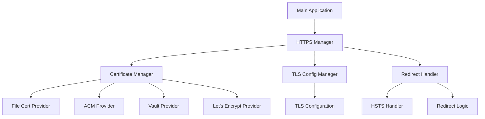
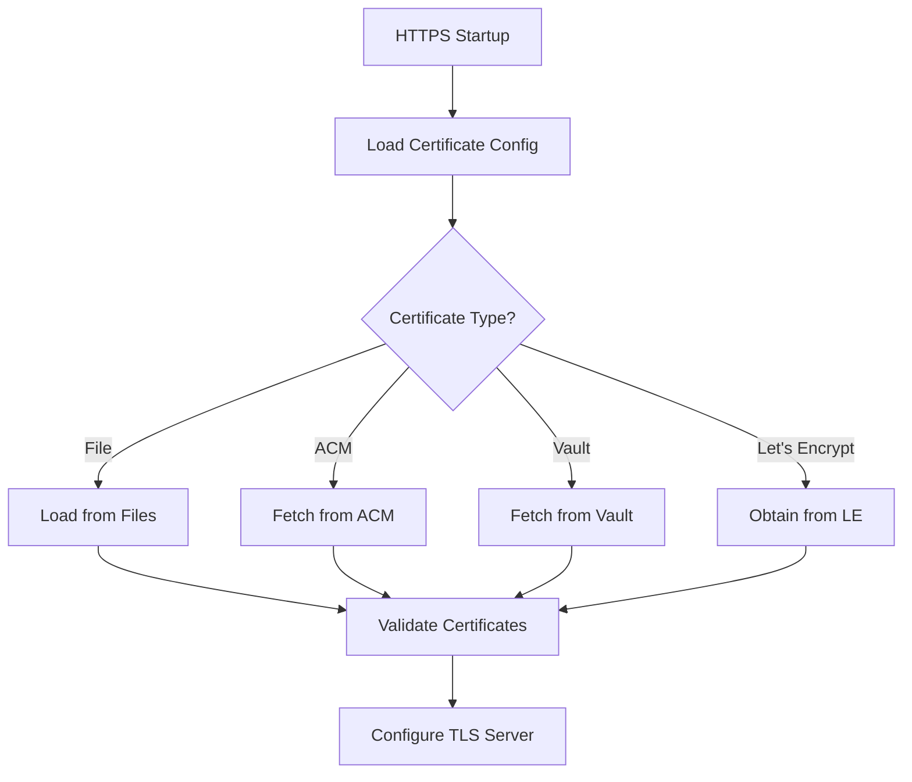

# HTTPS Enforcement Implementation Design

## 1. Overview

This document outlines the comprehensive design for implementing HTTPS enforcement in the Rangkai Edu backend application. The implementation will provide robust HTTPS support across multiple environments (development, staging, production) with enterprise-grade certificate management integration.

## 2. Current State Analysis

### 2.1 Server Configuration
The application currently runs on HTTP only using Gin framework:
- Listens on port 8080
- No TLS configuration
- No HTTPS enforcement
- No certificate management

### 2.2 Existing Security Infrastructure
- JWT-based authentication middleware
- Role-based authorization middleware
- Provider management system for email/SMS services
- Configuration management via environment variables

### 2.3 Deployment Architecture
- Docker-based deployment
- Docker Compose for local development
- Multi-environment configuration support

## 3. Requirements Analysis

### 3.1 Certificate Management
- Integration with enterprise certificate management services (Alibaba ACM, HashiCorp Vault)
- Support for file-based certificates as fallback
- Environment-specific certificate handling
- Automated certificate rotation support

### 3.2 HTTP to HTTPS Redirection
- 301 redirects for all HTTP traffic
- HSTS (HTTP Strict Transport Security) headers
- Configurable redirection behavior per environment

### 3.3 TLS Configuration
- Comprehensive TLS settings customization
- Support for mutual TLS (mTLS) client authentication
- Modern cipher suite selection
- TLS version control

### 3.4 Multi-Environment Support
- Development: localhost HTTPS with self-signed certificates
- Staging: Let's Encrypt or enterprise certificates
- Production: Enterprise certificate management integration

## 4. Technical Design

### 4.1 Configuration Structure

#### 4.1.1 HTTPS Configuration Struct
```go
// HTTPSConfig represents the HTTPS configuration
type HTTPSConfig struct {
    // Enabled enables HTTPS support
    Enabled bool `json:"enabled" mapstructure:"enabled"`
    
    // Port is the HTTPS port to listen on
    Port int `json:"port" mapstructure:"port"`
    
    // HTTPPort is the HTTP port for redirection (0 to disable)
    HTTPPort int `json:"http_port" mapstructure:"http_port"`
    
    // Certificate management configuration
    Certificate CertificateConfig `json:"certificate" mapstructure:"certificate"`
    
    // TLS configuration
    TLS TLSConfig `json:"tls" mapstructure:"tls"`
    
    // HSTS configuration
    HSTS HSTSConfig `json:"hsts" mapstructure:"hsts"`
    
    // Redirect configuration
    Redirect RedirectConfig `json:"redirect" mapstructure:"redirect"`
}

// CertificateConfig represents certificate management configuration
type CertificateConfig struct {
    // Type of certificate management (file, acm, vault, letsencrypt)
    Type string `json:"type" mapstructure:"type"`
    
    // File-based certificate configuration
    File FileCertConfig `json:"file" mapstructure:"file"`
    
    // Alibaba ACM configuration
    ACM ACMConfig `json:"acm" mapstructure:"acm"`
    
    // HashiCorp Vault configuration
    Vault VaultConfig `json:"vault" mapstructure:"vault"`
    
    // Let's Encrypt configuration
    LetsEncrypt LetsEncryptConfig `json:"lets_encrypt" mapstructure:"lets_encrypt"`
}

// FileCertConfig represents file-based certificate configuration
type FileCertConfig struct {
    // CertFile is the path to the certificate file
    CertFile string `json:"cert_file" mapstructure:"cert_file"`
    
    // KeyFile is the path to the private key file
    KeyFile string `json:"key_file" mapstructure:"key_file"`
    
    // CAFile is the path to the CA certificate file (optional)
    CAFile string `json:"ca_file" mapstructure:"ca_file"`
}

// ACMConfig represents Alibaba ACM configuration
type ACMConfig struct {
    // Endpoint is the ACM service endpoint
    Endpoint string `json:"endpoint" mapstructure:"endpoint"`
    
    // AccessKeyID for authentication
    AccessKeyID string `json:"access_key_id" mapstructure:"access_key_id"`
    
    // AccessKeySecret for authentication
    AccessKeySecret string `json:"access_key_secret" mapstructure:"access_key_secret"`
    
    // Region where ACM is deployed
    Region string `json:"region" mapstructure:"region"`
    
    // CertificateName is the name/ID of the certificate in ACM
    CertificateName string `json:"certificate_name" mapstructure:"certificate_name"`
}

// VaultConfig represents HashiCorp Vault configuration
type VaultConfig struct {
    // Address is the Vault server address
    Address string `json:"address" mapstructure:"address"`
    
    // Token for authentication
    Token string `json:"token" mapstructure:"token"`
    
    // Path to the certificate in Vault
    CertPath string `json:"cert_path" mapstructure:"cert_path"`
    
    // Path to the private key in Vault
    KeyPath string `json:"key_path" mapstructure:"key_path"`
    
    // Path to the CA certificate in Vault (optional)
    CAPath string `json:"ca_path" mapstructure:"ca_path"`
}

// LetsEncryptConfig represents Let's Encrypt configuration
type LetsEncryptConfig struct {
    // Email for Let's Encrypt account
    Email string `json:"email" mapstructure:"email"`
    
    // Domains to obtain certificates for
    Domains []string `json:"domains" mapstructure:"domains"`
    
    // Cache directory for certificates
    CacheDir string `json:"cache_dir" mapstructure:"cache_dir"`
    
    // Challenge type (http, tls, dns)
    Challenge string `json:"challenge" mapstructure:"challenge"`
}

// TLSConfig represents TLS configuration
type TLSConfig struct {
    // MinVersion is the minimum TLS version (TLS10, TLS11, TLS12, TLS13)
    MinVersion string `json:"min_version" mapstructure:"min_version"`
    
    // MaxVersion is the maximum TLS version (TLS10, TLS11, TLS12, TLS13)
    MaxVersion string `json:"max_version" mapstructure:"max_version"`
    
    // CipherSuites is a list of allowed cipher suites
    CipherSuites []string `json:"cipher_suites" mapstructure:"cipher_suites"`
    
    // PreferServerCipherSuites prefers server's cipher suite order
    PreferServerCipherSuites bool `json:"prefer_server_cipher_suites" mapstructure:"prefer_server_cipher_suites"`
    
    // ClientAuth enables client certificate authentication
    ClientAuth bool `json:"client_auth" mapstructure:"client_auth"`
    
    // ClientCAs is the path to client CA certificates
    ClientCAs string `json:"client_cas" mapstructure:"client_cas"`
    
    // SessionTicketsDisabled disables TLS session tickets
    SessionTicketsDisabled bool `json:"session_tickets_disabled" mapstructure:"session_tickets_disabled"`
    
    // SessionTicketKey is the key for encrypting session tickets
    SessionTicketKey string `json:"session_ticket_key" mapstructure:"session_ticket_key"`
}

// HSTSConfig represents HSTS configuration
type HSTSConfig struct {
    // Enabled enables HSTS
    Enabled bool `json:"enabled" mapstructure:"enabled"`
    
    // MaxAge is the max-age directive in seconds
    MaxAge int `json:"max_age" mapstructure:"max_age"`
    
    // IncludeSubDomains includes subdomains in HSTS policy
    IncludeSubDomains bool `json:"include_subdomains" mapstructure:"include_subdomains"`
    
    // Preload adds preload directive to HSTS header
    Preload bool `json:"preload" mapstructure:"preload"`
}

// RedirectConfig represents HTTP to HTTPS redirect configuration
type RedirectConfig struct {
    // Enabled enables HTTP to HTTPS redirection
    Enabled bool `json:"enabled" mapstructure:"enabled"`
    
    // StatusCode is the HTTP status code for redirects (301, 302, 307, 308)
    StatusCode int `json:"status_code" mapstructure:"status_code"`
    
    // Permanent enables permanent redirect (301)
    Permanent bool `json:"permanent" mapstructure:"permanent"`
}
```

### 4.2 Environment Variables

#### 4.2.1 HTTPS Configuration Variables
```
# HTTPS Configuration
HTTPS_ENABLED=true
HTTPS_PORT=8443
HTTP_PORT=8080

# Certificate Management
HTTPS_CERTIFICATE_TYPE=file  # file, acm, vault, letsencrypt
HTTPS_CERTIFICATE_FILE_CERT_FILE=/path/to/cert.pem
HTTPS_CERTIFICATE_FILE_KEY_FILE=/path/to/key.pem
HTTPS_CERTIFICATE_FILE_CA_FILE=/path/to/ca.pem

# Alibaba ACM Configuration
HTTPS_CERTIFICATE_ACM_ENDPOINT=acm.cn-hangzhou.aliyuncs.com
HTTPS_CERTIFICATE_ACM_ACCESS_KEY_ID=your-access-key-id
HTTPS_CERTIFICATE_ACM_ACCESS_KEY_SECRET=your-access-key-secret
HTTPS_CERTIFICATE_ACM_REGION=cn-hangzhou
HTTPS_CERTIFICATE_ACM_CERTIFICATE_NAME=your-certificate-name

# HashiCorp Vault Configuration
HTTPS_CERTIFICATE_VAULT_ADDRESS=https://vault.example.com:8200
HTTPS_CERTIFICATE_VAULT_TOKEN=your-vault-token
HTTPS_CERTIFICATE_VAULT_CERT_PATH=secret/certificates/app-cert
HTTPS_CERTIFICATE_VAULT_KEY_PATH=secret/certificates/app-key
HTTPS_CERTIFICATE_VAULT_CA_PATH=secret/certificates/ca-cert

# Let's Encrypt Configuration
HTTPS_CERTIFICATE_LETSENCRYPT_EMAIL=admin@example.com
HTTPS_CERTIFICATE_LETSENCRYPT_DOMAINS=example.com,www.example.com
HTTPS_CERTIFICATE_LETSENCRYPT_CACHE_DIR=/var/cache/letsencrypt
HTTPS_CERTIFICATE_LETSENCRYPT_CHALLENGE=http

# TLS Configuration
HTTPS_TLS_MIN_VERSION=TLS12
HTTPS_TLS_MAX_VERSION=TLS13
HTTPS_TLS_CIPHER_SUITES=TLS_ECDHE_RSA_WITH_AES_128_GCM_SHA256,TLS_ECDHE_RSA_WITH_AES_256_GCM_SHA384
HTTPS_TLS_PREFER_SERVER_CIPHER_SUITES=true
HTTPS_TLS_CLIENT_AUTH=false
HTTPS_TLS_CLIENT_CAS=/path/to/client-cas.pem
HTTPS_TLS_SESSION_TICKETS_DISABLED=false
HTTPS_TLS_SESSION_TICKET_KEY=your-session-ticket-key

# HSTS Configuration
HTTPS_HSTS_ENABLED=true
HTTPS_HSTS_MAX_AGE=31536000  # 1 year
HTTPS_HSTS_INCLUDE_SUBDOMAINS=true
HTTPS_HSTS_PRELOAD=true

# Redirect Configuration
HTTPS_REDIRECT_ENABLED=true
HTTPS_REDIRECT_STATUS_CODE=301
HTTPS_REDIRECT_PERMANENT=true
```

## 5. Implementation Architecture

### 5.1 Component Diagram


### 5.2 Certificate Management Flow


## 6. HTTP to HTTPS Redirection Strategy

### 6.1 Redirection Implementation
The redirection will be implemented as a separate HTTP server that redirects all traffic to HTTPS:

```go
// HTTPRedirectServer handles HTTP to HTTPS redirection
type HTTPRedirectServer struct {
    server *http.Server
    config *RedirectConfig
}

// Start starts the HTTP redirect server
func (h *HTTPRedirectServer) Start() error {
    mux := http.NewServeMux()
    mux.HandleFunc("/", h.redirectHandler)
    
    h.server = &http.Server{
        Addr:    fmt.Sprintf(":%d", h.config.HTTPPort),
        Handler: mux,
    }
    
    return h.server.ListenAndServe()
}

// redirectHandler handles HTTP to HTTPS redirection
func (h *HTTPRedirectServer) redirectHandler(w http.ResponseWriter, r *http.Request) {
    // Get the target HTTPS URL
    target := fmt.Sprintf("https://%s:%d%s", r.Host, h.config.HTTPSPort, r.URL.Path)
    if r.URL.RawQuery != "" {
        target += "?" + r.URL.RawQuery
    }
    
    // Set HSTS header if enabled
    if h.config.HSTS.Enabled {
        hstsValue := fmt.Sprintf("max-age=%d", h.config.HSTS.MaxAge)
        if h.config.HSTS.IncludeSubDomains {
            hstsValue += "; includeSubDomains"
        }
        if h.config.HSTS.Preload {
            hstsValue += "; preload"
        }
        w.Header().Set("Strict-Transport-Security", hstsValue)
    }
    
    // Perform redirect
    http.Redirect(w, r, target, h.config.StatusCode)
}
```

### 6.2 HSTS Implementation
HSTS headers will be added to all HTTPS responses:

```go
// HSTSMiddleware adds HSTS headers to responses
func HSTSMiddleware(config *HSTSConfig) gin.HandlerFunc {
    return func(c *gin.Context) {
        if config.Enabled {
            hstsValue := fmt.Sprintf("max-age=%d", config.MaxAge)
            if config.IncludeSubDomains {
                hstsValue += "; includeSubDomains"
            }
            if config.Preload {
                hstsValue += "; preload"
            }
            c.Header("Strict-Transport-Security", hstsValue)
        }
        c.Next()
    }
}
```

## 7. TLS Configuration Best Practices

### 7.1 Secure TLS Settings
```go
// SecureTLSConfig returns a secure TLS configuration
func SecureTLSConfig(config *TLSConfig) (*tls.Config, error) {
    tlsConfig := &tls.Config{
        PreferServerCipherSuites: config.PreferServerCipherSuites,
        SessionTicketsDisabled:   config.SessionTicketsDisabled,
    }
    
    // Set minimum TLS version
    switch config.MinVersion {
    case "TLS10":
        tlsConfig.MinVersion = tls.VersionTLS10
    case "TLS11":
        tlsConfig.MinVersion = tls.VersionTLS11
    case "TLS12":
        tlsConfig.MinVersion = tls.VersionTLS12
    case "TLS13":
        tlsConfig.MinVersion = tls.VersionTLS13
    default:
        tlsConfig.MinVersion = tls.VersionTLS12
    }
    
    // Set maximum TLS version
    switch config.MaxVersion {
    case "TLS10":
        tlsConfig.MaxVersion = tls.VersionTLS10
    case "TLS11":
        tlsConfig.MaxVersion = tls.VersionTLS11
    case "TLS12":
        tlsConfig.MaxVersion = tls.VersionTLS12
    case "TLS13":
        tlsConfig.MaxVersion = tls.VersionTLS13
    default:
        tlsConfig.MaxVersion = tls.VersionTLS13
    }
    
    // Set cipher suites
    if len(config.CipherSuites) > 0 {
        cipherSuites := make([]uint16, 0, len(config.CipherSuites))
        for _, cipherName := range config.CipherSuites {
            if cipher, ok := cipherSuiteMap[cipherName]; ok {
                cipherSuites = append(cipherSuites, cipher)
            }
        }
        tlsConfig.CipherSuites = cipherSuites
    }
    
    // Configure client authentication
    if config.ClientAuth {
        tlsConfig.ClientAuth = tls.RequireAndVerifyClientCert
        if config.ClientCAs != "" {
            caCert, err := ioutil.ReadFile(config.ClientCAs)
            if err != nil {
                return nil, fmt.Errorf("failed to read client CA file: %w", err)
            }
            caCertPool := x509.NewCertPool()
            caCertPool.AppendCertsFromPEM(caCert)
            tlsConfig.ClientCAs = caCertPool
        }
    }
    
    return tlsConfig, nil
}
```

### 7.2 Recommended Cipher Suites
Recommended modern cipher suites for security:
- TLS_ECDHE_RSA_WITH_AES_128_GCM_SHA256
- TLS_ECDHE_RSA_WITH_AES_256_GCM_SHA384
- TLS_ECDHE_ECDSA_WITH_AES_128_GCM_SHA256
- TLS_ECDHE_ECDSA_WITH_AES_256_GCM_SHA384
- TLS_ECDHE_RSA_WITH_CHACHA20_POLY1305
- TLS_ECDHE_ECDSA_WITH_CHACHA20_POLY1305

## 8. Certificate Management Approaches

### 8.1 File-Based Certificates
For development and simple deployments:
- Certificates stored as PEM files
- Manual certificate rotation
- Simple configuration

### 8.2 Alibaba ACM Integration
For Alibaba Cloud deployments:
- Automatic certificate fetching from ACM
- Secure credential management
- Certificate rotation support

### 8.3 HashiCorp Vault Integration
For enterprise deployments:
- Secure certificate storage in Vault
- Dynamic certificate issuance
- Comprehensive audit logging

### 8.4 Let's Encrypt Integration
For public internet deployments:
- Automatic certificate issuance
- Automatic renewal
- ACME challenge support (HTTP, TLS, DNS)

## 9. Integration with Existing Server Setup

### 9.1 Modified Main Function
```go
func main() {
    // Initialize the database connection pool
    if err := db.Init(); err != nil {
        log.Fatalf("Failed to initialize database: %v", err)
    }
    defer db.Close()

    // Load configuration
    cfg := config.Load()
    
    // Initialize HTTPS manager
    httpsManager, err := https.NewManager(cfg.HTTPS)
    if err != nil {
        log.Fatalf("Failed to initialize HTTPS manager: %v", err)
    }
    
    // Create Gin engine
    r := gin.Default()
    
    // Add HSTS middleware if enabled
    if cfg.HTTPS.HSTS.Enabled {
        r.Use(https.HSTSMiddleware(&cfg.HTTPS.HSTS))
    }
    
    // Welcome route
    r.GET("/", func(c *gin.Context) {
        c.JSON(200, gin.H{
            "message": "Welcome to Rangkai Edu Backend API",
        })
    })

    // Setup auth routes
    routes.SetupAuthRoutes(r)

    // Setup class routes
    routes.SetupClassRoutes(r)

    // Setup subject routes
    routes.SetupSubjectRoutes(r)

    // Setup material routes
    routes.SetupMaterialRoutes(r)

    // Setup health check routes
    routes.SetupHealthRoutes(r)
    
    // Start HTTP redirect server if enabled
    if cfg.HTTPS.Redirect.Enabled && cfg.HTTPS.HTTPPort > 0 {
        redirectServer := https.NewHTTPRedirectServer(cfg.HTTPS.HTTPPort, cfg.HTTPS.Port, &cfg.HTTPS.Redirect, &cfg.HTTPS.HSTS)
        go func() {
            if err := redirectServer.Start(); err != nil && err != http.ErrServerClosed {
                log.Printf("HTTP redirect server error: %v", err)
            }
        }()
        defer redirectServer.Shutdown(context.Background())
    }
    
    // Start HTTPS server
    if cfg.HTTPS.Enabled {
        log.Printf("Starting HTTPS server on port %d", cfg.HTTPS.Port)
        if err := httpsManager.ListenAndServeTLS(r, cfg.HTTPS.Port); err != nil {
            log.Fatalf("Failed to start HTTPS server: %v", err)
        }
    } else {
        // Fallback to HTTP for development
        log.Printf("Starting HTTP server on port %d", 8080)
        if err := r.Run(":8080"); err != nil {
            log.Fatalf("Failed to start HTTP server: %v", err)
        }
    }
}
```

### 9.2 HTTPS Manager Implementation
```go
// Manager handles HTTPS configuration and server management
type Manager struct {
    config     *HTTPSConfig
    certManager *CertificateManager
    tlsConfig  *tls.Config
}

// NewManager creates a new HTTPS manager
func NewManager(config HTTPSConfig) (*Manager, error) {
    certManager, err := NewCertificateManager(config.Certificate)
    if err != nil {
        return nil, fmt.Errorf("failed to create certificate manager: %w", err)
    }
    
    tlsConfig, err := SecureTLSConfig(&config.TLS)
    if err != nil {
        return nil, fmt.Errorf("failed to create TLS config: %w", err)
    }
    
    return &Manager{
        config:      &config,
        certManager: certManager,
        tlsConfig:   tlsConfig,
    }, nil
}

// ListenAndServeTLS starts the HTTPS server
func (m *Manager) ListenAndServeTLS(handler http.Handler, port int) error {
    // Get certificates
    cert, key, err := m.certManager.GetCertificates()
    if err != nil {
        return fmt.Errorf("failed to get certificates: %w", err)
    }
    
    // Configure TLS
    m.tlsConfig.Certificates = []tls.Certificate{
        {
            Certificate: cert,
            PrivateKey:  key,
        },
    }
    
    // Create server
    server := &http.Server{
        Addr:      fmt.Sprintf(":%d", port),
        Handler:   handler,
        TLSConfig: m.tlsConfig,
    }
    
    // Start server
    return server.ListenAndServeTLS("", "")
}
```

## 10. Error Handling for TLS-Related Issues

### 10.1 Certificate Loading Errors
- Graceful fallback to HTTP mode for development
- Detailed error logging for production debugging
- Health check endpoint for certificate status

### 10.2 TLS Configuration Errors
- Validation of TLS settings at startup
- Fallback to secure defaults for invalid configurations
- Comprehensive error messages for misconfigurations

### 10.3 Certificate Expiration Handling
- Proactive certificate expiration monitoring
- Automated renewal for Let's Encrypt certificates
- Alerting for manual certificate rotation needs

## 11. Multi-Environment Configuration

### 11.1 Development Environment
```
HTTPS_ENABLED=false
HTTPS_PORT=8443
HTTP_PORT=8080
HTTPS_CERTIFICATE_TYPE=file
HTTPS_CERTIFICATE_FILE_CERT_FILE=./certs/dev-cert.pem
HTTPS_CERTIFICATE_FILE_KEY_FILE=./certs/dev-key.pem
HTTPS_TLS_MIN_VERSION=TLS12
HTTPS_HSTS_ENABLED=false
HTTPS_REDIRECT_ENABLED=false
```

### 11.2 Staging Environment
```
HTTPS_ENABLED=true
HTTPS_PORT=8443
HTTP_PORT=8080
HTTPS_CERTIFICATE_TYPE=letsencrypt
HTTPS_CERTIFICATE_LETSENCRYPT_EMAIL=admin@staging.example.com
HTTPS_CERTIFICATE_LETSENCRYPT_DOMAINS=staging.example.com
HTTPS_CERTIFICATE_LETSENCRYPT_CACHE_DIR=/var/cache/letsencrypt
HTTPS_TLS_MIN_VERSION=TLS12
HTTPS_HSTS_ENABLED=true
HTTPS_HSTS_MAX_AGE=31536000
HTTPS_REDIRECT_ENABLED=true
```

### 11.3 Production Environment
```
HTTPS_ENABLED=true
HTTPS_PORT=8443
HTTP_PORT=8080
HTTPS_CERTIFICATE_TYPE=acm
HTTPS_CERTIFICATE_ACM_ENDPOINT=acm.cn-hangzhou.aliyuncs.com
HTTPS_CERTIFICATE_ACM_ACCESS_KEY_ID=${ACM_ACCESS_KEY_ID}
HTTPS_CERTIFICATE_ACM_ACCESS_KEY_SECRET=${ACM_ACCESS_KEY_SECRET}
HTTPS_CERTIFICATE_ACM_REGION=cn-hangzhou
HTTPS_CERTIFICATE_ACM_CERTIFICATE_NAME=prod-app-cert
HTTPS_TLS_MIN_VERSION=TLS12
HTTPS_TLS_CIPHER_SUITES=TLS_ECDHE_RSA_WITH_AES_128_GCM_SHA256,TLS_ECDHE_RSA_WITH_AES_256_GCM_SHA384
HTTPS_HSTS_ENABLED=true
HTTPS_HSTS_MAX_AGE=31536000
HTTPS_HSTS_INCLUDE_SUBDOMAINS=true
HTTPS_HSTS_PRELOAD=true
HTTPS_REDIRECT_ENABLED=true
HTTPS_REDIRECT_STATUS_CODE=301
```

## 12. Security Considerations

### 12.1 Certificate Security
- Secure storage of certificate files
- Proper file permissions (600 for private keys)
- Encryption of sensitive certificate data
- Regular certificate rotation

### 12.2 TLS Security
- Disable deprecated TLS versions
- Use only secure cipher suites
- Enable perfect forward secrecy
- Configure secure session management

### 12.3 Configuration Security
- Environment variable-based configuration
- Secure credential management
- Encryption of sensitive configuration values
- Regular security audits

## 13. Monitoring and Logging

### 13.1 Certificate Monitoring
- Certificate expiration alerts
- Certificate validity checks
- Certificate issuance tracking
- Certificate rotation logging

### 13.2 TLS Connection Monitoring
- TLS handshake success/failure tracking
- Cipher suite usage statistics
- TLS version distribution
- Connection error logging

### 13.3 Performance Monitoring
- HTTPS connection latency
- TLS handshake performance
- Certificate loading time
- Redirect performance metrics

## 14. Testing Strategy

### 14.1 Unit Tests
- Certificate loading and validation
- TLS configuration generation
- HTTP to HTTPS redirection logic
- HSTS header generation

### 14.2 Integration Tests
- End-to-end HTTPS server startup
- Certificate management integration
- Redirect server functionality
- Health check endpoints

### 14.3 Security Tests
- TLS configuration security validation
- Certificate chain validation
- Cipher suite security checks
- HSTS header validation

## 15. Deployment Considerations

### 15.1 Docker Configuration
Update Dockerfile to support HTTPS:
```dockerfile
# Copy certificate files if they exist
COPY --chown=appuser:appuser certs/ ./certs/

# Expose both HTTP and HTTPS ports
EXPOSE 8080 8443

# Update health check for HTTPS
HEALTHCHECK --interval=30s --timeout=3s --start-period=5s --retries=3 \
  CMD wget --quiet --tries=1 --spider https://localhost:8443/health || exit 1
```

### 15.2 Docker Compose Configuration
Update docker-compose.yml for HTTPS:
```yaml
services:
  backend:
    # ... existing configuration ...
    ports:
      - "${HTTP_PORT:-8080}:8080"
      - "${HTTPS_PORT:-8443}:8443"
    volumes:
      - ./config:/app/config
      - ./certs:/app/certs:ro
    environment:
      # ... existing environment variables ...
      - HTTPS_ENABLED=true
      - HTTPS_PORT=8443
      - HTTP_PORT=8080
      - HTTPS_CERTIFICATE_TYPE=file
      - HTTPS_CERTIFICATE_FILE_CERT_FILE=/app/certs/cert.pem
      - HTTPS_CERTIFICATE_FILE_KEY_FILE=/app/certs/key.pem
```

## 16. Implementation Roadmap

### 16.1 Phase 1: Core Implementation
1. Create HTTPS configuration structures
2. Implement certificate management interfaces
3. Create TLS configuration utilities
4. Implement HTTP to HTTPS redirection
5. Add HSTS support

### 16.2 Phase 2: Certificate Providers
1. Implement file-based certificate provider
2. Implement Alibaba ACM provider
3. Implement HashiCorp Vault provider
4. Implement Let's Encrypt provider
5. Create certificate manager orchestration

### 16.3 Phase 3: Integration and Testing
1. Integrate HTTPS support into main application
2. Update configuration loading
3. Implement error handling
4. Create comprehensive test suite
5. Update documentation

### 16.4 Phase 4: Deployment and Monitoring
1. Update Docker configurations
2. Create deployment guides
3. Implement monitoring and alerting
4. Performance optimization
5. Security hardening

## 17. Documentation Updates

### 17.1 Configuration Documentation
- Update config/.env.example with HTTPS variables
- Create HTTPS configuration guide
- Document certificate management procedures

### 17.2 Deployment Documentation
- Update deployment guides for HTTPS
- Create certificate management workflows
- Document monitoring and troubleshooting

### 17.3 Security Documentation
- Update security framework documentation
- Document TLS security best practices
- Create certificate management security guide

## 18. Next Steps

1. Review and approve this design document
2. Create implementation tasks based on this specification
3. Begin Phase 1 implementation
4. Set up development environment for HTTPS testing
5. Create test certificates for development