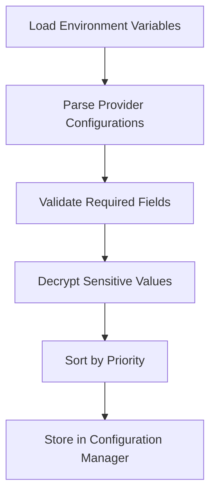
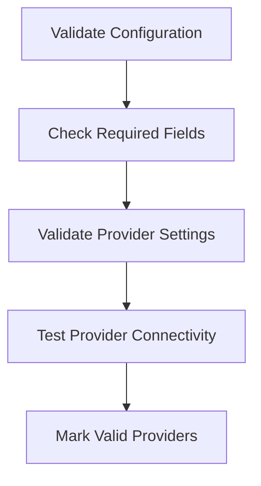

# Multi-Provider Configuration Design

## Overview

This document outlines the design for a flexible, secure configuration system that supports multiple email and SMS providers while maintaining backward compatibility with the current implementation.

## Configuration Structure

### Core Configuration Interface

```go
// ProviderConfig represents the common interface for all service providers
type ProviderConfig interface {
    // GetName returns the provider name (e.g., "gmail", "twilio")
    GetName() string
    
    // GetType returns the provider type ("email" or "sms")
    GetType() string
    
    // IsEnabled returns whether the provider is enabled
    IsEnabled() bool
    
    // Validate checks if the configuration is valid
    Validate() error
    
    // GetPriority returns the priority for this provider (lower numbers = higher priority)
    GetPriority() int
}
```

### Email Provider Configuration

```go
// EmailProviderConfig represents the configuration for an email provider
type EmailProviderConfig struct {
    Name        string            `json:"name" mapstructure:"name"`               // Provider identifier (e.g., "gmail", "sendgrid")
    Type        string            `json:"type" mapstructure:"type"`               // Always "email"
    Enabled     bool              `json:"enabled" mapstructure:"enabled"`         // Whether this provider is enabled
    Priority    int               `json:"priority" mapstructure:"priority"`       // Priority for fallback (0 = highest)
    Settings    EmailSettings     `json:"settings" mapstructure:"settings"`       // Provider-specific settings
}

// EmailSettings contains the common settings for email providers
type EmailSettings struct {
    FromEmail   string `json:"from_email" mapstructure:"from_email"`     // Default sender email
    FromName    string `json:"from_name" mapstructure:"from_name"`       // Default sender name
    ReplyTo     string `json:"reply_to" mapstructure:"reply_to"`         // Reply-to address
}

// SMTPProviderConfig represents configuration for SMTP-based email providers
type SMTPProviderConfig struct {
    EmailProviderConfig `mapstructure:",squash"`
    Host                string `json:"host" mapstructure:"host"`               // SMTP server host
    Port                int    `json:"port" mapstructure:"port"`               // SMTP server port
    Username            string `json:"username" mapstructure:"username"`       // SMTP username
    Password            string `json:"password" mapstructure:"password"`       // SMTP password (encrypted)
    UseTLS              bool   `json:"use_tls" mapstructure:"use_tls"`         // Use TLS encryption
    UseStartTLS         bool   `json:"use_starttls" mapstructure:"use_starttls"` // Use STARTTLS
}

// SendGridProviderConfig represents configuration for SendGrid email provider
type SendGridProviderConfig struct {
    EmailProviderConfig `mapstructure:",squash"`
    APIKey              string `json:"api_key" mapstructure:"api_key"`         // SendGrid API key (encrypted)
}

// GmailProviderConfig represents configuration for Gmail/Google Workspace
type GmailProviderConfig struct {
    EmailProviderConfig `mapstructure:",squash"`
    ClientID            string `json:"client_id" mapstructure:"client_id"`     // OAuth2 Client ID
    ClientSecret        string `json:"client_secret" mapstructure:"client_secret"` // OAuth2 Client Secret (encrypted)
    RefreshToken        string `json:"refresh_token" mapstructure:"refresh_token"` // OAuth2 Refresh Token (encrypted)
    AccessToken         string `json:"access_token" mapstructure:"access_token"`   // OAuth2 Access Token (encrypted)
}
```

### SMS Provider Configuration

```go
// SMSProviderConfig represents the configuration for an SMS provider
type SMSProviderConfig struct {
    Name        string          `json:"name" mapstructure:"name"`               // Provider identifier (e.g., "twilio", "sns")
    Type        string          `json:"type" mapstructure:"type"`               // Always "sms"
    Enabled     bool            `json:"enabled" mapstructure:"enabled"`         // Whether this provider is enabled
    Priority    int             `json:"priority" mapstructure:"priority"`       // Priority for fallback (0 = highest)
    Settings    SMSSettings     `json:"settings" mapstructure:"settings"`       // Provider-specific settings
}

// SMSSettings contains the common settings for SMS providers
type SMSSettings struct {
    FromNumber  string `json:"from_number" mapstructure:"from_number"` // Default sender number
}

// TwilioProviderConfig represents configuration for Twilio SMS provider
type TwilioProviderConfig struct {
    SMSProviderConfig `mapstructure:",squash"`
    AccountSID        string `json:"account_sid" mapstructure:"account_sid"` // Twilio Account SID
    AuthToken         string `json:"auth_token" mapstructure:"auth_token"`   // Twilio Auth Token (encrypted)
}

// SNSProviderConfig represents configuration for Amazon SNS SMS provider
type SNSProviderConfig struct {
    SMSProviderConfig `mapstructure:",squash"`
    AccessKeyID       string `json:"access_key_id" mapstructure:"access_key_id"`     // AWS Access Key ID
    SecretAccessKey   string `json:"secret_access_key" mapstructure:"secret_access_key"` // AWS Secret Access Key (encrypted)
    Region            string `json:"region" mapstructure:"region"`                       // AWS Region
}
```

### Secure Credential Management

```go
// CredentialManager handles encryption/decryption of sensitive credentials
type CredentialManager interface {
    // Encrypt encrypts a plaintext value
    Encrypt(plaintext string) (string, error)
    
    // Decrypt decrypts a ciphertext value
    Decrypt(ciphertext string) (string, error)
    
    // IsEncrypted checks if a value is encrypted
    IsEncrypted(value string) bool
}

// SecretProvider retrieves secrets from external secret management systems
type SecretProvider interface {
    // GetSecret retrieves a secret by name
    GetSecret(name string) (string, error)
    
    // SetSecret stores a secret by name
    SetSecret(name, value string) error
}
```

### Configuration Manager

```go
// ConfigurationManager manages the application's configuration
type ConfigurationManager struct {
    // Email providers sorted by priority
    EmailProviders []EmailProviderConfig `json:"email_providers"`
    
    // SMS providers sorted by priority
    SMSProviders []SMSProviderConfig `json:"sms_providers"`
    
    // Credential manager for encrypting/decrypting sensitive values
    CredentialManager CredentialManager
    
    // Secret provider for retrieving secrets from external systems
    SecretProvider SecretProvider
}

// GetPrimaryEmailProvider returns the highest priority enabled email provider
func (cm *ConfigurationManager) GetPrimaryEmailProvider() (EmailProviderConfig, error) {
    for _, provider := range cm.EmailProviders {
        if provider.Enabled {
            return provider, nil
        }
    }
    return EmailProviderConfig{}, errors.New("no enabled email provider found")
}

// GetPrimarySMSProvider returns the highest priority enabled SMS provider
func (cm *ConfigurationManager) GetPrimarySMSProvider() (SMSProviderConfig, error) {
    for _, provider := range cm.SMSProviders {
        if provider.Enabled {
            return provider, nil
        }
    }
    return SMSProviderConfig{}, errors.New("no enabled SMS provider found")
}

// GetEmailProviderByName returns a specific email provider by name
func (cm *ConfigurationManager) GetEmailProviderByName(name string) (EmailProviderConfig, error) {
    for _, provider := range cm.EmailProviders {
        if provider.Name == name && provider.Enabled {
            return provider, nil
        }
    }
    return EmailProviderConfig{}, fmt.Errorf("email provider %s not found or not enabled", name)
}

// GetSMSProviderByName returns a specific SMS provider by name
func (cm *ConfigurationManager) GetSMSProviderByName(name string) (SMSProviderConfig, error) {
    for _, provider := range cm.SMSProviders {
        if provider.Name == name && provider.Enabled {
            return provider, nil
        }
    }
    return SMSProviderConfig{}, fmt.Errorf("SMS provider %s not found or not enabled", name)
}
```

## Environment Variable Mapping

### Email Providers

```env
# Primary SMTP provider (backward compatibility)
EMAIL_PROVIDER_0_TYPE=smtp
EMAIL_PROVIDER_0_NAME=primary-smtp
EMAIL_PROVIDER_0_ENABLED=true
EMAIL_PROVIDER_0_PRIORITY=0
EMAIL_PROVIDER_0_SETTINGS_HOST=smtp.gmail.com
EMAIL_PROVIDER_0_SETTINGS_PORT=587
EMAIL_PROVIDER_0_SETTINGS_USERNAME=your_email@gmail.com
EMAIL_PROVIDER_0_SETTINGS_PASSWORD=encrypted_password_here
EMAIL_PROVIDER_0_SETTINGS_FROM_EMAIL=your_email@gmail.com
EMAIL_PROVIDER_0_SETTINGS_FROM_NAME=Rangkai Edu
EMAIL_PROVIDER_0_SETTINGS_USE_TLS=true
EMAIL_PROVIDER_0_SETTINGS_USE_STARTTLS=true

# Secondary SendGrid provider (fallback)
EMAIL_PROVIDER_1_TYPE=sendgrid
EMAIL_PROVIDER_1_NAME=sendgrid-fallback
EMAIL_PROVIDER_1_ENABLED=true
EMAIL_PROVIDER_1_PRIORITY=1
EMAIL_PROVIDER_1_SETTINGS_API_KEY=encrypted_api_key_here
EMAIL_PROVIDER_1_SETTINGS_FROM_EMAIL=noreply@rangkaiedu.com
EMAIL_PROVIDER_1_SETTINGS_FROM_NAME=Rangkai Edu
```

### SMS Providers

```env
# Primary Twilio provider (backward compatibility)
SMS_PROVIDER_0_TYPE=sms
SMS_PROVIDER_0_NAME=twilio-primary
SMS_PROVIDER_0_ENABLED=true
SMS_PROVIDER_0_PRIORITY=0
SMS_PROVIDER_0_SETTINGS_ACCOUNT_SID=your_twilio_account_sid
SMS_PROVIDER_0_SETTINGS_AUTH_TOKEN=encrypted_auth_token_here
SMS_PROVIDER_0_SETTINGS_FROM_NUMBER=+1234567890

# Secondary SNS provider (fallback)
SMS_PROVIDER_1_TYPE=sns
SMS_PROVIDER_1_NAME=sns-fallback
SMS_PROVIDER_1_ENABLED=true
SMS_PROVIDER_1_PRIORITY=1
SMS_PROVIDER_1_SETTINGS_ACCESS_KEY_ID=your_aws_access_key_id
SMS_PROVIDER_1_SETTINGS_SECRET_ACCESS_KEY=encrypted_secret_access_key_here
SMS_PROVIDER_1_SETTINGS_REGION=us-east-1
SMS_PROVIDER_1_SETTINGS_FROM_NUMBER=+1234567890
```

## Configuration Loading Process

### 1. Environment Variable Parsing



### 2. Configuration Validation



## Backward Compatibility

### Legacy Configuration Support

The new configuration system will maintain backward compatibility with the existing environment variables:

```go
// loadLegacyConfig loads configuration from legacy environment variables
func loadLegacyConfig() *ConfigurationManager {
    cfg := &ConfigurationManager{}
    
    // Check if legacy SMTP config exists
    if os.Getenv("SMTP_HOST") != "" {
        provider := SMTPProviderConfig{
            EmailProviderConfig: EmailProviderConfig{
                Name:     "legacy-smtp",
                Type:     "email",
                Enabled:  true,
                Priority: 0,
            },
            Host:        os.Getenv("SMTP_HOST"),
            Port:        getEnvInt("SMTP_PORT", 587),
            Username:    os.Getenv("SMTP_USER"),
            Password:    os.Getenv("SMTP_PASS"),
            UseTLS:      true,
            UseStartTLS: true,
        }
        cfg.EmailProviders = append(cfg.EmailProviders, provider)
    }
    
    // Check if legacy Twilio config exists
    if os.Getenv("TWILIO_ACCOUNT_SID") != "" {
        provider := TwilioProviderConfig{
            SMSProviderConfig: SMSProviderConfig{
                Name:     "legacy-twilio",
                Type:     "sms",
                Enabled:  true,
                Priority: 0,
            },
            AccountSID: os.Getenv("TWILIO_ACCOUNT_SID"),
            AuthToken:  os.Getenv("TWILIO_AUTH_TOKEN"),
        }
        cfg.SMSProviders = append(cfg.SMSProviders, provider)
    }
    
    return cfg
}
```

## Security Implementation

### Credential Encryption

```go
// encryptCredential encrypts a credential value
func encryptCredential(value string, cm CredentialManager) (string, error) {
    if cm.IsEncrypted(value) {
        return value, nil // Already encrypted
    }
    return cm.Encrypt(value)
}

// decryptCredential decrypts a credential value
func decryptCredential(value string, cm CredentialManager) (string, error) {
    if !cm.IsEncrypted(value) {
        return value, nil // Not encrypted
    }
    return cm.Decrypt(value)
}
```

### Secret Management Integration

```go
// loadSecret retrieves a secret value, falling back to environment variable
func loadSecret(name, envVar string, sp SecretProvider) (string, error) {
    // Try to get from secret provider first
    if sp != nil {
        if secret, err := sp.GetSecret(name); err == nil {
            return secret, nil
        }
    }
    
    // Fall back to environment variable
    return os.Getenv(envVar), nil
}
```

## Usage Examples

### Sending Email with Provider Selection

```go
// SendOTPEmail sends an OTP email using the configured provider
func SendOTPEmail(cfg *ConfigurationManager, to, otp string) error {
    provider, err := cfg.GetPrimaryEmailProvider()
    if err != nil {
        return fmt.Errorf("no email provider configured: %w", err)
    }
    
    switch provider.Type {
    case "smtp":
        return sendSMTPOTPEmail(provider, to, otp)
    case "sendgrid":
        return sendSendGridOTPEmail(provider, to, otp)
    case "gmail":
        return sendGmailOTPEmail(provider, to, otp)
    default:
        return fmt.Errorf("unsupported email provider type: %s", provider.Type)
    }
}
```

### Sending SMS with Provider Selection

```go
// SendOTPSMS sends an OTP SMS using the configured provider
func SendOTPSMS(cfg *ConfigurationManager, to, otp string) error {
    provider, err := cfg.GetPrimarySMSProvider()
    if err != nil {
        return fmt.Errorf("no SMS provider configured: %w", err)
    }
    
    switch provider.Type {
    case "twilio":
        return sendTwilioOTPSMS(provider, to, otp)
    case "sns":
        return sendSNSOTPSMS(provider, to, otp)
    default:
        return fmt.Errorf("unsupported SMS provider type: %s", provider.Type)
    }
}
```

## Monitoring and Observability

### Configuration Health Checks

```go
// HealthCheck verifies that all enabled providers are properly configured
func (cm *ConfigurationManager) HealthCheck() []ProviderHealth {
    var health []ProviderHealth
    
    // Check email providers
    for _, provider := range cm.EmailProviders {
        if provider.Enabled {
            health = append(health, checkEmailProviderHealth(provider))
        }
    }
    
    // Check SMS providers
    for _, provider := range cm.SMSProviders {
        if provider.Enabled {
            health = append(health, checkSMSProviderHealth(provider))
        }
    }
    
    return health
}

// ProviderHealth represents the health status of a provider
type ProviderHealth struct {
    Name     string `json:"name"`
    Type     string `json:"type"`
    Status   string `json:"status"`   // "healthy", "degraded", "unhealthy"
    Message  string `json:"message"`  // Additional details
    LastTest time.Time `json:"last_test"`
}
```

## Migration Path

### Phase 1: Configuration Structure Implementation

1. Implement the new configuration structures
2. Add support for loading from environment variables
3. Maintain backward compatibility with existing variables
4. Add validation for new configuration format

### Phase 2: Provider Implementation

1. Refactor existing SMTP implementation to use new structure
2. Refactor existing Twilio implementation to use new structure
3. Add support for additional providers (SendGrid, SNS)
4. Implement credential encryption/decryption

### Phase 3: Monitoring and Security

1. Add health checks for all providers
2. Implement secret management integration
3. Add detailed logging and metrics
4. Implement circuit breaker pattern

This design provides a flexible, secure, and extensible configuration system that supports multiple providers while maintaining backward compatibility with the existing implementation.