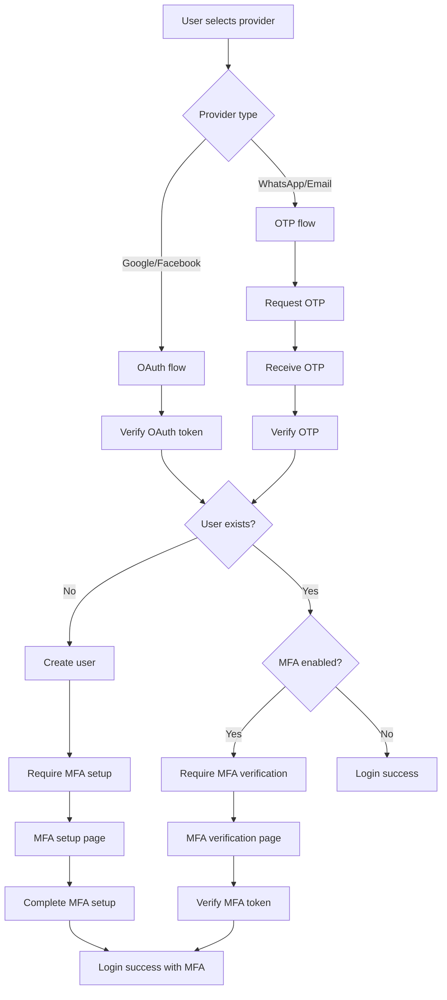

# OAuth2 Provider Credential Management Specification

## 1. Overview

This document provides a comprehensive technical specification for managing OAuth2 provider credentials in the Rangkai Edu backend application. It details the current implementation, security best practices, configuration structure, and integration with the existing authentication system.

## 2. Current OAuth2 Implementation Analysis

### 2.1 Supported Providers
The current implementation supports the following OAuth2 providers:
- Google OAuth2
- Facebook OAuth2
- WhatsApp (OTP-based)
- Email (OTP-based)

### 2.2 Database Schema
The database schema has been enhanced to support OAuth2 providers through migration 005:

```sql
-- Users table enhancements
ALTER TABLE users 
ADD COLUMN google_id VARCHAR(255) UNIQUE,
ADD COLUMN facebook_id VARCHAR(255) UNIQUE,
ADD COLUMN mfa_secret VARCHAR(255),
ADD COLUMN is_mfa_enabled BOOLEAN DEFAULT FALSE,
ADD COLUMN mfa_backup_codes TEXT[];

-- OAuth providers table enhancement
ALTER TABLE oauth_providers 
DROP CONSTRAINT IF EXISTS oauth_providers_provider_check;

ALTER TABLE oauth_providers 
ADD CONSTRAINT oauth_providers_provider_check 
CHECK (provider IN ('google', 'apple', 'facebook'));
```

### 2.3 Current Credential Storage
OAuth2 credentials are currently stored as environment variables:
- `GOOGLE_CLIENT_ID`
- `GOOGLE_CLIENT_SECRET`
- `FACEBOOK_CLIENT_ID`
- `FACEBOOK_CLIENT_SECRET`

### 2.4 Authentication Flow
The unified authentication system implements the following flow:



## 3. OAuth2 Provider Credential Management Requirements

### 3.1 Security Requirements
1. **Credential Protection**: OAuth2 client secrets must be protected at rest and in transit
2. **Environment Isolation**: Different credentials for development, staging, and production environments
3. **Access Control**: Restricted access to credential configuration
4. **Audit Logging**: Track access and changes to OAuth2 credentials
5. **Rotation Support**: Mechanisms for credential rotation without service interruption

### 3.2 Configuration Requirements
1. **Provider Flexibility**: Support for multiple OAuth2 providers
2. **Environment-Specific**: Different configurations per deployment environment
3. **Documentation**: Clear setup instructions for each provider
4. **Validation**: Configuration validation at application startup
5. **Fallback**: Graceful degradation when OAuth2 providers are misconfigured

### 3.3 Integration Requirements
1. **Existing Auth System**: Seamless integration with current JWT-based authentication
2. **User Management**: Proper linking of OAuth2 identities to user accounts
3. **MFA Support**: Integration with existing MFA implementation
4. **Error Handling**: Comprehensive error handling for OAuth2 flows
5. **Monitoring**: Health checks and monitoring for OAuth2 providers

## 4. Secure Storage and Rotation Strategy

### 4.1 Credential Storage Hierarchy
```
Credential Storage Hierarchy
├── Development
│   ├── Local development (.env files)
│   └── Shared development (environment variables)
├── Staging
│   ├── Pre-production testing
│   └── Environment variables/secrets management
└── Production
    ├── Live production environment
    └── Secure secrets management (HashiCorp Vault, AWS Secrets Manager)
```

### 4.2 Sensitive Variables
The following OAuth2-related variables contain sensitive information:
- `GOOGLE_CLIENT_SECRET`
- `FACEBOOK_CLIENT_SECRET`

### 4.3 Security Best Practices
1. **Environment-specific Storage**: Never store sensitive variables in version control
2. **Production Secrets**: Use secure secret management systems for production environments
3. **Access Control**: Limit access to environment configuration files
4. **Encryption at Rest**: Encrypt sensitive configuration files when stored
5. **Rotation Policy**: Implement regular credential rotation for all OAuth2 providers
6. **Audit Logging**: Log access to sensitive configuration values
7. **Transmission Security**: Use secure channels when transmitting configuration values

### 4.4 Credential Rotation Process
1. **Preparation**: Generate new credentials in OAuth2 provider consoles
2. **Staging**: Deploy new credentials to staging environment first
3. **Validation**: Test OAuth2 flows with new credentials in staging
4. **Production Deployment**: Deploy new credentials to production
5. **Verification**: Confirm OAuth2 flows work with new credentials
6. **Cleanup**: Remove old credentials from provider consoles after grace period

## 5. Environment-Specific Configuration Structure

### 5.1 Configuration Loading Priority
1. Environment variables (highest priority)
2. `.env` file values
3. Hardcoded defaults (lowest priority)

### 5.2 Environment Variables Specification

#### 5.2.1 Required Variables
All OAuth2 configuration variables are optional. If not provided, the respective OAuth2 provider functionality will be disabled.

#### 5.2.2 OAuth Configuration Variables
| Variable | Required | Default | Description |
|----------|----------|---------|-------------|
| `GOOGLE_CLIENT_ID` | No | `` | Google OAuth client ID |
| `GOOGLE_CLIENT_SECRET` | No | `` | Google OAuth client secret |
| `FACEBOOK_CLIENT_ID` | No | `` | Facebook OAuth client ID |
| `FACEBOOK_CLIENT_SECRET` | No | `` | Facebook OAuth client secret |

### 5.3 Environment-Specific Examples

#### 5.3.1 Development Environment
```env
# OAuth Configuration
GOOGLE_CLIENT_ID=dev_google_client_id
GOOGLE_CLIENT_SECRET=dev_google_client_secret
FACEBOOK_CLIENT_ID=dev_facebook_client_id
FACEBOOK_CLIENT_SECRET=dev_facebook_client_secret
```

#### 5.3.2 Staging Environment
```env
# OAuth Configuration
GOOGLE_CLIENT_ID=staging_google_client_id
GOOGLE_CLIENT_SECRET=staging_google_client_secret
FACEBOOK_CLIENT_ID=staging_facebook_client_id
FACEBOOK_CLIENT_SECRET=staging_facebook_client_secret
```

#### 5.3.3 Production Environment
```env
# OAuth Configuration
GOOGLE_CLIENT_ID=prod_google_client_id
GOOGLE_CLIENT_SECRET=prod_google_client_secret
FACEBOOK_CLIENT_ID=prod_facebook_client_id
FACEBOOK_CLIENT_SECRET=prod_facebook_client_secret
```

## 6. Integration with Existing Authentication System

### 6.1 User Identity Management
The system maintains OAuth2 identities through the enhanced users table:

```sql
-- OAuth2 identity fields in users table
google_id VARCHAR(255) UNIQUE,
facebook_id VARCHAR(255) UNIQUE
```

### 6.2 Authentication Flow Integration
1. **User Lookup**: Check for existing user by OAuth2 provider ID
2. **User Creation**: Create new user if OAuth2 identity not found
3. **JWT Generation**: Generate JWT token with user claims
4. **MFA Integration**: Enforce MFA for new users as per security policy

### 6.3 API Endpoint Integration
The unified authentication routes integrate OAuth2 providers:

```go
// OAuth2 routes in auth_routes.go
auth.POST("/google", controllers.GoogleAuthHandler)
auth.POST("/facebook", controllers.FacebookAuthHandler)
```

### 6.4 Data Model Integration
The User model supports OAuth2 provider identities:

```go
type User struct {
    // ... other fields
    GoogleID   sql.NullString `json:"google_id"`
    FacebookID sql.NullString `json:"facebook_id"`
    // ... other fields
}
```

## 7. Error Handling for OAuth2 Flows

### 7.1 Common OAuth2 Errors
1. **Invalid Credentials**: Misconfigured client ID/secret
2. **Token Validation Failure**: Invalid or expired OAuth2 tokens
3. **User Creation Failure**: Database errors during user creation
4. **MFA Setup Required**: New users requiring MFA setup
5. **Provider Unavailable**: OAuth2 provider service interruptions

### 7.2 Error Response Format
All OAuth2 endpoints follow consistent error response format:

```json
{
  "error": "string",
  "message": "string",
  "code": "integer"
}
```

### 7.3 Error Handling Strategies
1. **Graceful Degradation**: Disable OAuth2 providers with invalid configuration
2. **Retry Logic**: Implement retry mechanisms for transient errors
3. **User-Friendly Messages**: Provide clear guidance for authentication failures
4. **Logging**: Detailed error logging for debugging and monitoring
5. **Rate Limiting**: Prevent abuse of OAuth2 endpoints

## 8. Configuration Structure for Multiple Providers

### 8.1 Provider Configuration Model
The system supports a flexible configuration structure for multiple OAuth2 providers:

```go
type OAuthProviderConfig struct {
    Name          string `json:"name"`
    ClientID      string `json:"client_id"`
    ClientSecret  string `json:"client_secret"`
    RedirectURI   string `json:"redirect_uri"`
    Enabled       bool   `json:"enabled"`
    Scopes        []string `json:"scopes"`
}
```

### 8.2 Redirect URI Management
Each OAuth2 provider requires specific redirect URIs:
- Google: `https://yourdomain.com/api/auth/google/callback`
- Facebook: `https://yourdomain.com/api/auth/facebook/callback`

### 8.3 Provider-Specific Configuration
The configuration system allows for provider-specific settings:
- Custom scopes per provider
- Different redirect URIs per environment
- Provider-specific validation rules
- Custom error handling per provider

## 9. Documentation and Setup Instructions

### 9.1 Provider Setup Guide
Each OAuth2 provider requires specific setup steps:

#### 9.1.1 Google OAuth2 Setup
1. Create project in Google Cloud Console
2. Enable Google+ API
3. Create OAuth2 credentials
4. Configure authorized redirect URIs
5. Set client ID and secret in environment variables

#### 9.1.2 Facebook OAuth2 Setup
1. Create Facebook Developer account
2. Create Facebook App
3. Configure Facebook Login product
4. Set valid OAuth redirect URIs
5. Set client ID and secret in environment variables

### 9.2 Environment Configuration
1. Copy `config/.env.example` to `.env`
2. Set OAuth2 provider credentials
3. Validate configuration with startup checks
4. Test OAuth2 flows in development environment

### 9.3 Troubleshooting Guide
Common issues and solutions:
- "Invalid client credentials" - Verify client ID/secret
- "Redirect URI mismatch" - Check authorized redirect URIs
- "Provider unavailable" - Check provider service status
- "User creation failed" - Check database connectivity

## 10. Implementation Roadmap

### 10.1 Phase 1: Configuration Enhancement
1. Implement enhanced configuration loading for OAuth2 providers
2. Add configuration validation for OAuth2 credentials
3. Implement environment-specific configuration loading
4. Add health checks for OAuth2 provider configuration

### 10.2 Phase 2: Security Hardening
1. Implement secure credential storage for production environments
2. Add audit logging for OAuth2 credential access
3. Implement credential rotation mechanisms
4. Add encryption for sensitive configuration values

### 10.3 Phase 3: Monitoring and Maintenance
1. Implement monitoring for OAuth2 provider health
2. Add metrics for OAuth2 authentication flows
3. Implement automated credential validation
4. Create documentation for credential management procedures

## 11. Security Considerations

### 11.1 Credential Protection
- Never commit OAuth2 credentials to version control
- Use secure secret management for production environments
- Implement access controls for configuration files
- Encrypt sensitive configuration at rest

### 11.2 Transmission Security
- Use HTTPS for all OAuth2 communication
- Validate OAuth2 provider certificates
- Implement secure token handling
- Protect against man-in-the-middle attacks

### 11.3 Access Control
- Limit access to OAuth2 configuration
- Implement role-based access for credential management
- Log all access to sensitive configuration
- Regularly audit credential access logs

## 12. Compliance and Best Practices

### 12.1 Data Protection
- Follow privacy by design principles
- Minimize collection of OAuth2 user data
- Implement proper data retention policies
- Support user data deletion requests

### 12.2 Industry Standards
- Follow OAuth2 RFC 6749 specifications
- Implement proper token validation
- Use secure cryptographic practices
- Regular security assessments

This specification provides a comprehensive framework for managing OAuth2 provider credentials while maintaining security best practices and operational simplicity.