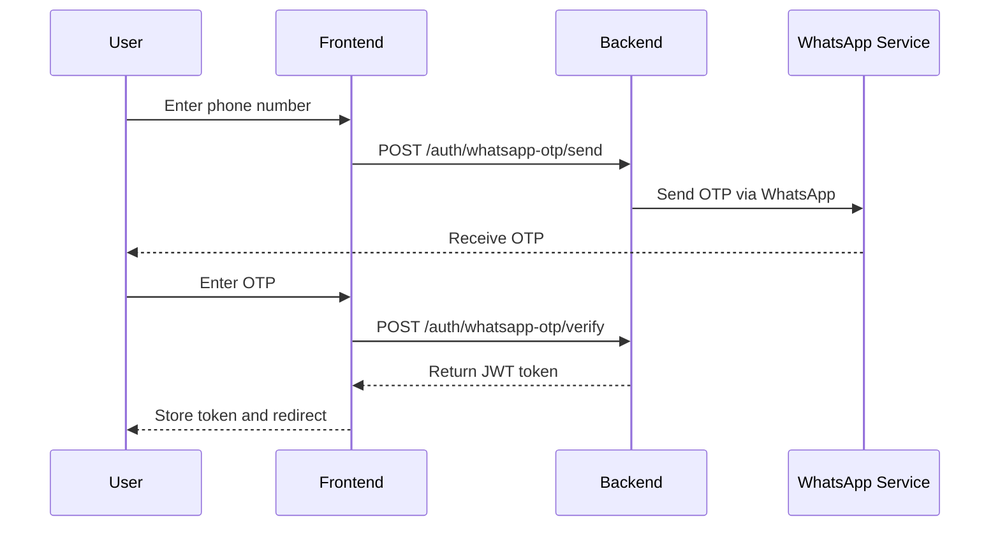
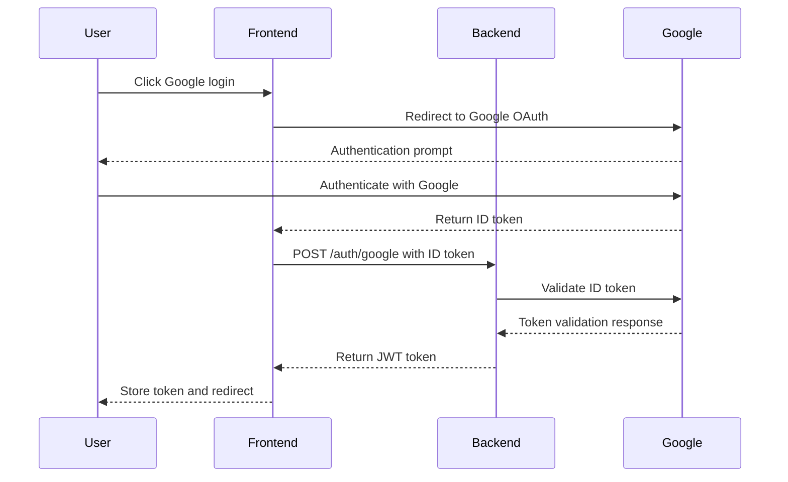
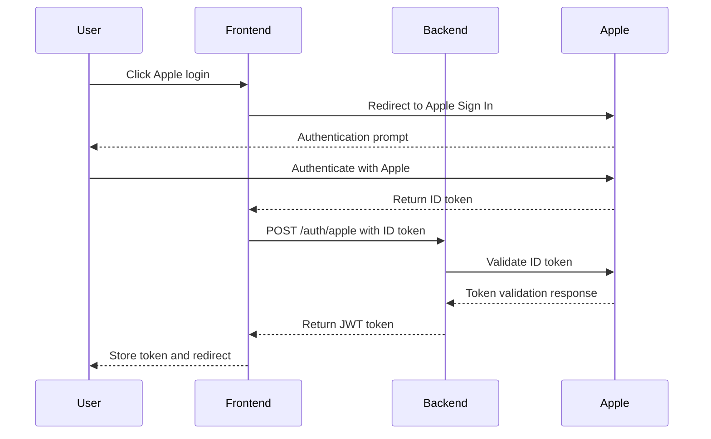

# Security Framework Integration

## Overview
This document outlines the security framework integration for the Rangkai Edu application. It includes authentication and authorization mechanisms, security best practices, and vulnerability identification.

## 1. Authentication Mechanisms

### 1.1 JWT-Based Authentication
Based on the existing API specification, the application uses JWT (JSON Web Tokens) for authentication:

#### Token Structure
- **Header**: Algorithm and token type
- **Payload**: User information (ID, role, expiration)
- **Signature**: HMAC SHA256 hash for token validation

#### Token Lifecycle
1. **Token Generation**: After successful authentication
2. **Token Validation**: On each protected API request
3. **Token Refresh**: Before expiration (optional)
4. **Token Revocation**: On logout or security events

#### Implementation Details
- **Expiration**: 24-hour validity for access tokens
- **Secret Management**: Environment-specific JWT secrets
- **Token Storage**: HTTP-only, secure cookies for web clients
- **Mobile Storage**: Secure storage (Keychain/Keystore)

### 1.2 Multi-Method Authentication

#### WhatsApp OTP Authentication

#### Google Authentication

#### Apple Authentication

### 1.3 Role Verification
Before authentication, users must verify their role:
- **Endpoint**: POST /auth/verify-role
- **Validation**: Check if role is valid for the application
- **Response**: Success/failure indication

## 2. Authorization Mechanisms

### 2.1 Role-Based Access Control (RBAC)

#### Roles
1. **Admin**: Full system access
2. **Teacher**: Access to class management, student data
3. **Student**: Access to learning materials, assignments
4. **Parent**: Access to child's academic information

#### Permission Model
- **Resource-Based**: Permissions tied to specific resources
- **Operation-Based**: Permissions for specific operations (create, read, update, delete)
- **Context-Based**: Permissions based on user context (class, school)

#### Implementation
- **Middleware**: Authorization middleware for API routes
- **Claims**: Role information embedded in JWT tokens
- **Policy Engine**: Centralized policy evaluation

### 2.2 API-Level Authorization

#### Route Protection
- **Protected Routes**: All API endpoints except authentication
- **Role Validation**: Check user role against required permissions
- **Scope Validation**: Check specific permissions for operations

#### Data Filtering
- **Row-Level Security**: Filter data based on user permissions
- **Column-Level Security**: Hide sensitive fields based on role
- **Aggregation Controls**: Limit data aggregation based on permissions

## 3. Security Best Practices

### 3.1 Backend Security

#### Input Validation
- **Sanitization**: Clean all user inputs
- **Validation**: Validate data types, formats, and ranges
- **Whitelisting**: Use allowlists for acceptable values

#### Secure Coding Practices
- **SQL Injection Prevention**: Use parameterized queries
- **XSS Prevention**: Escape output data
- **CSRF Protection**: Use anti-CSRF tokens
- **Rate Limiting**: Implement request rate limiting

#### Dependency Management
- **Vulnerability Scanning**: Regular scanning of dependencies
- **Update Policy**: Regular updates of dependencies
- **Security Audits**: Periodic security assessments

#### Logging and Monitoring
- **Security Events**: Log authentication attempts, authorization failures
- **Audit Trail**: Maintain audit logs for critical operations
- **Anomaly Detection**: Monitor for unusual patterns

### 3.2 Frontend Security

#### Client-Side Protection
- **Input Validation**: Client-side validation for user experience
- **Secure Storage**: Use secure storage for tokens
- **Content Security Policy**: Implement strict CSP headers
- **Subresource Integrity**: Use SRI for external resources

#### User Experience Security
- **Session Management**: Proper session handling
- **Logout Functionality**: Complete token invalidation
- **Password Policies**: Enforce strong password requirements (for future password-based auth)

#### Communication Security
- **HTTPS Enforcement**: All communication over HTTPS
- **Secure Headers**: Implement security headers
- **CORS Configuration**: Restrict cross-origin requests

## 4. Potential Vulnerabilities

### 4.1 Authentication Vulnerabilities

#### OTP-Related Risks
- **Brute Force**: Multiple OTP attempts
  - **Mitigation**: Rate limiting, OTP expiration
- **Interception**: OTP interception
  - **Mitigation**: Short expiration times, secure delivery

#### Token-Related Risks
- **Token Theft**: Access token stolen
  - **Mitigation**: Short expiration, secure storage
- **Token Replay**: Reuse of valid tokens
  - **Mitigation**: Token blacklisting, short expiration

#### Social Login Risks
- **Provider Compromise**: Google/Apple account compromise
  - **Mitigation**: Monitor authentication logs, implement 2FA
- **Token Validation**: Invalid token validation
  - **Mitigation**: Proper token verification, certificate validation

### 4.2 Authorization Vulnerabilities

#### Privilege Escalation
- **Role Manipulation**: Unauthorized role changes
  - **Mitigation**: Server-side role validation, immutable roles in tokens
- **Data Access**: Unauthorized data access
  - **Mitigation**: Row-level security, proper permission checks

#### Insecure Direct Object References
- **Resource Access**: Direct access to unauthorized resources
  - **Mitigation**: Access control checks, indirect references

### 4.3 Data Security Vulnerabilities

#### Data Exposure
- **Sensitive Data**: Unprotected sensitive information
  - **Mitigation**: Data encryption, proper access controls
- **Error Information**: Detailed error messages
  - **Mitigation**: Generic error messages, detailed logging server-side

#### Injection Attacks
- **SQL Injection**: Malicious SQL queries
  - **Mitigation**: Parameterized queries, ORM usage
- **Command Injection**: OS command execution
  - **Mitigation**: Input validation, secure API usage

## 5. Security Implementation Roadmap

### 5.1 Phase 1: Core Authentication
1. Implement JWT token generation and validation
2. Set up WhatsApp OTP authentication flow
3. Integrate Google authentication
4. Integrate Apple authentication
5. Implement role verification

### 5.2 Phase 2: Authorization Framework
1. Implement RBAC middleware
2. Set up route protection
3. Implement data filtering
4. Create permission management system

### 5.3 Phase 3: Security Hardening
1. Implement rate limiting
2. Set up security headers
3. Configure CSP and CORS
4. Implement input validation
5. Set up security logging

### 5.4 Phase 4: Monitoring and Auditing
1. Implement security event logging
2. Set up audit trails
3. Configure anomaly detection
4. Implement security dashboards

## 6. Compliance Considerations

### 6.1 Data Protection
- **Privacy by Design**: Implement privacy controls from the start
- **Data Minimization**: Collect only necessary data
- **User Rights**: Support data access, rectification, deletion

### 6.2 Regulatory Compliance
- **Local Regulations**: Comply with Indonesian data protection laws
- **Education Standards**: Follow educational data protection guidelines
- **Industry Standards**: Adhere to information security standards

## 7. Security Testing

### 7.1 Automated Security Testing
- **Dependency Scanning**: Regular vulnerability scans
- **Static Analysis**: Code security analysis
- **Dynamic Analysis**: Runtime security testing

### 7.2 Manual Security Testing
- **Penetration Testing**: Regular security assessments
- **Code Reviews**: Security-focused code reviews
- **Architecture Reviews**: Security architecture validation

## 8. Incident Response

### 8.1 Security Events
- **Detection**: Automated monitoring for security events
- **Classification**: Categorize incidents by severity
- **Response**: Defined response procedures

### 8.2 Breach Management
- **Containment**: Isolate affected systems
- **Investigation**: Determine scope and impact
- **Recovery**: Restore systems and data
- **Reporting**: Notify stakeholders as required

## 9. Security Training

### 9.1 Development Team
- **Secure Coding**: Training on secure coding practices
- **Threat Awareness**: Understanding common threats
- **Incident Response**: Procedures for handling security events

### 9.2 Operations Team
- **System Hardening**: Secure system configuration
- **Monitoring**: Security event monitoring
- **Response Procedures**: Incident response protocols

## 10. Next Steps

1. Implement JWT token management system
2. Set up authentication middleware
3. Create authorization policy engine
4. Implement security logging and monitoring
5. Configure security headers and CSP
6. Set up automated security scanning
7. Document security procedures and policies
8. Plan security training for development team
9. Establish incident response procedures
10. Schedule regular security assessments