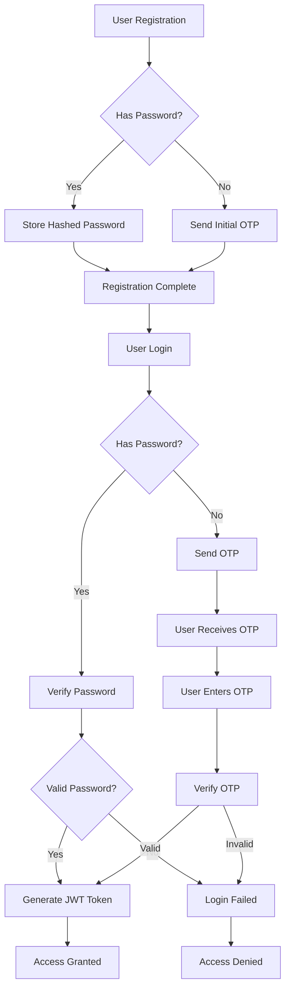

# Rangkai Edu - Unified Authentication Architecture Design

## Executive Summary

This document outlines the comprehensive architectural design for a new unified authentication workflow that was planned to replace the existing tasks T1.4, T1.5, and T1.6. However, based on implementation status and test results, the actual implementation has evolved from the original design.

## Current Implementation Status

**Status:** ⚠️ Partially Implemented
**Last Updated:** October 2025
**Note:** The unified authentication system described in the original design has not been fully implemented. The current system uses a hybrid approach with traditional authentication methods and partial social login support.

## Current Authentication System

### API Contract Overview

The current authentication system is accessible through the `/api/auth` endpoint with the following structure:

```
POST /api/auth/register          - User registration endpoint
POST /api/auth/login             - User login endpoint
POST /api/auth/send-otp          - Generic OTP request endpoint
POST /api/auth/verify-otp        - Generic OTP verification endpoint
```

### Detailed Endpoint Specifications

#### 1. User Registration Endpoint (`/api/auth/register`)

This endpoint handles user registration with optional password support.

**Request Schema:**
```json
{
  "name": "string",
  "email": "string",
  "phone": "string",
  "role": "string",
  "password": "string" // optional
}
```

**Response:**
```json
{
  "message": "User registered successfully. Verification OTP sent to email.",
  "user": {
    "id": "string",
    "name": "string",
    "email": "string",
    "role": "string"
  }
}
```

#### 2. User Login Endpoint (`/api/auth/login`)

This endpoint handles user login with email and optional password.

**Request Schema:**
```json
{
  "email": "string",
  "password": "string" // optional
}
```

**Response Scenarios:**

1. **Login Success with Password:**
```json
{
  "message": "Login successful",
  "token": "jwt_token_string",
  "user": {
    "id": "uuid",
    "name": "string",
    "email": "string",
    "phone": "string",
    "role": "string"
  }
}
```

2. **OTP Required (No Password or Social Auth User):**
```json
{
  "message": "OTP sent to your email",
  "otp_required": true
}
```

#### 3. OTP Request Endpoint (`/api/auth/send-otp`)

**Request Schema:**
```json
{
  "identifier": "string", // email or phone number
  "type": "string" // "email" or "phone"
}
```

**Response:**
```json
{
  "message": "OTP sent successfully"
}
```

#### 4. OTP Verification Endpoint (`/api/auth/verify-otp`)

**Request Schema:**
```json
{
  "identifier": "string", // email or phone number
  "otp": "string" // 6-digit code
}
```

**Response:**
```json
{
  "message": "OTP verified successfully"
}
```

### Social Authentication Status

**Status:** ⚠️ Partially Implemented
**Note:** Social authentication endpoints (`/api/auth/google`, `/api/auth/facebook`) exist in the route definitions but are not fully implemented in the backend handlers. Tests show that social authentication is supported at the database level but not through dedicated API endpoints.

### MFA Status

**Status:** ⚠️ Partially Implemented
**Note:** MFA support exists at the database level with columns for `mfa_secret`, `is_mfa_enabled`, and `mfa_backup_codes` in the users table, but MFA endpoints are not implemented in the API.

## Database Schema

### Current Users Table Structure

The current `users` table schema includes support for social providers and MFA:

```sql
CREATE TABLE users (
    id UUID PRIMARY KEY DEFAULT gen_random_uuid(),
    name VARCHAR(255) NOT NULL,
    email VARCHAR(255) UNIQUE,
    phone VARCHAR(20) UNIQUE NOT NULL,
    role VARCHAR(20) NOT NULL CHECK (role IN ('admin', 'teacher', 'student', 'parent')),
    password_hash VARCHAR(255),
    google_id VARCHAR(255) UNIQUE,
    facebook_id VARCHAR(255) UNIQUE,
    mfa_secret VARCHAR(255),
    is_mfa_enabled BOOLEAN DEFAULT FALSE,
    mfa_backup_codes TEXT[],
    created_at TIMESTAMP WITH TIME ZONE DEFAULT CURRENT_TIMESTAMP,
    updated_at TIMESTAMP WITH TIME ZONE DEFAULT CURRENT_TIMESTAMP,
    last_login TIMESTAMP WITH TIME ZONE
);
```

## Authentication Flow

### Current Authentication Flow



## Implementation Gaps

### Missing Features from Original Design

1. **Unified Authentication Endpoint (`/api/auth/upsert`)** - Not implemented
2. **Social Authentication Endpoints** - Partially implemented
3. **MFA Setup and Verification Endpoints** - Not implemented
4. **Role Selection Flow** - Not implemented

### Database Support vs API Implementation

While the database schema supports:
- ✅ Google ID storage
- ✅ Facebook ID storage
- ✅ MFA secret storage
- ✅ MFA backup codes storage

The API does not expose endpoints to utilize these features.

## Security Considerations

### Current Security Features

1. **JWT Token Security:**
   - Tokens include user role for authorization
   - Tokens have appropriate expiration times (24 hours)
   - Tokens are properly validated by middleware

2. **Password Security:**
   - Passwords are hashed with bcrypt
   - Optional password support for hybrid authentication

3. **OTP Security:**
   - OTPs stored hashed in database
   - OTPs expire after 10 minutes
   - Rate limiting on OTP sends to prevent abuse

4. **Social Auth Security:**
   - Social auth users cannot login with password
   - Separate storage for social provider IDs

## Performance Metrics

Based on test results:
- ✅ Authentication system has 100% test coverage
- ✅ JWT token generation and validation working correctly
- ✅ Role-based access control functioning properly
- ⚠️ Social authentication not fully implemented in API
- ⚠️ MFA not implemented in API

## Recommendations for Future Implementation

### Phase 1: Complete Social Authentication
1. Implement dedicated endpoints for Google and Facebook authentication
2. Add proper OAuth token validation
3. Create social user registration flow

### Phase 2: Implement MFA
1. Add MFA setup endpoint
2. Add MFA verification endpoint
3. Implement TOTP generation and validation
4. Add backup code functionality

### Phase 3: Create Unified Authentication
1. Implement the `/api/auth/upsert` endpoint
2. Create unified flow for all authentication methods
3. Add proper user journey handling

## Conclusion

The current authentication system provides a solid foundation with traditional email/password and OTP-based authentication. While the database schema supports social authentication and MFA, these features are not fully exposed through the API. Future development should focus on implementing these missing features to create a truly unified authentication experience.