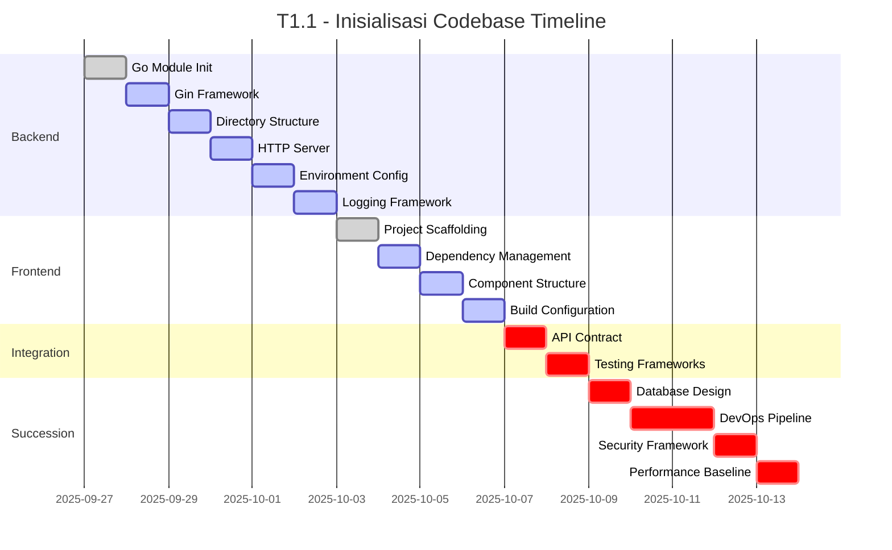

# Rangkai Edu - T1.1: Inisialisasi Codebase
**Project Initialization Plan**

---

## Executive Summary

This document outlines the comprehensive plan for T1.1 "Inisialisasi Codebase" of the Rangkai Edu project. The task involves establishing the foundational codebase for both backend and frontend components, setting up integration points, and preparing for subsequent development phases. The plan is structured into four distinct phases with clear ownership, timelines, and deliverables.

## Project Overview

- **Project**: Rangkai Edu
- **Task**: T1.1 - Inisialisasi Codebase
- **Duration**: 2 Weeks
- **Teams**: Backend Team (2 developers), Frontend Team (2 developers)

## Phase 1: Backend Infrastructure Initialization
**Duration**: 5 Days | **Ownership**: Backend Team

### Objectives
- Establish Go-based backend infrastructure using Gin framework
- Create standardized directory structure
- Implement basic HTTP server with health check endpoints
- Set up environment configuration and logging framework

### Detailed Tasks

#### 1.1 Go Module Initialization
- Initialize Go module with proper versioning (go mod init)
- Configure go.mod and go.sum files
- Set up dependency management structure
- **Time Estimate**: 0.5 days
- **Deliverable**: Initialized Go module with basic structure

#### 1.2 Gin Framework Integration
- Install and configure Gin framework
- Set up basic routing mechanism
- Configure middleware integration points
- **Time Estimate**: 1 day
- **Deliverable**: Gin framework integrated with basic routing

#### 1.3 Standardized Directory Architecture
- Create controllers directory for request handling
- Create models directory for data structures
- Create routes directory for API endpoint definitions
- Create middleware directory for cross-cutting concerns
- Create config directory for configuration management
- Create utils directory for helper functions
- **Time Estimate**: 1 day
- **Deliverable**: Complete directory structure with placeholder files

#### 1.4 Basic HTTP Server Implementation
- Implement main server entry point
- Create health check endpoints (/health, /ping)
- Set up graceful shutdown mechanism
- Configure server listening on appropriate ports
- **Time Estimate**: 1 day
- **Deliverable**: Running HTTP server with health endpoints

#### 1.5 Environment Configuration Setup
- Implement environment variable management
- Create configuration loading mechanism
- Set up different environments (development, staging, production)
- **Time Estimate**: 0.5 days
- **Deliverable**: Environment configuration system

#### 1.6 Initial Logging Framework Implementation
- Integrate structured logging solution
- Configure log levels and output formats
- Set up log rotation mechanism
- **Time Estimate**: 1 day
- **Deliverable**: Functional logging framework

### Success Criteria
- Go module properly initialized with Gin framework
- Standardized directory structure in place
- HTTP server running with health check endpoints
- Environment configuration system functional
- Logging framework implemented and tested

### Dependencies
- Go language environment (version 1.19+)
- Git repository access

---

## Phase 2: Frontend Foundation Setup
**Duration**: 3 Days | **Ownership**: Frontend Team

### Objectives
- Establish frontend project scaffolding
- Install and configure dependencies
- Create basic component structure
- Set up build configuration

### Detailed Tasks

#### 2.1 Project Scaffolding
- Review existing frontend structure (Vite-based React application)
- Update project configuration files as needed
- Ensure compatibility with backend API structure
- **Time Estimate**: 0.5 days
- **Deliverable**: Updated project scaffolding

#### 2.2 Dependency Installation and Update
- Audit existing dependencies in package.json
- Update dependencies to latest stable versions
- Install any additional required packages
- **Time Estimate**: 1 day
- **Deliverable**: Updated dependency configuration

#### 2.3 Basic Component Structure
- Review existing component structure in src/components
- Create additional base components as needed
- Establish component naming conventions
- **Time Estimate**: 1 day
- **Deliverable**: Enhanced component structure

#### 2.4 Initial Build Configuration
- Review Vite configuration in vite.config.js
- Optimize build settings for development and production
- Configure environment variables for frontend
- **Time Estimate**: 0.5 days
- **Deliverable**: Optimized build configuration

### Success Criteria
- Frontend project properly configured and updated
- Dependencies current and compatible
- Component structure organized and extensible
- Build configuration optimized

### Dependencies
- Node.js environment (version 16+)
- NPM or Yarn package manager
- Existing frontend codebase

---

## Phase 3: Integration and Validation
**Duration**: 2 Days | **Collaborative Effort**

### Objectives
- Define API contract between frontend and backend
- Set up initial testing frameworks
- Configure code quality tools
- Validate integration between components

### Detailed Tasks

#### 3.1 API Contract Definition
- Document REST API endpoints and data structures
- Define request/response formats
- Create API specification document
- **Time Estimate**: 0.5 days
- **Deliverable**: API contract documentation

#### 3.2 Initial Testing Framework Setup
- Set up backend testing framework (Go testing package)
- Configure frontend testing (Vitest or Jest)
- Create basic test structure
- **Time Estimate**: 0.5 days
- **Deliverable**: Testing frameworks configured

#### 3.3 Code Quality Tools Configuration
- Configure linters for backend (golint, go vet)
- Configure linters for frontend (ESLint)
- Set up code formatting tools (gofmt, Prettier)
- **Time Estimate**: 0.5 days
- **Deliverable**: Code quality tools configured

#### 3.4 Integration Testing Procedures
- Create end-to-end integration tests
- Validate frontend-backend communication
- Document testing procedures
- **Time Estimate**: 0.5 days
- **Deliverable**: Integration testing procedures

### Success Criteria
- Clear API contract defined and documented
- Testing frameworks configured for both components
- Code quality tools implemented
- Successful integration validation

### Dependencies
- Completed backend and frontend foundational setups
- Defined communication protocols

---

## Phase 4: Succession Planning
**Duration**: 4 Days | **Project Leadership**

### Objectives
- Prepare roadmap for subsequent development phases
- Establish foundation for database design
- Configure DevOps pipeline
- Plan security and performance considerations

### Detailed Tasks

#### 4.1 Database Schema Design Preparation (T1.2)
- Define initial entity relationship models
- Plan database migration strategy
- Select appropriate database technology
- **Time Estimate**: 1 day
- **Deliverable**: Database design plan

#### 4.2 DevOps Pipeline Configuration (T1.3)
- Design CI/CD pipeline structure
- Configure automated testing workflows
- Set up deployment environments
- **Time Estimate**: 1.5 days
- **Deliverable**: DevOps pipeline design

#### 4.3 Security Framework Integration
- Plan authentication and authorization mechanisms
- Define security best practices
- Identify potential vulnerabilities
- **Time Estimate**: 1 day
- **Deliverable**: Security framework plan

#### 4.4 Performance Baseline Establishment
- Define performance metrics and KPIs
- Plan load testing strategies
- Establish monitoring requirements
- **Time Estimate**: 0.5 days
- **Deliverable**: Performance baseline plan

### Success Criteria
- Clear roadmap for subsequent phases
- Database design foundation established
- DevOps pipeline planned
- Security and performance considerations addressed

### Dependencies
- Completed initial codebase setup
- Defined project requirements for future phases

---

## Timeline Overview

## Team Structure and Communication

### Backend Team (2 Developers)
- **Lead**: Backend Technical Lead
- **Responsibilities**: 
  - Go module and Gin framework implementation
  - Server infrastructure and configuration
  - Logging and environment management
- **Daily Sync**: 10:00 AM Standup
- **Communication Channel**: #backend-team Slack channel

### Frontend Team (2 Developers)
- **Lead**: Frontend Technical Lead
- **Responsibilities**:
  - Project scaffolding and dependency management
  - Component structure and build configuration
- **Daily Sync**: 10:30 AM Standup
- **Communication Channel**: #frontend-team Slack channel

### Cross-Team Coordination
- **Integration Lead**: Project Technical Lead
- **Responsibilities**:
  - API contract definition
  - Integration testing and validation
  - Succession planning coordination
- **Cross-Team Sync**: 3:00 PM Daily Integration Meeting
- **Communication Channel**: #t1-1-init Slack channel

## Risk Mitigation Strategies

### Technical Risks
1. **Dependency Compatibility Issues**
   - Mitigation: Create isolated development environments
   - Contingency: Maintain alternative framework options

2. **Integration Challenges**
   - Mitigation: Define API contracts early
   - Contingency: Implement mock services for development

3. **Performance Bottlenecks**
   - Mitigation: Establish performance baselines early
   - Contingency: Plan for optimization iterations

### Resource Risks
1. **Team Member Unavailability**
   - Mitigation: Cross-train team members
   - Contingency: Re-allocate tasks within teams

2. **Tooling Issues**
   - Mitigation: Document setup procedures
   - Contingency: Maintain alternative development environments

## Success Criteria and Acceptance Checkpoints

### Phase 1 Completion (Backend)
- [ ] Go module initialized with Gin framework
- [ ] Standardized directory structure implemented
- [ ] HTTP server running with health endpoints
- [ ] Environment configuration functional
- [ ] Logging framework implemented

### Phase 2 Completion (Frontend)
- [ ] Project scaffolding updated
- [ ] Dependencies current and compatible
- [ ] Component structure organized
- [ ] Build configuration optimized

### Phase 3 Completion (Integration)
- [ ] API contract documented
- [ ] Testing frameworks configured
- [ ] Code quality tools implemented
- [ ] Integration testing successful

### Phase 4 Completion (Succession)
- [ ] Database design plan created
- [ ] DevOps pipeline design completed
- [ ] Security framework plan documented
- [ ] Performance baseline established

## Deliverables

1. **Codebase**: Fully initialized backend and frontend codebases
2. **Documentation**: API contract, setup guides, and architecture documentation
3. **Testing Framework**: Configured testing environments for both components
4. **Roadmap**: Detailed plan for subsequent development phases
5. **Integration Validation**: Successful communication between frontend and backend

## Approval

**Prepared by**: Roo, Technical Architect
**Date**: 2025-09-27
**Version**: 1.0

---