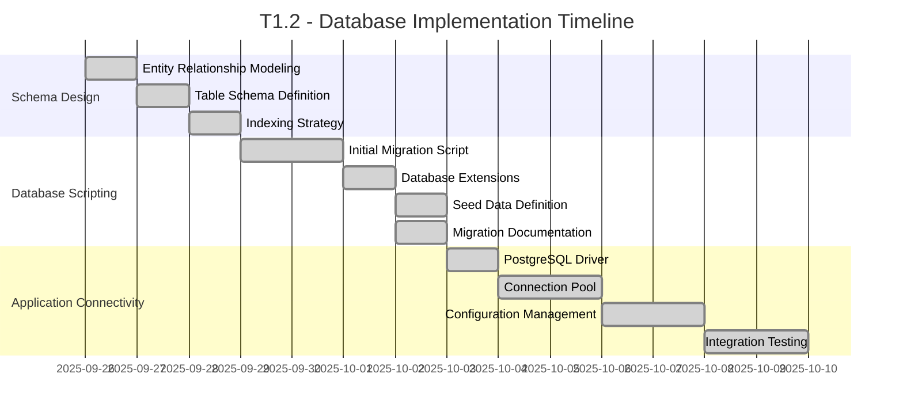

# Rangkai Edu - T1.2: Database Implementation
**Database Design & Setup Plan**

---

## Executive Summary

This document outlines the comprehensive plan for T1.2 "Database Implementation" of the Rangkai Edu project. The task involves designing the database schema, creating migration scripts, implementing database connectivity, and establishing configuration management for the PostgreSQL database. The plan is structured into three distinct phases with clear ownership, timelines, and deliverables.

The database implementation will establish a robust foundation for storing user authentication data, educational content, and administrative information. The implementation follows industry best practices for database design, security, and performance optimization.

## Project Overview

- **Project**: Rangkai Edu
- **Task**: T1.2 - Database Implementation
- **Duration**: 2 Weeks
- **Team**: Backend Team (2 developers)

## Phase 1: Database Schema Design (T1.2.1)
**Duration**: 3 Days | **Ownership**: Backend Team

### Objectives
- Design comprehensive database schema for all application entities
- Define relationships between tables with appropriate constraints
- Plan indexing strategy for optimal query performance
- Document entity relationship models and data flow

### Detailed Tasks

#### 1.1 Entity Relationship Modeling
- Define all core entities based on application requirements
- Establish primary and foreign key relationships
- Create entity relationship diagram using Mermaid
- Document relationship cardinality and constraints
- **Time Estimate**: 1 day
- **Deliverable**: Complete entity relationship model documentation

#### 1.2 Table Schema Definition
- Design users, schools, classes, subjects, and related tables
- Define authentication-related tables (auth_tokens, otp_verifications)
- Create junction tables for many-to-many relationships
- Specify data types, constraints, and default values
- **Time Estimate**: 1 day
- **Deliverable**: Detailed table schema definitions

#### 1.3 Indexing and Performance Strategy
- Identify columns requiring indexes for query optimization
- Plan composite indexes for frequently joined queries
- Define unique constraints for data integrity
- Document performance considerations and optimization strategies
- **Time Estimate**: 1 day
- **Deliverable**: Indexing strategy documentation

### Success Criteria
- Complete entity relationship model documented
- All table schemas defined with appropriate constraints
- Indexing strategy planned for optimal performance
- Database design documentation completed

### Implementation Notes
- Defined 10 core entities: users (with roles: admin, teacher, student, parent), schools, classes, subjects, teachers, students, parents, auth_tokens, otp_verifications, oauth_providers
- Added 2 junction tables: class_teachers, student_parents
- Established relationships: one-to-many (e.g., schools to classes), many-to-many (e.g., classes to teachers via class_teachers)
- Created Mermaid ER diagram in docs/database-design.md
- Designed schemas using UUID primary keys, timestamps, enums for roles, constraints for data integrity
- Implemented indexing: individual indexes on email and role in users, composite indexes on junction tables
- Total: 12 tables
- Updated docs/database-design.md with full schema details

### Dependencies
- Application requirements documentation
- API specification document
- PostgreSQL database technology selection

---

## Phase 2: Database Scripting (T1.2.2)
**Duration**: 4 Days | **Ownership**: Backend Team

### Objectives
- Create SQL migration scripts for database initialization
- Implement database extensions and functions
- Define seed data for development and testing
- Establish migration strategy for future changes

### Detailed Tasks

#### 2.1 Initial Migration Script Creation
- Create 001_create_tables.sql migration file
- Implement UUID extension for PostgreSQL
- Define all core tables with appropriate constraints
- Add indexes for performance optimization
- **Time Estimate**: 1.5 days
- **Deliverable**: Complete initial migration script

#### 2.2 Database Extension Implementation
- Enable required PostgreSQL extensions (uuid-ossp)
- Implement custom functions or stored procedures if needed
- Configure database-level settings for optimal performance
- **Time Estimate**: 0.5 days
- **Deliverable**: Database extensions and configurations

#### 2.3 Seed Data Definition
- Create seed data for development environments
- Define test users with different roles (admin, teacher, student, parent)
- Create sample schools, classes, and subjects
- **Time Estimate**: 1 day
- **Deliverable**: Seed data scripts for development

#### 2.4 Migration Strategy Documentation
- Document migration process using Goose migration tool
- Define up and down migration procedures
- Create guidelines for future schema changes
- **Time Estimate**: 1 day
- **Deliverable**: Migration strategy documentation

### Success Criteria
- Initial migration script created and tested
- Database extensions properly configured
- Seed data defined for development environments
- Migration strategy documented

### Implementation Notes
- Updated migrations/001_create_tables.sql: includes extensions (pgcrypto, uuid-ossp), creation of 12 tables with foreign keys, triggers, and indexes
- Created migrations/002_seed_data.sql: seed data including 1 admin, 2 teachers, 3 students, 2 parents, 2 schools, 4 classes, 5 subjects, and populated junction tables
- Created docs/migration-guide.md: documents Goose migration tool usage, up/down procedures, and guidelines for future changes
- Decision: Used pgcrypto for UUID generation in triggers

### Dependencies
- Completed database schema design
- PostgreSQL database environment
- Migration tool (Goose) selection

---

## Phase 3: Application Connectivity (T1.2.3 - T1.2.5)
**Duration**: 7 Days | **Ownership**: Backend Team

### Objectives
- Implement PostgreSQL driver integration
- Create database connection management system
- Establish configuration management for database settings
- Validate database connectivity with application

### Detailed Tasks

#### 3.1 PostgreSQL Driver Installation (T1.2.3)
- Install pgx PostgreSQL driver for Go
- Configure driver dependencies in go.mod
- Test basic connectivity with PostgreSQL database
- **Time Estimate**: 1 day
- **Deliverable**: PostgreSQL driver installed and configured

#### 3.2 Database Connection Pool Implementation (T1.2.4)
- Implement connection pooling using pgxpool
- Configure pool settings (min/max connections, timeouts)
- Create singleton pattern for database instance management
- Implement connection health checks
- **Time Estimate**: 2 days
- **Deliverable**: Database connection pool implementation

#### 3.3 Configuration Management System (T1.2.5)
- Implement environment-based configuration loading
- Create .env.example file with required database settings
- Implement configuration validation
- Document configuration usage in README files
- **Time Estimate**: 2 days
- **Deliverable**: Complete configuration management system

#### 3.4 Integration Testing and Validation
- Create example usage files for database package
- Test database connectivity with various configurations
- Validate connection pool behavior under load
- Document integration testing procedures
- **Time Estimate**: 2 days
- **Deliverable**: Integration testing validation

### Success Criteria
- PostgreSQL driver properly installed and configured
- Database connection pool implemented with appropriate settings
- Configuration management system functional
- Successful integration testing with application

### Implementation Notes
- Selected pgx v4 driver for stability (v5 deferred)
- Implemented singleton database connection pool in pkg/db/db.go using pgxpool: MinConns=4, MaxConns=20, with health checks
- Added environment configuration in config/config.go: uses godotenv for loading, validation, and includes .env.example
- Created examples/db_example.go demonstrating queries with seeded data
- Updated tests and documentation for database integration
- Decision: pgx v4 chosen for proven stability in production environments

### Dependencies
- Go language environment (version 1.19+)
- PostgreSQL database server
- Completed database schema and migration scripts

---

## Timeline Overview

## Team Structure and Communication

### Backend Team (2 Developers)
- **Lead**: Backend Technical Lead
- **Responsibilities**: 
  - Database schema design and implementation
  - Migration script creation and management
  - Database connectivity and configuration
  - Performance optimization and security
- **Daily Sync**: 10:00 AM Standup
- **Communication Channel**: #backend-team Slack channel

### Cross-Team Coordination
- **Integration Lead**: Project Technical Lead
- **Responsibilities**:
  - Coordination with frontend team for data requirements
  - API contract alignment with database schema
  - Performance and security review
- **Cross-Team Sync**: 3:00 PM Daily Integration Meeting
- **Communication Channel**: #t1-2-db Slack channel

## Risk Mitigation Strategies

### Technical Risks
1. **Database Performance Issues**
   - Mitigation: Implement proper indexing and query optimization
   - Contingency: Plan for database tuning and optimization iterations

2. **Connection Pool Exhaustion**
   - Mitigation: Configure appropriate pool sizes and timeouts
   - Contingency: Implement connection monitoring and alerting

3. **Migration Failures**
   - Mitigation: Create comprehensive backup and rollback procedures
   - Contingency: Implement migration testing in staging environment

### Resource Risks
1. **Team Member Unavailability**
   - Mitigation: Cross-train team members on database implementation
   - Contingency: Re-allocate tasks within the backend team

2. **Database Technology Issues**
   - Mitigation: Document setup procedures and configuration details
   - Contingency: Maintain alternative database setup procedures

## Success Criteria and Acceptance Checkpoints

### Phase 1 Completion (Schema Design)
- [x] Entity relationship model documented
- [x] All table schemas defined with constraints
- [x] Indexing strategy planned
- [x] Database design documentation completed

### Phase 2 Completion (Database Scripting)
- [x] Initial migration script created and tested
- [x] Database extensions configured
- [x] Seed data defined for development
- [x] Migration strategy documented

### Phase 3 Completion (Application Connectivity)
- [x] PostgreSQL driver installed and configured
- [x] Database connection pool implemented
- [x] Configuration management system functional
- [x] Integration testing successful

## Deliverables

1. **Database Schema**: Complete database design with all tables, relationships, and constraints
2. **Migration Scripts**: SQL scripts for database initialization and future schema changes
3. **Database Connectivity**: Implemented database connection management with pooling
4. **Configuration Management**: Environment-based configuration system for database settings
5. **Documentation**: Database design documentation, migration strategy, and usage guides
6. **Integration Validation**: Successful database connectivity with the application

## Approval

**Updated by**: Roo, Orchestrator
**Date**: 2025-09-28
**Version**: 2.0
All phases completed successfully.

---