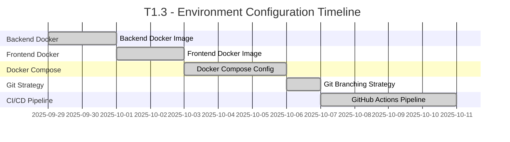

# Rangkai Edu - T1.3: Environment Configuration
**Development, Staging, and Production Environment Setup Plan**

---

## Executive Summary

This document outlines the comprehensive plan for T1.3 "Environment Configuration" of the Rangkai Edu project. The task involves setting up development, staging, and production environments, creating Docker images for both frontend and backend components, configuring Docker Compose for local development, establishing proper Git branching strategies, and implementing CI/CD pipelines using GitHub Actions. The plan is structured into five distinct subtasks with clear ownership, timelines, and deliverables.

## Project Overview

- **Project**: Rangkai Edu
- **Task**: T1.3 - Environment Configuration
- **Duration**: 2 Weeks
- **Team**: DevOps Team (1 specialist)

## T1.3 Subtasks

### T1.3.1: Backend Docker Image Creation
**Duration**: 2 Days | **Ownership**: DevOps Mode

#### Objectives
- Create multi-stage Docker image for Go backend application
- Optimize image size and security
- Implement proper build arguments and environment variables
- Document Docker image usage

#### Detailed Tasks
1. Create Dockerfile for backend application with multi-stage build
2. Implement build optimization techniques (Go modules cache, minimal base image)
3. Configure build arguments for different environments
4. Test Docker image build process
5. Document Docker image creation and usage

#### Acceptance Criteria
- Successfully built Go backend Docker image with multi-stage build
- Docker image optimized for size and security
- Proper documentation of image usage

### T1.3.2: Frontend Docker Image Creation
**Duration**: 2 Days | **Ownership**: DevOps Mode

#### Objectives
- Create multi-stage Docker image for React/Vite frontend application
- Optimize build process and final image size
- Implement proper environment variable handling
- Document Docker image usage

#### Detailed Tasks
1. Create Dockerfile for frontend application with multi-stage build
2. Implement build optimization (npm cache, production build)
3. Configure environment variables for different deployment targets
4. Test Docker image build process
5. Document Docker image creation and usage

#### Acceptance Criteria
- Successfully built React/Vite frontend Docker image with multi-stage build
- Docker image optimized for size and performance
- Proper documentation of image usage

### T1.3.3: Docker Compose Configuration
**Duration**: 3 Days | **Ownership**: DevOps Mode

#### Objectives
- Create Docker Compose configuration for local development
- Configure services for backend, frontend, and database
- Implement environment-specific configurations
- Document usage and customization options

#### Detailed Tasks
1. Create docker-compose.yml for local development environment
2. Configure PostgreSQL service with proper volume mounting
3. Set up networking between services
4. Implement environment variable management through .env files
5. Test complete environment startup with `docker-compose up`
6. Document Docker Compose usage

#### Acceptance Criteria
- Running `docker-compose up` successfully starts all containers without errors
- All services properly configured and networked
- Environment-specific configurations implemented
- Proper documentation of Docker Compose usage

### T1.3.4: Git Branching Strategy Implementation
**Duration**: 1 Day | **Ownership**: DevOps Mode

#### Objectives
- Establish proper Git branching strategy
- Implement branch protection rules
- Document branching conventions
- Set up repository structure for collaboration

#### Detailed Tasks
1. Create required branches (main, develop, staging)
2. Implement branch protection rules for main and staging
3. Document Git branching strategy and workflows
4. Set up proper merge strategies and code review processes

#### Acceptance Criteria
- Git repository has proper branch structure (main, develop, staging) with protection rules
- Branching strategy documented and communicated to team
- Proper merge strategies implemented

### T1.3.5: GitHub Actions CI/CD Pipeline
**Duration**: 4 Days | **Ownership**: DevOps Mode

#### Objectives
- Implement CI/CD pipeline using GitHub Actions
- Configure automated testing and building
- Set up deployment workflows for different environments
- Implement proper security practices

#### Detailed Tasks
1. Create GitHub Actions workflow files for CI/CD
2. Implement automated testing for both frontend and backend
3. Configure Docker image building and pushing to registry
4. Set up deployment workflows for staging environment
5. Implement security scanning and quality checks
6. Test workflow triggers and execution

#### Acceptance Criteria
- GitHub Actions workflow file exists and successfully triggers on push to develop branch
- Automated testing and building configured for both components
- Deployment workflows implemented for staging environment
- Security and quality checks integrated into pipeline

## Dependencies Between Phases

- **Phase 2 (T1.3.2)** depends on **Phase 1 (T1.3.1)** - Both Docker images need to be created before configuring Docker Compose
- **Phase 3 (T1.3.3)** depends on **Phases 1 and 2** - Docker Compose configuration requires both backend and frontend Docker images
- **Phase 5 (T1.3.5)** depends on **Phase 4 (T1.3.4)** - CI/CD pipeline implementation requires proper Git branching structure

## Timeline Overview

## Team Structure and Communication

### DevOps Team (1 Specialist)
- **Role**: DevOps Specialist
- **Responsibilities**: 
  - Docker image creation and optimization
  - Docker Compose configuration
  - Git branching strategy implementation
  - CI/CD pipeline setup
- **Daily Sync**: 10:00 AM Standup
- **Communication Channel**: #devops-team Slack channel

## Risk Mitigation Strategies

### Technical Risks
1. **Docker Build Failures**
   - Mitigation: Implement proper error handling and logging in Dockerfiles
   - Contingency: Maintain alternative build strategies

2. **Environment Configuration Issues**
   - Mitigation: Use environment files and proper variable substitution
   - Contingency: Implement fallback configurations

3. **CI/CD Pipeline Failures**
   - Mitigation: Implement comprehensive testing in pipeline
   - Contingency: Set up rollback procedures and notifications

### Resource Risks
1. **Tooling Issues**
   - Mitigation: Document setup procedures and version requirements
   - Contingency: Maintain alternative development environments

## Success Criteria and Acceptance Checkpoints

### T1.3.1 Completion (Backend Docker)
- [ ] Successfully built Go backend Docker image with multi-stage build
- [ ] Docker image optimized for size and security
- [ ] Documentation of image usage created

### T1.3.2 Completion (Frontend Docker)
- [ ] Successfully built React/Vite frontend Docker image with multi-stage build
- [ ] Docker image optimized for size and performance
- [ ] Documentation of image usage created

### T1.3.3 Completion (Docker Compose)
- [ ] Running `docker-compose up` successfully starts all containers without errors
- [ ] All services properly configured and networked
- [ ] Environment-specific configurations implemented
- [ ] Documentation of Docker Compose usage created

### T1.3.4 Completion (Git Branching)
- [ ] Git repository has proper branch structure (main, develop, staging) with protection rules
- [ ] Branching strategy documented
- [ ] Merge strategies implemented

### T1.3.5 Completion (CI/CD Pipeline)
- [ ] GitHub Actions workflow file exists and successfully triggers on push to develop branch
- [ ] Automated testing and building configured
- [ ] Deployment workflows implemented
- [ ] Security and quality checks integrated

## Follow-up Task

[new_task]
<mode>documentation-writer</mode>
<message>Please update the project README.md files with the following information:
1. Docker/Docker Compose usage instructions for both backend and frontend
2. Git branching strategy overview with workflow diagrams
3. Environment setup instructions for new developers
4. CI/CD pipeline documentation with trigger information</message>
[/new_task]

## Deliverables

1. **Docker Images**: Multi-stage Docker images for both backend and frontend applications
2. **Docker Compose Configuration**: Complete configuration for local development environment
3. **Git Repository**: Properly configured repository with branch protection rules
4. **CI/CD Pipeline**: GitHub Actions workflows for automated testing and deployment
5. **Documentation**: Updated documentation for all implemented components

## Approval

**Prepared by**: DevOps Specialist
**Date**: 2025-09-29
**Version**: 1.0