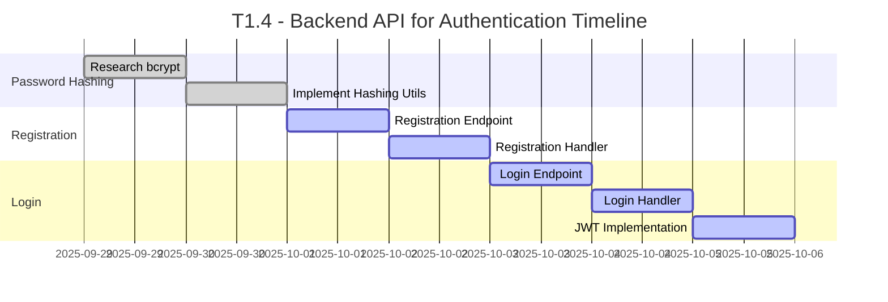

# Rangkai Edu - T1.4: Backend API for Authentication
**User Registration and Login API Implementation Plan**

---

## Executive Summary

This document outlines the comprehensive plan for T1.4 "Backend API for Authentication" of the Rangkai Edu project. The task involves implementing secure user authentication mechanisms including optional password hashing, OTP-based login via email or phone (WhatsApp number), user registration, and login functionality with JWT token generation. The plan is structured into distinct subtasks with clear ownership, timelines, and deliverables.

The implementation will establish a secure foundation for user authentication using OTP for email/phone, with optional password support, following industry best practices for security and token-based authentication.

## Project Overview

- **Project**: Rangkai Edu
- **Task**: T1.4 - Backend API for Authentication
- **Duration**: 1 Week
- **Team**: Backend Team (2 developers)

## T1.4 Subtasks

### T1.4.1: Research and Implement Password Hashing using bcrypt (Optional for Hybrid Support)
**Duration**: 2 Days | **Ownership**: Project Research then Code Mode

#### Objectives
- Research and understand bcrypt password hashing algorithm for optional password support
- Implement secure password hashing utility in Go
- Create helper functions for password hashing and verification
- Document security considerations and best practices

#### Detailed Tasks
1. Research bcrypt algorithm and its advantages over other hashing methods
2. Analyze existing Go bcrypt libraries and select appropriate one
3. Create password hashing utility package with helper functions
4. Implement password verification functionality
5. Test hashing and verification functions with various inputs
6. Document implementation details and security considerations

#### Acceptance Criteria
- [x] Password hashing utility package created with proper functions
- [x] bcrypt library properly integrated and configured
- [x] Helper functions for hashing and verification implemented
- [x] Security documentation created

### T1.4.2: Build User Registration Handler with Optional Password and Initial OTP
**Duration**: 2 Days | **Ownership**: Code Mode (Go specialist)

#### Objectives
- Create REST API endpoint for user registration
- Implement request validation and error handling
- Integrate optional password hashing utility
- Store user data in database with proper validation
- Send initial OTP to email after registration

#### Detailed Tasks
1. Create `/register` API endpoint in routes package
2. Implement user registration handler in controllers package
3. Add request validation for required fields (email, phone, role; password optional)
4. Integrate bcrypt password hashing utility if password provided
5. Implement database storage with proper error handling
6. Add duplicate user detection and appropriate error responses
7. Generate and send initial OTP via email after successful registration
8. Create comprehensive tests for registration handler

#### Acceptance Criteria
- [x] `/register` endpoint accepts POST requests and creates new users
- [x] Passwords are properly hashed using bcrypt before storage if provided
- [x] Request validation prevents invalid data from being stored
- [x] Duplicate user registration is properly handled
- [x] Database integration works correctly
- [x] Initial OTP sent to email after registration

### T1.4.3 & T1.4.4: Build OTP-Based Authentication Handlers
**Duration**: 3 Days | **Ownership**: Code Mode (Go specialist)

#### Objectives
- Create REST API endpoints for OTP sending and verification
- Implement OTP generation, storage, and validation
- Integrate email/SMS sending for OTP delivery
- Generate secure JWT tokens upon successful OTP verification
- Handle authentication errors appropriately
- Deprecate password-based login in favor of OTP (hybrid support)

#### Detailed Tasks
1. Create `/send-otp` and `/verify-otp` API endpoints in routes package
2. Implement SendOTPHandler and VerifyOTPHandler in controllers package
3. Add request validation for identifier (email/phone) and type
4. Integrate OTP utilities for generation and verification
5. Integrate email (net/smtp) and SMS (Twilio) for OTP delivery
6. Implement JWT token generation with proper claims upon verification
7. Add proper error handling for invalid/expired OTPs
8. Create comprehensive tests for OTP handlers
9. Document API endpoints with request/response examples

#### Acceptance Criteria
- [x] `/send-otp` endpoint generates and sends OTP via email or phone
- [x] `/verify-otp` endpoint validates OTP and returns JWT with role claims
- [x] Invalid/expired OTPs return proper error responses
- [x] JWT tokens include user role for authorization purposes
- [x] Database integration works correctly for OTP storage and user lookup
- [x] Hybrid support for optional password in registration

## Dependencies Between Phases

- **T1.4.2** depends on **T1.4.1** - User registration uses optional password hashing utility
- **T1.4.3/4** depends on OTP utilities and T1.2 - OTP handlers require database for storage and user lookup
- **All T1.4 subtasks** depend on **T1.2 Database Implementation** - Authentication requires database connectivity, user table, and otps table

## Timeline Overview

## Team Structure and Communication

### Backend Team (2 Developers)
- **Lead**: Backend Technical Lead
- **Responsibilities**: 
  - Password hashing implementation
  - Registration and login handler development
  - Database integration
  - Security implementation
- **Daily Sync**: 10:00 AM Standup
- **Communication Channel**: #backend-team Slack channel

## Risk Mitigation Strategies

### Technical Risks
1. **Password Security Vulnerabilities**
   - Mitigation: Use well-established bcrypt library and follow security best practices
   - Contingency: Implement additional security layers and regular security audits

2. **JWT Implementation Issues**
   - Mitigation: Use proven JWT libraries and follow RFC standards
   - Contingency: Implement fallback authentication mechanisms

3. **Database Integration Failures**
   - Mitigation: Implement proper error handling and connection pooling
   - Contingency: Create mock database services for development

### Resource Risks
1. **Team Member Unavailability**
   - Mitigation: Cross-train team members on authentication implementation
   - Contingency: Re-allocate tasks within the backend team

## Success Criteria and Acceptance Checkpoints

### T1.4.1 Completion (Password Hashing - Optional)
- [x] Password hashing utility package created
- [x] bcrypt library properly integrated
- [x] Helper functions for hashing and verification implemented
- [x] Security documentation created

### T1.4.2 Completion (User Registration with OTP)
- [x] `/register` endpoint accepts POST requests
- [x] Optional passwords properly hashed before database storage
- [x] Request validation prevents invalid data storage
- [x] Duplicate user registration properly handled
- [x] Initial OTP sent to email

### T1.4.3/4 Completion (OTP Authentication)
- [x] `/send-otp` and `/verify-otp` endpoints handle OTP flow
- [x] Valid OTP generates JWT tokens with role claims
- [x] Invalid/expired OTPs return proper error responses
- [x] API documentation with examples created (updated for OTP)

## Follow-up Task

<!-- [new_task] block completed: API documentation updated in docs/api-spec.md and docs/user-management-authentication-module.md with OTP endpoints, examples, JWT details, deprecation notes, and error formats. -->

## Deliverables

1. **Password Hashing Utility**: Secure optional password hashing implementation using bcrypt
2. **Registration API**: Functional `/register` endpoint with optional password and initial OTP
3. **OTP Authentication API**: Functional `/send-otp` and `/verify-otp` endpoints with JWT token generation
4. **Database Integration**: Proper storage and retrieval of user credentials and OTPs
5. **Documentation**: API documentation with request/response examples for OTP flow
6. **Tests**: Comprehensive test coverage for authentication and OTP functionality

## Approval

**Prepared by**: Roo, Technical Architect
**Date**: 2025-09-29
**Version**: 1.0