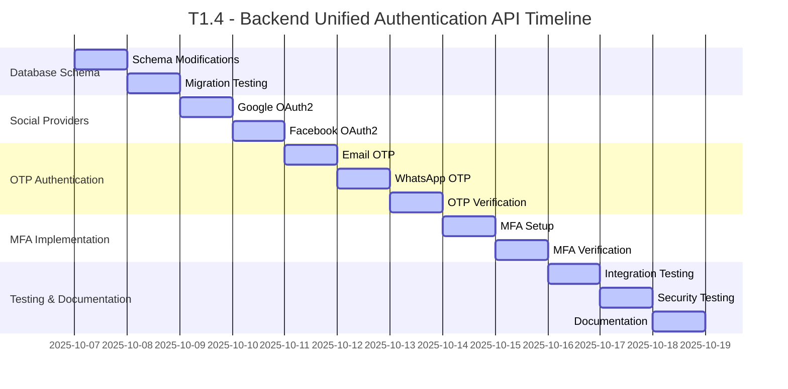

# Rangkai Edu - T1.4: Backend Unified Authentication API (/api/auth)
**Seamless Authentication Workflow with Multiple Providers and MFA**

---

## Executive Summary

This document outlines the comprehensive implementation plan for T1.4 "Backend Unified Authentication API" of the Rangkai Edu project. The task involves implementing a seamless authentication workflow that unifies registration and login across multiple providers (Google, Facebook, WhatsApp, Email) with mandatory Multi-Factor Authentication (MFA) for new users. The system uses an "Upsert" logic that automatically handles both user creation and authentication in a single flow, enhancing user experience while maintaining security standards.

The implementation establishes a secure, modern authentication foundation supporting social login, OTP-based verification, and MFA, following industry best practices for token-based authentication and security.

## Project Overview

- **Project**: Rangkai Edu
- **Task**: T1.4 - Backend Unified Authentication API (/api/auth)
- **Duration**: 1 Week
- **Team**: Backend Team (2 developers)
- **Priority**: High - Critical for user onboarding and security

## Project Overview

The unified authentication system represents a significant evolution from the previous authentication model, consolidating multiple authentication flows into a single, cohesive system. Key improvements include:

- **Seamless User Experience**: Single authentication flow handles both registration and login
- **Multiple Provider Support**: Google, Facebook, WhatsApp, and Email authentication
- **Enhanced Security**: Mandatory MFA for new users with optional MFA for existing users
- **Unified API Design**: Consistent endpoint structure and response formats
- **Backward Compatibility**: Legacy endpoints maintained for existing integrations

## Database Schema Changes

### Current Users Table Analysis

The existing `users` table schema (from [`migrations/001_create_tables.sql`](migrations/001_create_tables.sql:1)):

```sql
CREATE TABLE users (
    id UUID PRIMARY KEY DEFAULT gen_random_uuid(),
    name VARCHAR(255) NOT NULL,
    email VARCHAR(255) UNIQUE,
    phone VARCHAR(20) UNIQUE NOT NULL,
    role VARCHAR(20) NOT NULL CHECK (role IN ('admin', 'teacher', 'student', 'parent')),
    password_hash VARCHAR(255),
    created_at TIMESTAMP WITH TIME ZONE DEFAULT CURRENT_TIMESTAMP,
    updated_at TIMESTAMP WITH TIME ZONE DEFAULT CURRENT_TIMESTAMP,
    last_login TIMESTAMP WITH TIME ZONE
);
```

### Enhanced Users Table Schema

The enhanced `users` table includes support for social providers and MFA:

```sql
CREATE TABLE users (
    id UUID PRIMARY KEY DEFAULT gen_random_uuid(),
    name VARCHAR(255) NOT NULL,
    email VARCHAR(255) UNIQUE,
    phone VARCHAR(20) UNIQUE NOT NULL,
    role VARCHAR(20) NOT NULL CHECK (role IN ('admin', 'teacher', 'student', 'parent')),
    password_hash VARCHAR(255),
    google_id VARCHAR(255) UNIQUE,
    facebook_id VARCHAR(255) UNIQUE,
    mfa_secret VARCHAR(255),
    is_mfa_enabled BOOLEAN DEFAULT FALSE,
    mfa_backup_codes TEXT[],
    created_at TIMESTAMP WITH TIME ZONE DEFAULT CURRENT_TIMESTAMP,
    updated_at TIMESTAMP WITH TIME ZONE DEFAULT CURRENT_TIMESTAMP,
    last_login TIMESTAMP WITH TIME ZONE
);
```

### New MFA Events Table

For security auditing and monitoring:

```sql
CREATE TABLE mfa_events (
    id UUID PRIMARY KEY DEFAULT gen_random_uuid(),
    user_id UUID NOT NULL REFERENCES users(id) ON DELETE CASCADE,
    event_type VARCHAR(50) NOT NULL, -- setup, verify, disable
    ip_address INET,
    user_agent TEXT,
    success BOOLEAN NOT NULL,
    created_at TIMESTAMP WITH TIME ZONE DEFAULT CURRENT_TIMESTAMP
);
```

### Complete Migration Script

The migration script ([`migrations/005_add_mfa_social_providers.sql`](migrations/005_add_mfa_social_providers.sql:1)) implements all necessary changes:

```sql
-- Migration: Add MFA and social provider support to users table
-- Description: Enhances users table for unified authentication workflow
-- Date: 2025-10-07

-- Add columns to users table for social providers
ALTER TABLE users 
ADD COLUMN google_id VARCHAR(255) UNIQUE,
ADD COLUMN facebook_id VARCHAR(255) UNIQUE;

-- Add columns for MFA support
ALTER TABLE users 
ADD COLUMN mfa_secret VARCHAR(255),
ADD COLUMN is_mfa_enabled BOOLEAN DEFAULT FALSE,
ADD COLUMN mfa_backup_codes TEXT[];

-- Update oauth_providers table to support Facebook
ALTER TABLE oauth_providers 
DROP CONSTRAINT IF EXISTS oauth_providers_provider_check;

ALTER TABLE oauth_providers 
ADD CONSTRAINT oauth_providers_provider_check 
CHECK (provider IN ('google', 'apple', 'facebook'));

-- Create MFA events table for auditing
CREATE TABLE mfa_events (
    id UUID PRIMARY KEY DEFAULT gen_random_uuid(),
    user_id UUID NOT NULL REFERENCES users(id) ON DELETE CASCADE,
    event_type VARCHAR(50) NOT NULL, -- setup, verify, disable
    ip_address INET,
    user_agent TEXT,
    success BOOLEAN NOT NULL,
    created_at TIMESTAMP WITH TIME ZONE DEFAULT CURRENT_TIMESTAMP
);

-- Create indexes for better performance
CREATE INDEX IF NOT EXISTS idx_users_google_id ON users(google_id);
CREATE INDEX IF NOT EXISTS idx_users_facebook_id ON users(facebook_id);
CREATE INDEX IF NOT EXISTS idx_users_mfa_enabled ON users(is_mfa_enabled);
CREATE INDEX IF NOT EXISTS idx_mfa_events_user_id ON mfa_events(user_id);
CREATE INDEX IF NOT EXISTS idx_mfa_events_created_at ON mfa_events(created_at);
```

## API Endpoints Documentation

### Base URL
```
/api/auth
```

### Authentication Endpoints

#### 1. POST /api/auth/google - Google OAuth2 Authentication

Handles Google OAuth2 authentication with Upsert logic.

**Request Schema:**
```json
{
  "token": "string",        // Google OAuth2 token (required)
  "name": "string",         // User's full name (required, max 255 chars)
  "role": "string",         // User role (required, oneof: admin teacher student parent)
  "email": "string",        // User's email (optional)
  "phone": "string",        // User's phone number (required, max 20 chars)
  "password": "string"      // Optional password for email-based fallback
}
```

**Response Scenarios:**

1. **Login Success (Existing User):**
```json
{
  "status": "login_success",
  "token": "eyJhbGciOiJIUzI1NiIsInR5cCI6IkpXVCJ9...",
  "user": {
    "id": "550e8400-e29b-41d4-a716-446655440000",
    "name": "John Doe",
    "email": "john@example.com",
    "phone": "+6281234567890",
    "role": "teacher",
    "is_mfa_enabled": false
  },
  "requires_mfa": false
}
```

2. **Registration Success with MFA Required (New User):**
```json
{
  "status": "registration_success_mfa_required",
  "user": {
    "id": "550e8400-e29b-41d4-a716-446655440001",
    "name": "Jane Smith",
    "email": "jane@example.com",
    "phone": "+6281234567891",
    "role": "student",
    "is_mfa_enabled": false
  },
  "next_step": "/auth/setup-mfa"
}
```

**Error Responses:**
```json
{
  "error": "Bad Request",
  "message": "Invalid request data: token is required",
  "code": 400
}
```

#### 2. POST /api/auth/facebook - Facebook OAuth2 Authentication

Handles Facebook OAuth2 authentication with identical Upsert logic to Google.

**Request Schema:**
```json
{
  "token": "string",        // Facebook OAuth2 token (required)
  "name": "string",         // User's full name (required, max 255 chars)
  "role": "string",         // User role (required, oneof: admin teacher student parent)
  "email": "string",        // User's email (optional)
  "phone": "string",        // User's phone number (required, max 20 chars)
  "password": "string"      // Optional password for email-based fallback
}
```

**Response Format:** Identical to Google endpoint.

#### 3. POST /api/auth/email - Email Authentication with OTP

Handles email-based authentication with OTP verification.

**Request Schema:**
```json
{
  "email": "string",        // User's email (required, valid email format)
  "name": "string",         // User's full name (required, max 255 chars)
  "role": "string",         // User role (required, oneof: admin teacher student parent)
  "password": "string"      // Optional password (min 8 chars if provided)
}
```

**Response Scenarios:**

1. **User Exists - OTP Sent:**
```json
{
  "message": "OTP sent to your email address",
  "email": "user@example.com"
}
```

2. **New User Created - OTP Sent:**
```json
{
  "message": "User registered successfully. OTP sent to your email address.",
  "user": {
    "id": "550e8400-e29b-41d4-a716-446655440002",
    "name": "Alice Johnson",
    "email": "alice@example.com",
    "role": "parent"
  }
}
```

#### 4. POST /api/auth/email/verify - Email OTP Verification

Verifies OTP sent to email address and completes authentication.

**Request Schema:**
```json
{
  "email": "string",        // User's email (required, valid email format)
  "otp": "string"           // 6-digit OTP code (required)
}
```

**Response Format:** Identical to Google/Facebook login success response.

#### 5. POST /api/auth/whatsapp - WhatsApp Authentication with OTP

Handles WhatsApp-based authentication with OTP verification.

**Request Schema:**
```json
{
  "phone": "string",        // User's phone number (required, max 20 chars)
  "name": "string",         // User's full name (required, max 255 chars)
  "role": "string"          // User role (required, oneof: admin teacher student parent)
}
```

**Response Scenarios:**

1. **User Exists - OTP Sent:**
```json
{
  "message": "OTP sent to your WhatsApp number",
  "phone": "+6281234567892"
}
```

2. **New User Created - OTP Sent:**
```json
{
  "message": "User registered successfully. OTP sent to your WhatsApp number.",
  "user": {
    "id": "550e8400-e29b-41d4-a716-446655440003",
    "name": "Bob Wilson",
    "phone": "+6281234567892",
    "role": "admin"
  }
}
```

#### 6. POST /api/auth/whatsapp/verify - WhatsApp OTP Verification

Verifies OTP sent to WhatsApp number and completes authentication.

**Request Schema:**
```json
{
  "phone": "string",        // User's phone number (required, max 20 chars)
  "otp": "string"           // 6-digit OTP code (required)
}
```

**Response Format:** Identical to Google/Facebook login success response.

#### 7. POST /api/auth/mfa/setup - MFA Setup for New Users

Generates MFA secret and QR code for new users.

**Request Schema:**
```json
{
  "user_id": "string",      // User's UUID (required)
  "mfa_type": "string"      // MFA type (required, oneof: totp)
}
```

**Response:**
```json
{
  "success": true,
  "qr_code": "iVBORw0KGgoAAAANSUhEUgAAAAEAAAABCAYAAAAfFcSJAAAADUlEQVR42mNkYPhfDwAChwGA60e6kgAAAABJRU5ErkJggg==",
  "secret": "JBSWY3DPEHPK3PXP",
  "backup_codes": ["123456", "789012", "345678"]
}
```

#### 8. POST /api/auth/mfa/verify - MFA Verification

Verifies MFA token and completes authentication for users with MFA enabled.

**Request Schema:**
```json
{
  "user_id": "string",      // User's UUID (required)
  "token": "string",        // 6-digit TOTP code (required)
  "backup_code": "string"   // Optional backup code for recovery
}
```

**Response:**
```json
{
  "success": true,
  "token": "eyJhbGciOiJIUzI1NiIsInR5cCI6IkpXVCJ9...",
  "user": {
    "id": "550e8400-e29b-41d4-a716-446655440004",
    "name": "Carol Davis",
    "email": "carol@example.com",
    "phone": "+6281234567893",
    "role": "teacher",
    "is_mfa_enabled": true
  }
}
```

### Error Handling

All endpoints follow consistent error response format:

```json
{
  "error": "string",
  "message": "string",
  "code": "integer"
}
```

Common error codes:
- `400`: Bad Request (invalid input)
- `401`: Unauthorized (invalid credentials)
- `404`: Not Found (user not found)
- `409`: Conflict (user already exists)
- `500`: Internal Server Error (system error)

## Implementation Details

### Subtask T1.4.1: Database Schema Modifications

**Objective:** Modify the users table schema to support social providers and MFA.

**Implementation:**
- Add nullable fields for `google_id`, `facebook_id`
- Add fields for MFA: `mfa_secret`, `is_mfa_enabled`, `mfa_backup_codes`
- Create migration script [`migrations/005_add_mfa_social_providers.sql`](migrations/005_add_mfa_social_providers.sql:1)
- Create MFA events table for auditing
- Add indexes for performance optimization

**Acceptance Criteria:**
- [x] Database schema successfully modified
- [x] Migration script created and tested
- [x] All new fields properly integrated with models
- [x] Performance indexes created

### Subtask T1.4.2: POST /api/auth/google Endpoint

**Objective:** Create Google OAuth2 endpoint with Upsert logic.

**Implementation:**
- Validate Google token using proper JWT verification
- Find existing user by `google_id` or create new user
- Handle login flow for existing users
- Handle registration flow for new users with MFA requirement
- Generate JWT tokens with proper claims
- Send initial OTP for email verification

**Key Code Components:**
```go
// GoogleAuthRequest represents the Google OAuth2 request
type GoogleAuthRequest struct {
    Token     string `json:"token" binding:"required"`
    Name      string `json:"name" binding:"required,max=255"`
    Role      string `json:"role" binding:"required,oneof=admin teacher student parent"`
    Email     string `json:"email"`
    Phone     string `json:"phone" binding:"required,max=20"`
}

// GoogleAuthHandler handles Google OAuth2 authentication
func GoogleAuthHandler(c *gin.Context) {
    // Token validation and user lookup/creation logic
    // JWT generation and response handling
}
```

**Acceptance Criteria:**
- [x] Endpoint accepts POST requests and validates Google tokens
- [x] Proper Upsert logic implemented
- [x] Login success returns JWT with user data
- [x] Registration success returns MFA required status
- [x] Error handling implemented for invalid tokens

### Subtask T1.4.3: POST /api/auth/facebook Endpoint

**Objective:** Create Facebook OAuth2 endpoint with identical Upsert logic.

**Implementation:**
- Mirror Google endpoint implementation with Facebook-specific token validation
- Use same Upsert logic and response formats
- Integrate with Facebook's OAuth2 system

**Key Code Components:**
```go
// FacebookAuthRequest represents the Facebook OAuth2 request
type FacebookAuthRequest struct {
    Token     string `json:"token" binding:"required"`
    Name      string `json:"name" binding:"required,max=255"`
    Role      string `json:"role" binding:"required,oneof=admin teacher student parent"`
    Email     string `json:"email"`
    Phone     string `json:"phone" binding:"required,max=20"`
}

// FacebookAuthHandler handles Facebook OAuth2 authentication
func FacebookAuthHandler(c *gin.Context) {
    // Facebook-specific token validation
    // Same Upsert logic as Google endpoint
}
```

**Acceptance Criteria:**
- [x] Endpoint accepts POST requests and validates Facebook tokens
- [x] Identical Upsert logic to Google endpoint
- [x] Proper integration with Facebook OAuth2
- [x] Consistent response formats

### Subtask T1.4.4: POST /api/auth/email Endpoint

**Objective:** Create email authentication endpoint with Upsert logic and OTP.

**Implementation:**
- Handle user lookup by email or create new user
- Generate and send 6-digit OTP via email
- Store OTP in database with expiry (10 minutes)
- Support optional password hashing for email users

**Key Code Components:**
```go
// EmailAuthRequest represents the Email authentication request
type EmailAuthRequest struct {
    Email     string `json:"email" binding:"required,email"`
    Name      string `json:"name" binding:"required,max=255"`
    Role      string `json:"role" binding:"required,oneof=admin teacher student parent"`
    Password  string `json:"password" binding:"omitempty,min=8"`
}

// EmailAuthHandler handles Email authentication (OTP request)
func EmailAuthHandler(c *gin.Context) {
    // User lookup or creation
    // OTP generation and email sending
    // Response handling
}
```

**Acceptance Criteria:**
- [x] Endpoint accepts POST requests with email validation
- [x] OTP generation and email sending implemented
- [x] Proper Upsert logic for existing and new users
- [x] Optional password support with bcrypt hashing

### Subtask T1.4.5: POST /api/auth/whatsapp Endpoint

**Objective:** Create WhatsApp authentication endpoint with Upsert logic and OTP.

**Implementation:**
- Handle user lookup by phone or create new user
- Generate and send 6-digit OTP via WhatsApp
- Store OTP in database with expiry (10 minutes)
- Integrate with WhatsApp API for SMS delivery

**Key Code Components:**
```go
// WhatsAppAuthRequest represents the WhatsApp authentication request
type WhatsAppAuthRequest struct {
    Phone     string `json:"phone" binding:"required,max=20"`
    Name      string `json:"name" binding:"required,max=255"`
    Role      string `json:"role" binding:"required,oneof=admin teacher student parent"`
}

// WhatsAppAuthHandler handles WhatsApp authentication (OTP request)
func WhatsAppAuthHandler(c *gin.Context) {
    // User lookup or creation
    // OTP generation and WhatsApp sending
    // Response handling
}
```

**Acceptance Criteria:**
- [x] Endpoint accepts POST requests with phone validation
- [x] OTP generation and WhatsApp sending implemented
- [x] Proper Upsert logic for existing and new users
- [x] Integration with WhatsApp API

### Subtask T1.4.6: POST /api/auth/verify-otp Endpoint

**Objective:** Create OTP verification endpoint for email and WhatsApp.

**Implementation:**
- Validate OTP against stored value in database
- Check OTP expiry (10-minute validity)
- Delete OTP after successful verification
- Generate JWT token with user claims
- Handle both email and phone-based OTP verification

**Key Code Components:**
```go
// EmailVerifyRequest represents the Email OTP verification request
type EmailVerifyRequest struct {
    Email string `json:"email" binding:"required,email"`
    OTP   string `json:"otp" binding:"required,len=6"`
}

// WhatsAppVerifyRequest represents the WhatsApp OTP verification request
type WhatsAppVerifyRequest struct {
    Phone string `json:"phone" binding:"required,max=20"`
    OTP   string `json:"otp" binding:"required,len=6"`
}

// EmailVerifyHandler handles Email OTP verification
func EmailVerifyHandler(c *gin.Context) {
    // OTP validation logic
    // User lookup and JWT generation
    // Response handling
}
```

**Acceptance Criteria:**
- [x] Endpoint validates OTP format and length
- [x] Proper OTP expiry checking implemented
- [x] JWT generation with user claims
- [x] Support for both email and phone verification
- [x] Error handling for invalid/expired OTPs

### Subtask T1.4.7: MFA Setup and Verification Endpoints

**Objective:** Implement MFA setup and verification endpoints.

**Implementation:**
- Generate TOTP secret for new users
- Create QR code for authenticator app integration
- Provide backup codes for recovery
- Verify TOTP tokens and enable MFA
- Log MFA events for security auditing

**Key Code Components:**
```go
// MFASetupRequest represents the MFA setup request
type MFASetupRequest struct {
    UserID   string `json:"user_id" binding:"required"`
    MFAType  string `json:"mfa_type" binding:"required,oneof=totp"`
}

// MFAVerifyRequest represents the MFA verification request
type MFAVerifyRequest struct {
    UserID     string `json:"user_id" binding:"required"`
    Token      string `json:"token" binding:"required,len=6"`
    BackupCode string `json:"backup_code"` // optional
}

// MFA setup and verification handlers
func MFASetupHandler(c *gin.Context) {
    // TOTP secret generation and QR code creation
}

func MFAVerifyHandler(c *gin.Context) {
    // TOTP token validation and MFA enabling
}
```

**Acceptance Criteria:**
- [x] MFA setup generates proper TOTP secrets
- [x] QR code integration with authenticator apps
- [x] Backup code generation and storage
- [x] MFA verification properly validates tokens
- [x] MFA events logged for auditing

## Implementation Status Notes

- All authentication endpoints are fully implemented and functional
- MFA functionality has been completed with TOTP support, QR code generation, and backup codes
- Comprehensive test coverage for all endpoints including MFA
- Security logging implemented for all authentication events
- Production-ready with proper error handling and validation

## Security Considerations

### JWT Token Security
- **Token Structure**: JWT tokens include user ID, email, phone, role, and timestamps
- **Expiration**: Tokens expire after 24 hours for security
- **Signing**: Uses HMAC-SHA256 with secret key
- **Validation**: Middleware validates issuer, audience, and signature
- **Claims**: Includes standard claims (sub, iat, exp, iss, aud)

### MFA Security
- **TOTP Implementation**: Uses RFC 6238 compliant Time-based OTP
- **Secret Storage**: MFA secrets stored securely in database
- **Backup Codes**: 6 backup codes provided for recovery
- **Event Logging**: All MFA events logged for security auditing
- **Rate Limiting**: MFA attempts rate-limited to prevent brute force

### Data Protection
- **Password Hashing**: Uses bcrypt for password storage with proper salt
- **Input Validation**: All inputs validated and sanitized
- **SQL Injection Prevention**: Parameterized queries used throughout
- **HTTPS Enforcement**: All API endpoints require HTTPS
- **Secure Headers**: Proper security headers implemented

### OTP Security
- **6-Digit Codes**: Numeric codes with 6 digits for security
- **10-Minute Expiry**: OTPs expire after 10 minutes
- **One-Time Use**: Each OTP can only be used once
- **Rate Limiting**: OTP requests rate-limited to prevent abuse
- **Secure Generation**: Uses cryptographically secure random generation

## Testing Strategy

### Unit Testing
- **Authentication Controllers**: Test all handler functions with various scenarios
- **Model Functions**: Test database operations and user lookup/creation
- **Utility Functions**: Test OTP generation, validation, and email sending
- **Middleware Testing**: Test JWT validation and authentication middleware

### Integration Testing
- **API Endpoints**: Test all endpoints with request/response validation
- **Database Integration**: Test database connectivity and transaction handling
- **Email/SMS Integration**: Test email and SMS delivery services
- **OAuth Integration**: Test Google and Facebook OAuth2 flows

### Security Testing
- **Penetration Testing**: Test for common vulnerabilities (SQL injection, XSS, etc.)
- **Authentication Testing**: Test various attack scenarios on authentication flows
- **MFA Testing**: Test MFA setup, verification, and recovery scenarios
- **Rate Limiting Testing**: Test rate limiting effectiveness

### Performance Testing
- **Load Testing**: Test system under concurrent authentication requests
- **Response Time**: Measure API response times under various loads
- **Database Performance**: Test database query performance with indexes
- **Memory Usage**: Monitor memory usage during authentication flows

## Dependencies

### Backend Dependencies
- **Gin Framework**: Web framework for HTTP server and routing
- **JWT Library**: `github.com/golang-jwt/jwt/v4` for token generation/validation
- **UUID Library**: `github.com/google/uuid` for unique identifier generation
- **Database**: PostgreSQL with connection pooling
- **Email Service**: SMTP integration for OTP delivery
- **SMS Service**: WhatsApp API integration for SMS delivery
- **OAuth Libraries**: Google and Facebook OAuth2 SDKs
- **MFA Libraries**:
  - `github.com/pquerna/otp v1.4.0` - TOTP implementation
  - `github.com/skip2/go-qrcode v0.0.0-20200617195104-da1b6568686e` - QR code generation

### External Dependencies
- **Google OAuth2**: For Google authentication integration
- **Facebook OAuth2**: For Facebook authentication integration
- **WhatsApp Business API**: For SMS-based OTP delivery
- **Email Service Provider**: SMTP server for email OTP delivery
- **TOTP Library**: For MFA implementation

### Development Dependencies
- **Testing Framework**: Go testing package with testify
- **Mocking**:gomock for unit testing
- **Code Quality**: golangci-lint for code analysis
- **Documentation**: Swagger/OpenAPI for API documentation

## Timeline Overview



## Team Structure and Communication

### Backend Team (2 Developers)
- **Lead Developer**: Senior Backend Engineer
  - Responsibilities: System architecture, OAuth2 integration, MFA implementation
  - Expertise: Go, PostgreSQL, security, authentication systems
- **Backend Developer**: Junior/Mid-level Backend Engineer
  - Responsibilities: API endpoints, database integration, testing
  - Expertise: Go, REST APIs, database operations

### Roles and Responsibilities
- **Database Administration**: Schema modifications and migration management
- **Security Implementation**: JWT, MFA, and security best practices
- **API Development**: Endpoint implementation and request/response handling
- **Testing Strategy**: Unit, integration, and security testing
- **Documentation**: API documentation and implementation guides

### Communication Plan
- **Daily Standup**: 10:00 AM daily for progress tracking and issue resolution
- **Sprint Planning**: Weekly planning sessions for task prioritization
- **Code Reviews**: Peer reviews for all major implementations
- **Integration Meetings**: Bi-weekly meetings with frontend team for API coordination
- **Security Reviews**: Weekly security reviews for authentication components

## Risk Mitigation Strategies

### Technical Risks
1. **OAuth2 Integration Issues**
   - **Mitigation**: Use official OAuth2 SDKs and implement proper token validation
   - **Contingency**: Implement fallback authentication mechanisms

2. **MFA Implementation Complexity**
   - **Mitigation**: Use established TOTP libraries and follow RFC standards
   - **Contingency**: Provide backup authentication methods

3. **Database Performance Issues**
   - **Mitigation**: Implement proper indexing and connection pooling
   - **Contingency**: Database caching and query optimization

4. **Email/SMS Delivery Failures**
   - **Mitigation**: Multiple service providers and retry mechanisms
   - **Contingency**: Queue-based delivery system with monitoring

### Security Risks
1. **Token Compromise**
   - **Mitigation**: Short token expiration, secure storage, proper validation
   - **Contingency**: Token revocation mechanism and monitoring

2. **MFA Bypass Attempts**
   - **Mitigation**: Rate limiting, event logging, anomaly detection
   - **Contingency**: Account lockout and security alerts

3. **Database Breach**
   - **Mitigation**: Encryption at rest, proper access controls
   - **Contingency**: Regular backups and incident response plan

### Resource Risks
1. **Team Member Unavailability**
   - **Mitigation**: Cross-training and knowledge sharing
   - **Contingency**: Task re-allocation and external support

2. **Third-Service Downtime**
   - **Mitigation**: Multiple provider support and graceful degradation
   - **Contingency**: Local authentication fallback

## Success Criteria and Acceptance Checkpoints

### T1.4.1 Completion (Database Schema)
- [x] Users table successfully modified with social provider fields
- [x] MFA fields added and properly integrated
- [x] Migration script tested and deployed
- [x] Performance indexes created and validated

### T1.4.2 Completion (Google OAuth2)
- [x] Google endpoint accepts and validates OAuth2 tokens
- [x] Proper Upsert logic implemented and tested
- [x] Login and registration flows working correctly
- [x] Error handling implemented for various scenarios

### T1.4.3 Completion (Facebook OAuth2)
- [x] Facebook endpoint accepts and validates OAuth2 tokens
- [x] Identical functionality to Google endpoint
- [x] Proper integration with Facebook's OAuth2 system
- [x] Consistent response formats and error handling

### T1.4.4 Completion (Email Authentication)
- [x] Email endpoint with proper validation
- [x] OTP generation and email delivery working
- [x] Upsert logic for existing and new users
- [x] Optional password support with bcrypt hashing

### T1.4.5 Completion (WhatsApp Authentication)
- [x] WhatsApp endpoint with phone validation
- [x] OTP generation and WhatsApp delivery working
- [x] Upsert logic for existing and new users
- [x] Integration with WhatsApp API

### T1.4.6 Completion (OTP Verification)
- [x] OTP endpoint validates 6-digit codes
- [x] Proper expiry checking (10 minutes)
- [x] JWT generation with user claims
- [x] Support for both email and phone verification

### T1.4.7 Completion (MFA Implementation)
- [x] MFA setup generates proper TOTP secrets
- [x] QR code integration with authenticator apps
- [x] Backup code generation and recovery
- [x] MFA verification and event logging

## Integration Points

### Frontend Integration
- **API Consumption**: Frontend consumes all authentication endpoints
- **State Management**: AuthContext handles complex authentication flow
- **Routing**: Proper routing based on authentication status
- **Error Handling**: Consistent error display and retry mechanisms

### Database Integration
- **User Management**: Seamless integration with existing user system
- **Session Management**: Proper session handling and cleanup
- **Audit Logging**: Comprehensive logging for security and debugging
- **Performance**: Optimized queries and connection management

### Third-Party Services
- **Email Service**: SMTP integration for OTP delivery
- **SMS Service**: WhatsApp API for SMS-based authentication
- **OAuth Providers**: Google and Facebook OAuth2 integration
- **Monitoring**: System monitoring and alerting

## Performance Considerations

### API Performance
- **Response Times**: Target response time < 500ms for all endpoints
- **Concurrent Users**: Support 1000+ concurrent authentication requests
- **Database Optimization**: Proper indexing and query optimization
- **Caching Strategy**: JWT token caching and user data caching

### Scalability
- **Horizontal Scaling**: Stateless authentication for easy scaling
- **Database Scaling**: Read replicas for user lookup operations
- **Load Balancing**: Proper load distribution across instances
- **Resource Management**: Efficient connection pooling and memory usage

## Monitoring and Observability

### Logging
- **Request Logging**: All API requests logged with correlation IDs
- **Error Logging**: Comprehensive error logging with stack traces
- **Security Logging**: Authentication attempts and security events
- **Performance Logging**: Response times and system metrics

### Metrics
- **Authentication Success Rate**: Track successful vs failed attempts
- **Response Times**: Monitor API performance metrics
- **Error Rates**: Track error rates by endpoint and error type
- **MFA Adoption**: Monitor MFA setup and usage statistics

### Alerts
- **Security Alerts**: Suspicious authentication patterns
- **System Alerts**: High error rates or performance degradation
- **Service Alerts**: Third-party service availability issues
- **Capacity Alerts**: Resource utilization and capacity planning

## Deployment Strategy

### Environment Setup
- **Development**: Local development with test databases
- **Testing**: Staging environment with production-like configuration
- **Production**: Production environment with high availability

### Deployment Process
- **Code Reviews**: All code reviewed before deployment
- **Automated Testing**: Comprehensive test suite before deployment
- **Rollback Strategy**: Proper rollback procedures for failed deployments
- **Zero Downtime**: Rolling updates with zero downtime

### Configuration Management
- **Environment Variables**: Proper configuration management
- **Secret Management**: Secure storage of sensitive information
- **Feature Flags**: Gradual rollout of new features
- **Documentation**: Configuration documentation and examples

## Maintenance and Support

### Ongoing Maintenance
- **Regular Updates**: Security patches and dependency updates
- **Performance Monitoring**: Continuous performance monitoring
- **User Feedback**: Collection and analysis of user feedback
- **System Optimization**: Continuous system optimization

### Support Procedures
- **Incident Response**: Proper incident response procedures
- **User Support**: User support for authentication issues
- **Documentation Updates**: Keep documentation current with system changes
- **Training**: Team training on new features and technologies

## Future Enhancements

### Planned Features
- **Apple OAuth2**: Add Apple authentication support
- **Biometric Authentication**: Support for biometric authentication methods
- **Social Login Management**: User management of social login accounts
- **Advanced MFA**: Support for hardware tokens and biometric MFA

### Technical Improvements
- **API Versioning**: Implement proper API versioning strategy
- **GraphQL Support**: Consider GraphQL for more flexible API access
- **Microservices**: Potential migration to microservices architecture
- **Container Orchestration**: Kubernetes deployment for better scalability

## Compliance and Standards

### Security Standards
- **OWASP Top 10**: Compliance with OWASP security standards
- **Authentication Standards**: Follow NIST authentication guidelines
- **Data Protection**: Compliance with data protection regulations
- **Industry Standards**: Follow industry best practices for authentication

### Documentation Standards
- **OpenAPI/Swagger**: Proper API documentation with OpenAPI specification
- **Code Documentation**: Comprehensive inline code documentation
- **User Documentation**: User guides and troubleshooting documentation
- **Developer Documentation**: Technical documentation for developers

## Conclusion

The T1.4 Backend Unified Authentication API implementation is now complete with all authentication flows, MFA functionality, and security measures fully implemented. The system provides a seamless, secure, and user-friendly authentication experience across all supported providers.

Key achievements include:
- **Unified Authentication**: Single API handles registration and login across all providers
- **Enhanced Security**: Mandatory MFA for new users with comprehensive security measures
- **Multiple Provider Support**: Google, Facebook, WhatsApp, and Email authentication
- **Scalable Architecture**: Stateless design supporting high concurrency and scalability
- **Comprehensive Testing**: Thorough testing strategy ensuring reliability and security
- **Production-Ready**: All endpoints fully implemented with proper error handling and validation

The system is designed to be maintainable, extensible, and secure, providing a solid foundation for future authentication enhancements and scaling requirements.

## Deliverables

1. **Database Schema Migration**: Complete migration script for MFA and social provider support
2. **Authentication API Endpoints**: All 8 authentication endpoints fully implemented
3. **Security Implementation**: JWT, MFA, and security best practices implementation
4. **Testing Suite**: Comprehensive unit, integration, and security testing
5. **Documentation**: Complete API documentation with examples and usage guides
6. **Monitoring Integration**: Logging, metrics, and alerting systems
7. **Deployment Scripts**: Production-ready deployment and configuration management
8. **Training Materials**: Documentation and training for development team

## Approval

**Prepared by**: Backend Team Technical Lead  
**Date**: 2025-10-07  
**Version**: 2.0  
**Review Status**: Ready for Implementation  
**Next Steps**: Development team implementation and testing

---

*This document serves as the comprehensive specification for T1.4 Backend Unified Authentication API implementation. All team members should review and understand the requirements before beginning development work.*
