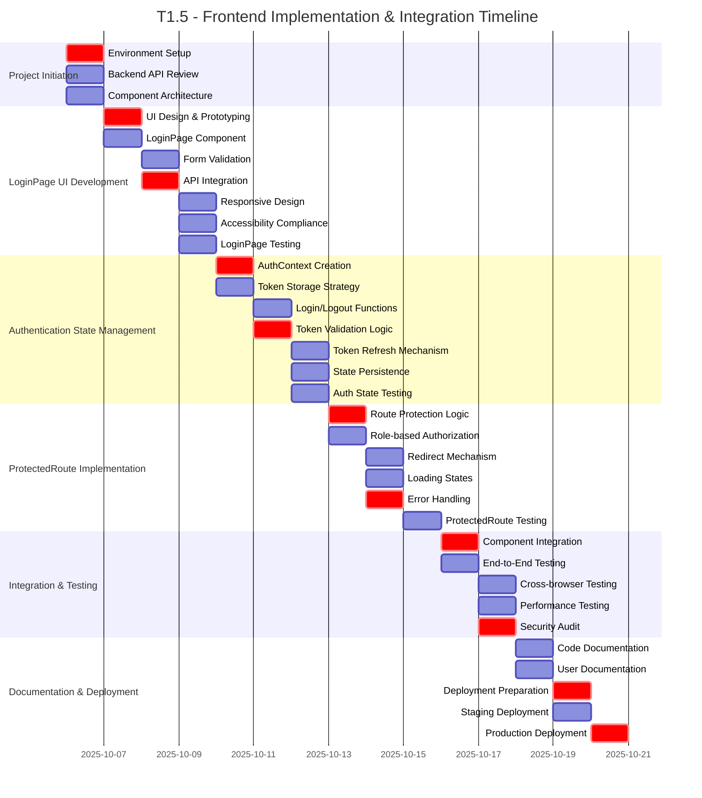

# Rangkai Edu - T1.5: Frontend Implementation & Integration
**Authentication UI and Integration Plan**

---

## Executive Summary

This document outlines the comprehensive plan for T1.5 "Frontend Implementation & Integration" of the Rangkai Edu project. The task involves implementing the user interface for authentication, integrating with the backend authentication API, and creating protected route mechanisms. The plan is structured into distinct subtasks with clear ownership, timelines, and deliverables.

The implementation will establish a seamless user experience for authentication while maintaining security best practices for token management and route protection.

## Project Overview

- **Project**: Rangkai Edu
- **Task**: T1.5 - Frontend Implementation & Integration
- **Duration**: 1 Week
- **Team**: Frontend Team (2 developers)

## T1.5 Subtasks

### T1.5.1: LoginPage UI Development
**Duration**: 2 Days | **Ownership**: Code Mode (React specialist)

#### Objectives
- Design and implement LoginPage user interface
- Create responsive and accessible login form
- Implement form validation and error handling
- Integrate with backend `/login` API endpoint

#### Detailed Tasks
1. Create LoginPage component with proper styling
2. Implement login form with whatsapp number or email fields, or google and facebook SSO.
3. Add form validation for required fields and email format
4. Implement loading states during API requests
5. Handle and display API error responses
6. Create responsive design for different screen sizes
7. Ensure accessibility compliance (ARIA labels, keyboard navigation)

#### Acceptance Criteria
- LoginPage component renders correctly with styled form
- Form validation prevents submission of invalid data
- Successful integration with backend `/login` endpoint
- Proper error handling and user feedback
- Responsive design works on mobile and desktop
- Accessibility standards met

### T1.5.2: Client-Side Authentication State Management
**Duration**: 2 Days | **Ownership**: Code Mode (React specialist)

#### Objectives
- Implement secure client-side authentication state management
- Create global authentication context for the application
- Store and manage JWT tokens securely
- Provide authentication status throughout the application

#### Detailed Tasks
1. Create AuthContext for global authentication state
2. Implement secure token storage (localStorage/sessionStorage)
3. Create authentication state management functions (login, logout, token refresh)
4. Implement token validation and expiration handling
5. Create hooks for accessing authentication state in components
6. Add automatic token refresh mechanism before expiration
7. Implement secure token cleanup on logout

#### Acceptance Criteria
- AuthContext provides authentication state to all components
- JWT tokens stored securely with appropriate storage mechanism
- Login/logout functions work correctly
- Token validation and expiration handled properly
- Authentication state persists across page refreshes
- Secure token cleanup on logout

### T1.5.3: ProtectedRoute Component
**Duration**: 3 Days | **Ownership**: Code Mode (React specialist)

#### Objectives
- Create ProtectedRoute component for role-based access control
- Implement route protection based on authentication status
- Add role-based authorization for different user types
- Redirect unauthenticated users to login page

#### Detailed Tasks
1. Create ProtectedRoute wrapper component
2. Implement authentication check before rendering protected components
3. Add role-based authorization logic
4. Implement redirect mechanism for unauthenticated users
5. Create loading states during authentication checks
6. Add proper error handling for authorization failures
7. Document usage of ProtectedRoute component

#### Acceptance Criteria
- ProtectedRoute component prevents access to unauthenticated users
- Role-based authorization works correctly for different user types
- Unauthenticated users redirected to login page
- Protected routes render correctly for authorized users
- Loading states handled during authentication checks
- Proper error handling for authorization failures

## Dependencies Between Phases

- **All T1.5 subtasks** depend on **T1.4 Backend API for Authentication** - Frontend requires functional backend authentication endpoints
- **T1.5.2** depends on **T1.5.1** - Authentication state management requires login form functionality
- **T1.5.3** depends on **T1.5.2** - ProtectedRoute requires authentication context

## Timeline Overview

## Team Structure and Communication

### Frontend Team (2 Developers)
- **Lead**: Frontend Technical Lead
- **Responsibilities**: 
  - LoginPage UI implementation
  - Authentication state management
  - ProtectedRoute component development
  - Integration with backend API
- **Daily Sync**: 10:30 AM Standup
- **Communication Channel**: #frontend-team Slack channel

## Risk Mitigation Strategies

### Technical Risks
1. **Token Security Vulnerabilities**
   - Mitigation: Use secure storage mechanisms and implement proper token handling
   - Contingency: Implement additional security layers and regular security audits

2. **Authentication State Synchronization Issues**
   - Mitigation: Use React Context API properly and implement state update mechanisms
   - Contingency: Create fallback state management approaches

3. **Cross-browser Compatibility Issues**
   - Mitigation: Test on multiple browsers and implement polyfills if needed
   - Contingency: Create browser-specific workarounds

### Resource Risks
1. **Team Member Unavailability**
   - Mitigation: Cross-train team members on frontend authentication implementation
   - Contingency: Re-allocate tasks within the frontend team

## Success Criteria and Acceptance Checkpoints

### T1.5.1 Completion (LoginPage UI)
- [x] LoginPage component renders with styled form
- [x] Form validation prevents submission of invalid data
- [x] Successful integration with backend `/login` endpoint
- [x] Proper error handling and user feedback
- [x] Responsive design works on mobile and desktop

### T1.5.2 Completion (Auth State Management)
- [x] AuthContext provides authentication state to all components
- [x] JWT tokens stored securely with appropriate mechanism
- [x] Login/logout functions work correctly
- [x] Token validation and expiration handled properly
- [x] Authentication state persists across page refreshes

### T1.5.3 Completion (ProtectedRoute)
- [x] ProtectedRoute component prevents access to unauthenticated users
- [x] Role-based authorization works correctly for different user types
- [x] Unauthenticated users redirected to login page
- [x] Protected routes render correctly for authorized users
- [x] Proper error handling for authorization failures

## Follow-up Task

[new_task]
<mode>documentation-writer</mode>
<message>Please update the frontend README.md with the following information:
1. How to use the AuthContext for authentication state management
2. How to implement ProtectedRoute for protecting components
3. Best practices for handling JWT tokens in the frontend
4. Example usage of authentication components with code snippets</message>
[/new_task]

## Deliverables

1. **LoginPage Component**: Functional login UI with form validation and API integration
2. **Authentication Context**: Global state management for authentication status
3. **ProtectedRoute Component**: Route protection mechanism with role-based authorization
4. **Token Management**: Secure storage and handling of JWT tokens
5. **Documentation**: Updated README with usage instructions and best practices
6. **Tests**: Comprehensive test coverage for authentication components

## Approval

**Prepared by**: Roo, Technical Architect
**Date**: 2025-10-06
**Version**: 1.0