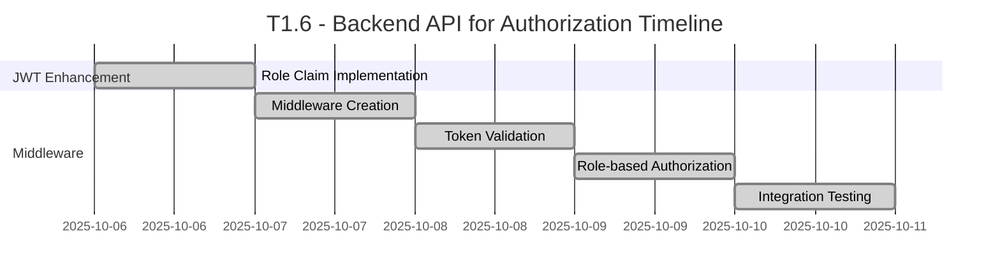

# Rangkai Edu - T1.6: Backend API for Authorization
**Role-based Access Control and JWT Implementation Plan**

---

## Executive Summary

This document outlines the comprehensive plan for T1.6 "Backend API for Authorization" of the Rangkai Edu project. The task involves implementing role-based access control mechanisms, enhancing JWT tokens with role claims, and creating authentication middleware for route protection. The plan is structured into distinct subtasks with clear ownership, timelines, and deliverables.

The implementation will establish a secure authorization framework that protects API endpoints based on user roles, ensuring that users can only access resources appropriate to their permissions.

## Project Overview

- **Project**: Rangkai Edu
- **Task**: T1.6 - Backend API for Authorization
- **Duration**: 1 Week
- **Team**: Backend Team (2 developers)

## T1.6 Subtasks

### T1.6.1: JWT with Role Claim
**Duration**: 1 Day | **Ownership**: Code Mode (Go specialist)

#### Objectives
- Enhance JWT token generation to include user role claims
- Ensure role information is securely embedded in tokens
- Maintain token security and integrity with role information

#### Detailed Tasks
1. Modify JWT token generation to include user role in payload
2. Ensure role claim is properly encoded and secured
3. Update token verification to extract role information
4. Test token generation with different user roles
5. Document JWT structure and role claim implementation

#### Acceptance Criteria
- JWT tokens include user role in payload
- Role information is properly encoded and secured
- Token verification correctly extracts role information
- Tokens generated for all user roles (admin, guru, siswa)
- Documentation of JWT structure with role claims

### T1.6.2 & T1.6.3: Authentication Middleware
**Duration**: 4 Days | **Ownership**: Code Mode (Go specialist)

#### Objectives
- Create custom authentication middleware for Gin framework
- Implement JWT token validation and parsing
- Extract user role from tokens for authorization decisions
- Protect API routes based on user roles

#### Detailed Tasks
1. Create authentication middleware package
2. Implement JWT token validation and parsing logic
3. Extract user information including role from tokens
4. Create role-based authorization functions
5. Implement middleware for different protection levels
6. Add proper error handling for invalid tokens
7. Create comprehensive tests for middleware functionality
8. Document middleware usage and configuration

#### Acceptance Criteria
- Authentication middleware validates JWT tokens correctly
- User role extracted from tokens for authorization
- Middleware protects routes based on role requirements
- Proper error responses for invalid/missing tokens
- Comprehensive test coverage for middleware functions
- Documentation for middleware usage

## Dependencies Between Phases

- **T1.6.1** depends on **T1.4 Backend API for Authentication** - Requires existing JWT implementation
- **T1.6.2/3** depends on **T1.6.1** - Middleware requires role-enhanced JWT tokens
- **All T1.6 subtasks** depend on **T1.2 Database Implementation** - Authorization requires user role data

## Timeline Overview

## Team Structure and Communication

### Backend Team (2 Developers)
- **Lead**: Backend Technical Lead
- **Responsibilities**: 
  - JWT enhancement with role claims
  - Authentication middleware development
  - Route protection implementation
  - Security implementation
- **Daily Sync**: 10:00 AM Standup
- **Communication Channel**: #backend-team Slack channel

## Risk Mitigation Strategies

### Technical Risks
1. **Authorization Bypass Vulnerabilities**
   - Mitigation: Implement comprehensive middleware testing and security audits
   - Contingency: Add additional authorization layers and monitoring

2. **Token Tampering Issues**
   - Mitigation: Use secure JWT signing and validation mechanisms
   - Contingency: Implement token refresh and invalidation procedures

3. **Role-based Logic Complexity**
   - Mitigation: Create clear role hierarchy and permission matrix
   - Contingency: Implement flexible authorization configuration

### Resource Risks
1. **Team Member Unavailability**
   - Mitigation: Cross-train team members on authorization implementation
   - Contingency: Re-allocate tasks within the backend team

## Success Criteria and Acceptance Checkpoints

### T1.6.1 Completion (JWT with Role Claim)
- [x] JWT tokens include user role in payload
- [x] Role information properly encoded and secured
- [x] Token verification extracts role information correctly
- [x] Tokens generated for all user roles
- [x] Documentation of JWT structure with role claims

### T1.6.2/3 Completion (Authentication Middleware)
- [x] Authentication middleware validates JWT tokens correctly
- [x] User role extracted from tokens for authorization
- [x] Middleware protects routes based on role requirements
- [x] Proper error responses for invalid/missing tokens
- [x] Comprehensive test coverage for middleware functions
- [x] Documentation for middleware usage

## Follow-up Task

[new_task]
<mode>documentation-writer</mode>
<message>Please create API documentation for the authorization features:
1. Document how JWT tokens include role claims
2. Document middleware usage for protecting routes
3. Explain role-based access control implementation
4. Include examples of protected endpoints and required roles</message>
[/new_task]

## Deliverables

1. **Enhanced JWT Implementation**: JWT tokens with embedded role claims
2. **Authentication Middleware**: Custom middleware for token validation and role extraction
3. **Route Protection**: Protected API endpoints with role-based access control
4. **Authorization Logic**: Role-based authorization functions and configuration
5. **Documentation**: API documentation for authorization features
6. **Tests**: Comprehensive test coverage for authorization functionality

## Approval

**Prepared by**: Roo, Technical Architect
**Date**: 2025-10-06
**Version**: 1.0