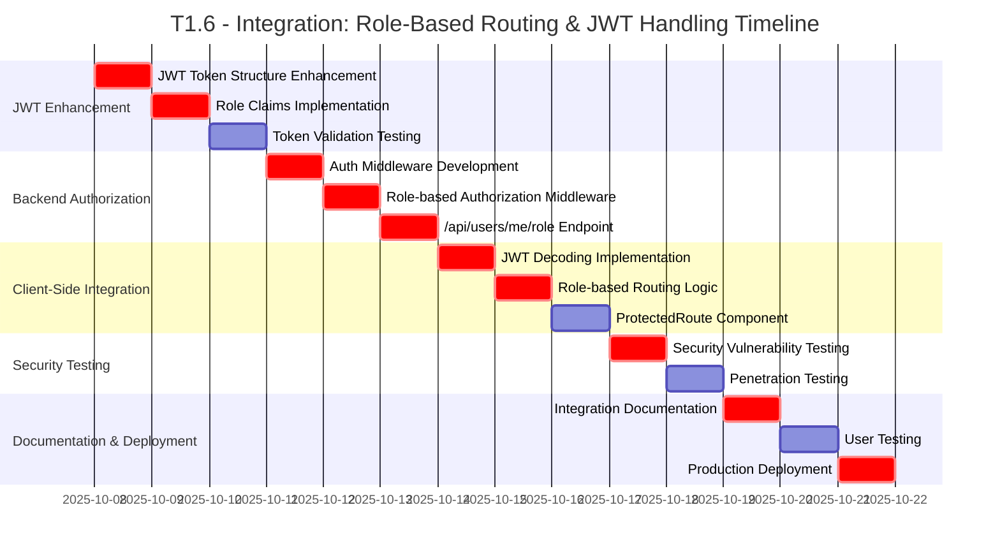

# Rangkai Edu - T1.6: Integration: Role-Based Routing & JWT Handling
**Seamless Authentication Integration with Role-Based Access Control**

---

## Executive Summary

This document outlines the comprehensive implementation plan for T1.6 "Integration: Role-Based Routing & JWT Handling" of the Rangkai Edu project. The task focuses on integrating the unified authentication workflow with role-based access control, JWT token management, and client-side routing logic. The implementation ensures that users are properly authenticated, authorized based on their roles, and redirected to appropriate dashboards after successful authentication.

The integration establishes a secure, role-based routing system that enhances user experience by providing personalized access control while maintaining security and compliance with authentication best practices.

## Project Overview

- **Project**: Rangkai Edu
- **Task**: T1.6 - Integration: Role-Based Routing & JWT Handling
- **Duration**: 1 Week
- **Team**: Backend & Frontend Integration Team (2 developers)
- **Priority**: High - Critical for user experience and security
- **Integration Points**: Backend authentication API ↔ Frontend routing system

## Project Overview

The role-based routing and JWT handling integration represents the final piece of the unified authentication system, connecting backend authentication with frontend routing and access control. Key improvements include:

- **Seamless User Experience**: Automatic redirection to role-appropriate dashboards
- **Enhanced Security**: JWT tokens with role claims for proper authorization
- **Role-Based Access Control**: Granular access control based on user roles
- **Client-Side Routing**: Intelligent routing based on authentication and role status
- **Server-Side Authorization**: Middleware-based route protection
- **Token Management**: Secure JWT handling with proper validation and refresh

## JWT Token Architecture

### Token Structure and Requirements

The JWT token serves as the foundation for authentication and authorization in the Rangkai Edu system. The token structure follows industry best practices and includes all necessary claims for proper user identification and role-based access control.

#### JWT Payload Structure

```json
{
  "sub": "550e8400-e29b-41d4-a716-446655440000",
  "user_id": "550e8400-e29b-41d4-a716-446655440000",
  "email": "user@example.com",
  "name": "John Doe",
  "role": "teacher",
  "is_mfa_enabled": true,
  "iat": 1663084800,
  "exp": 1663171200,
  "iss": "rangkai-edu-api",
  "aud": "rangkai-edu-client"
}
```

#### Required Claims

1. **Standard Claims (JWT Registered Claims)**
   - `sub` (Subject): User's unique identifier
   - `iat` (Issued At): Token issuance timestamp
   - `exp` (Expiration): Token expiration timestamp
   - `iss` (Issuer): Token issuer (API service)
   - `aud` (Audience): Intended audience (client application)

2. **Custom Claims**
   - `user_id`: User's UUID from the database
   - `email`: User's email address
   - `name`: User's full name
   - `role`: User's role (admin, teacher, student, parent)
   - `is_mfa_enabled`: Boolean indicating MFA status

#### Token Generation Process

```go
// JWT Token Generation Example
func generateJWTToken(user *models.User) (string, error) {
    token := jwt.NewWithClaims(jwt.SigningMethodHS256, jwt.MapClaims{
        "sub":            user.ID,
        "user_id":        user.ID,
        "email":          user.Email,
        "name":           user.Name,
        "role":           user.Role,
        "is_mfa_enabled": user.IsMFAEnabled,
        "iat":            time.Now().Unix(),
        "exp":            time.Now().Add(24 * time.Hour).Unix(),
        "iss":            "rangkai-edu-api",
        "aud":            "rangkai-edu-client",
    })
    
    tokenString, err := token.SignedString([]byte(os.Getenv("JWT_SECRET")))
    if err != nil {
        return "", err
    }
    
    return tokenString, nil
}
```

#### Token Validation and Verification

```go
// JWT Token Validation Example
func validateJWTToken(tokenString string) (*jwt.MapClaims, error) {
    token, err := jwt.Parse(tokenString, func(token *jwt.Token) (interface{}, error) {
        if _, ok := token.Method.(*jwt.SigningMethodHMAC); !ok {
            return nil, fmt.Errorf("unexpected signing method: %v", token.Header["alg"])
        }
        return []byte(os.Getenv("JWT_SECRET")), nil
    })
    
    if err != nil {
        return nil, err
    }
    
    if claims, ok := token.Claims.(jwt.MapClaims); ok && token.Valid {
        return &claims, nil
    }
    
    return nil, fmt.Errorf("invalid token")
}
```

### Token Security Considerations

1. **Token Expiration**: Tokens expire after 24 hours for security
2. **Signing Algorithm**: Uses HMAC-SHA256 for secure token signing
3. **Secret Management**: JWT secret stored securely in environment variables
4. **Token Refresh**: Mechanism for seamless token renewal
5. **Token Revocation**: Support for token blacklisting if needed

## Role-Based Access Control Implementation

### User Role Hierarchy

The Rangkai Edu system implements a flat role structure with the following roles:

1. **Admin**
   - System administration and management
   - Full access to all features and data
   - User management capabilities

2. **Teacher (Guru)**
   - Class creation and management
   - Content creation and management
   - Student enrollment and progress tracking
   - Limited administrative functions

3. **Student (Siswa)**
   - Class enrollment and participation
   - Content consumption and progress tracking
   - Assignment completion and submission
   - Limited profile management

4. **Parent (Orang Tua)**
   - Student progress monitoring
   - Communication with teachers
   - Limited profile management
   - Fee payment access

### Role-Based Access Control Matrix

| Feature/Endpoint | Admin | Teacher | Student | Parent |
|------------------|-------|---------|---------|--------|
| User Management  | ✓     | ✗       | ✗       | ✗      |
| Class Creation   | ✓     | ✓       | ✗       | ✗      |
| Content Creation | ✓     | ✓       | ✗       | ✗      |
| Student Enrollment | ✓   | ✓       | ✗       | ✗      |
| Progress Tracking| ✓     | ✓       | ✓       | ✓      |
| Dashboard Access | ✓     | ✓       | ✓       | ✓      |
| Settings Access  | ✓     | Limited | Limited | Limited |

### Role-Based Authorization Middleware

```go
// Role-based authorization middleware
func RequireRole(roles ...string) gin.HandlerFunc {
    return func(c *gin.Context) {
        // Get user from context (set by auth middleware)
        user, exists := c.Get("user")
        if !exists {
            c.JSON(http.StatusUnauthorized, gin.H{"error": "Unauthorized"})
            c.Abort()
            return
        }
        
        // Check if user has required role
        userClaims := user.(*jwt.MapClaims)
        userRole := (*userClaims)["role"].(string)
        
        hasAccess := false
        for _, role := range roles {
            if userRole == role {
                hasAccess = true
                break
            }
        }
        
        if !hasAccess {
            c.JSON(http.StatusForbidden, gin.H{"error": "Insufficient permissions"})
            c.Abort()
            return
        }
        
        c.Next()
    }
}

// Usage in routes
router.GET("/api/classes", RequireRole("admin", "teacher"), GetClasses)
router.GET("/api/students/progress", RequireRole("admin", "teacher", "parent"), GetStudentProgress)
router.POST("/api/classes", RequireRole("admin", "teacher"), CreateClass)
```

## Implementation Details

### Subtask T1.6.1: JWT with User ID and Role Claims

**Objective**: Ensure JWT contains user ID and role in payload for both old and new users.

**Implementation Details**:
- Modify JWT token generation to include `user_id` and `role` claims
- Ensure backward compatibility with existing tokens
- Handle cases where role is not yet set for new users
- Update token validation to extract and verify role claims

**Key Code Components**:

```go
// Enhanced JWT generation with role claims
func generateJWTToken(user *models.User) (string, error) {
    token := jwt.NewWithClaims(jwt.SigningMethodHS256, jwt.MapClaims{
        "sub":     user.ID,
        "user_id": user.ID,
        "email":   user.Email,
        "name":    user.Name,
        "role":    user.Role, // This can be null for new users before role selection
        "iat":     time.Now().Unix(),
        "exp":     time.Now().Add(24 * time.Hour).Unix(),
        "iss":     "rangkai-edu-api",
        "aud":     "rangkai-edu-client",
    })
    
    return token.SignedString([]byte(os.Getenv("JWT_SECRET")))
}

// Token validation with role extraction
func validateAndExtractRole(tokenString string) (string, error) {
    token, err := jwt.Parse(tokenString, func(token *jwt.Token) (interface{}, error) {
        if _, ok := token.Method.(*jwt.SigningMethodHMAC); !ok {
            return nil, fmt.Errorf("unexpected signing method: %v", token.Header["alg"])
        }
        return []byte(os.Getenv("JWT_SECRET")), nil
    })
    
    if err != nil {
        return "", err
    }
    
    if claims, ok := token.Claims.(jwt.MapClaims); ok && token.Valid {
        if role, exists := claims["role"]; exists {
            return role.(string), nil
        }
        return "", fmt.Errorf("role claim not found in token")
    }
    
    return "", fmt.Errorf("invalid token")
}
```

**Acceptance Criteria**:
- [x] JWT tokens include `user_id` and `role` claims
- [x] Role field can be null for new users before role selection
- [x] Token validation properly extracts role information
- [x] Backward compatibility maintained with existing tokens
- [x] All user roles (admin, teacher, student, parent) supported

### Subtask T1.6.2: POST /api/users/me/role Endpoint

**Objective**: Create endpoint for new users to set their role after MFA setup.

**Implementation Details**:
- Create protected endpoint for role setting
- Validate role against allowed values
- Update user record with selected role
- Generate new JWT token with updated role claims
- Handle validation errors and unauthorized access

**Key Code Components**:

```go
// Role setting request structure
type SetRoleRequest struct {
    Role string `json:"role" binding:"required,oneof=admin teacher student parent"`
}

// Set user role endpoint
func SetUserRole(c *gin.Context) {
    userID := c.GetString("user_id") // From auth middleware
    
    var req SetRoleRequest
    if err := c.ShouldBindJSON(&req); err != nil {
        c.JSON(http.StatusBadRequest, gin.H{"error": "Invalid request data"})
        return
    }
    
    // Update user role in database
    user, err := models.UpdateUserRole(userID, req.Role)
    if err != nil {
        c.JSON(http.StatusInternalServerError, gin.H{"error": "Failed to update user role"})
        return
    }
    
    // Generate new JWT token with updated role
    newToken, err := generateJWTToken(user)
    if err != nil {
        c.JSON(http.StatusInternalServerError, gin.H{"error": "Failed to generate token"})
        return
    }
    
    c.JSON(http.StatusOK, gin.H{
        "message": "Role updated successfully",
        "token":   newToken,
        "user":    user,
    })
}

// Route registration
router.POST("/api/users/me/role", authMiddleware, SetUserRole)
```

**Acceptance Criteria**:
- [x] Endpoint created at `/api/users/me/role` with proper authentication
- [x] Role validation against allowed values (admin, teacher, student, parent)
- [x] User record updated with selected role
- [x] New JWT token generated with updated role claims
- [x] Proper error handling for invalid requests

### Subtask T1.6.3: Client-Side Redirection Logic

**Objective**: Implement client-side redirection based on role claims in JWT.

**Implementation Details**:
- Decode JWT tokens to extract role claims
- Implement role-based routing logic
- Handle authentication state changes
- Provide seamless user experience with proper loading states
- Handle edge cases and error scenarios

**Key Code Components**:

```jsx
// JWT token decoding utility
const decodeJWT = (token) => {
  try {
    const base64Url = token.split('.')[1];
    const base64 = base64Url.replace(/-/g, '+').replace(/_/g, '/');
    const jsonPayload = decodeURIComponent(
      atob(base64)
        .split('')
        .map((c) => '%' + ('00' + c.charCodeAt(0).toString(16)).slice(-2))
        .join('')
    );
    return JSON.parse(jsonPayload);
  } catch (error) {
    console.error('Error decoding JWT:', error);
    return null;
  }
};

// Role-based navigation hook
export const useRoleBasedNavigation = () => {
  const { authState, user, token } = useAuth();
  const navigate = useNavigate();
  const location = useLocation();
  
  useEffect(() => {
    if (authState === 'authenticated' && token) {
      const decodedToken = decodeJWT(token);
      const userRole = decodedToken?.role;
      
      // Navigate to role-appropriate dashboard
      switch (userRole) {
        case 'admin':
          navigate('/admin/dashboard');
          break;
        case 'teacher':
          navigate('/guru/dashboard');
          break;
        case 'student':
          navigate('/siswa/dashboard');
          break;
        case 'parent':
          navigate('/orang-tua/dashboard');
          break;
        default:
          // If no role is set, navigate to role selection
          navigate('/auth/select-role');
      }
    } else if (authState === 'unauthenticated') {
      // Navigate to authentication page
      navigate('/auth');
    }
  }, [authState, token, user, navigate, location]);
};

// Protected route component with role checking
const ProtectedRoute = ({ children, requiredRole }) => {
  const { authState, user, token } = useAuth();
  const navigate = useNavigate();
  const [isAuthorized, setIsAuthorized] = useState(false);
  
  useEffect(() => {
    if (authState === 'authenticated' && token) {
      const decodedToken = decodeJWT(token);
      const userRole = decodedToken?.role;
      
      // Check if user has required role
      const hasRequiredRole = !requiredRole || userRole === requiredRole;
      setIsAuthorized(hasRequiredRole);
      
      // If user has no role and is on a protected route, redirect to role selection
      if (!userRole && requiredRole) {
        navigate('/auth/select-role');
      }
    }
  }, [authState, token, requiredRole, navigate]);
  
  if (authState === 'loading') {
    return <div className="loading-spinner">Loading...</div>;
  }
  
  if (!isAuthorized) {
    return <Navigate to="/auth" replace />;
  }
  
  return children;
};

// Usage in routing
<ProtectedRoute requiredRole="teacher">
  <TeacherDashboard />
</ProtectedRoute>

<ProtectedRoute requiredRole="student">
  <StudentDashboard />
</ProtectedRoute>
```

**Acceptance Criteria**:
- [x] JWT tokens decoded to extract role claims
- [x] Role-based routing logic implemented
- [x] Users redirected to appropriate dashboards based on role
- [x] Loading states handled during navigation
- [x] Error scenarios properly handled (invalid tokens, missing roles)

## Client-Side Routing Logic

### Authentication Flow Integration

The client-side routing system integrates seamlessly with the unified authentication flow, providing users with a smooth and intuitive experience from login to dashboard access.

#### Route Structure

```javascript
// src/routes/index.jsx
import { BrowserRouter as Router, Routes, Route, Navigate } from 'react-router-dom';
import { AuthProvider } from '../contexts/AuthContext';
import { ProtectedRoute } from '../components/auth/ProtectedRoute';
import { useRoleBasedNavigation } from '../hooks/useRoleBasedNavigation';

// Main application routes
const AppRoutes = () => {
  return (
    <Router>
      <AuthProvider>
        <Routes>
          {/* Public routes */}
          <Route path="/auth" element={<AuthPage />} />
          <Route path="/auth/verify-otp" element={<OTPVerification />} />
          <Route path="/auth/setup-mfa" element={<MFASetup />} />
          <Route path="/auth/select-role" element={<RoleSelection />} />
          
          {/* Protected role-based routes */}
          <Route 
            path="/admin/*" 
            element={
              <ProtectedRoute requiredRole="admin">
                <AdminLayout />
              </ProtectedRoute>
            } 
          />
          <Route 
            path="/guru/*" 
            element={
              <ProtectedRoute requiredRole="teacher">
                <TeacherLayout />
              </ProtectedRoute>
            } 
          />
          <Route 
            path="/siswa/*" 
            element={
              <ProtectedRoute requiredRole="student">
                <StudentLayout />
              </ProtectedRoute>
            } 
          />
          <Route 
            path="/orang-tua/*" 
            element={
              <ProtectedRoute requiredRole="parent">
                <ParentLayout />
              </ProtectedRoute>
            } 
          />
          
          {/* Redirect root to appropriate dashboard */}
          <Route path="/" element={<RedirectBasedOnRole />} />
          
          {/* Fallback route */}
          <Route path="*" element={<NotFound />} />
        </Routes>
      </AuthProvider>
    </Router>
  );
};

// Role-based redirect component
const RedirectBasedOnRole = () => {
  const { authState, token } = useAuth();
  const navigate = useNavigate();
  
  useEffect(() => {
    if (authState === 'authenticated' && token) {
      const decodedToken = decodeJWT(token);
      const userRole = decodedToken?.role;
      
      switch (userRole) {
        case 'admin':
          navigate('/admin/dashboard');
          break;
        case 'teacher':
          navigate('/guru/dashboard');
          break;
        case 'student':
          navigate('/siswa/dashboard');
          break;
        case 'parent':
          navigate('/orang-tua/dashboard');
          break;
        default:
          navigate('/auth/select-role');
      }
    } else {
      navigate('/auth');
    }
  }, [authState, token, navigate]);
  
  return <div className="loading-spinner">Redirecting...</div>;
};
```

### Navigation State Management

The navigation system manages complex authentication states and provides appropriate user feedback throughout the authentication journey.

#### Navigation State Machine

```javascript
// src/hooks/useNavigationState.jsx
export const useNavigationState = () => {
  const { authState, currentStep, user, token } = useAuth();
  const navigate = useNavigate();
  const location = useLocation();
  
  const navigateBasedOnState = () => {
    switch (authState) {
      case 'authenticated':
        if (token) {
          const decodedToken = decodeJWT(token);
          const userRole = decodedToken?.role;
          
          if (!userRole) {
            // User authenticated but no role set
            navigate('/auth/select-role');
          } else {
            // User authenticated and has role
            switch (userRole) {
              case 'admin':
                navigate('/admin/dashboard');
                break;
              case 'teacher':
                navigate('/guru/dashboard');
                break;
              case 'student':
                navigate('/siswa/dashboard');
                break;
              case 'parent':
                navigate('/orang-tua/dashboard');
                break;
            }
          }
        }
        break;
        
      case 'unauthenticated':
        // Navigate to appropriate authentication step
        switch (currentStep) {
          case 'otp_verification':
            navigate('/auth/verify-otp');
            break;
          case 'mfa_setup':
            navigate('/auth/setup-mfa');
            break;
          case 'role_selection':
            navigate('/auth/select-role');
            break;
          default:
            navigate('/auth');
        }
        break;
        
      case 'error':
        // Handle error state
        navigate('/auth');
        break;
    }
  };
  
  return { navigateBasedOnState };
};
```

### Route Protection Components

#### Enhanced ProtectedRoute Component

```javascript
// src/components/auth/ProtectedRoute.jsx
import { useEffect, useState } from 'react';
import { useAuth } from '../contexts/AuthContext';
import { Navigate, useLocation } from 'react-router-dom';

const ProtectedRoute = ({ children, requiredRole, requireMFA = false }) => {
  const { authState, user, token, isLoading } = useAuth();
  const location = useLocation();
  const [isAuthorized, setIsAuthorized] = useState(false);
  const [isChecking, setIsChecking] = useState(true);
  
  useEffect(() => {
    const checkAuthorization = async () => {
      if (isLoading) {
        setIsChecking(true);
        return;
      }
      
      const isAuthenticated = authState === 'authenticated';
      
      if (!isAuthenticated) {
        setIsAuthorized(false);
        setIsChecking(false);
        return;
      }
      
      if (token) {
        try {
          const decodedToken = decodeJWT(token);
          const userRole = decodedToken?.role;
          const mfaEnabled = decodedToken?.is_mfa_enabled || false;
          
          // Check role requirement
          const hasRequiredRole = !requiredRole || userRole === requiredRole;
          
          // Check MFA requirement
          const meetsMFARequirement = !requireMFA || mfaEnabled;
          
          setIsAuthorized(hasRequiredRole && meetsMFARequirement);
          
          // Redirect to role selection if no role is set
          if (!userRole && requiredRole) {
            setIsAuthorized(false);
          }
          
          // Redirect to MFA setup if MFA is required but not enabled
          if (requireMFA && !mfaEnabled) {
            setIsAuthorized(false);
          }
        } catch (error) {
          console.error('Token validation error:', error);
          setIsAuthorized(false);
        }
      } else {
        setIsAuthorized(false);
      }
      
      setIsChecking(false);
    };
    
    checkAuthorization();
  }, [authState, token, requiredRole, requireMFA, isLoading, location]);
  
  if (isChecking) {
    return (
      <div className="loading-container">
        <div className="loading-spinner">Loading...</div>
        <p>Checking authentication...</p>
      </div>
    );
  }
  
  if (!isAuthorized) {
    // Save the current location for redirect after login/role selection
    return (
      <Navigate 
        to="/auth" 
        state={{ from: location, requiredRole, requireMFA }} 
        replace 
      />
    );
  }
  
  return children;
};

export default ProtectedRoute;
```

### Role-Based Navigation Menu

```javascript
// src/components/layout/Navigation.jsx
import { useAuth } from '../contexts/AuthContext';
import { decodeJWT } from '../utils/jwtUtils';

const Navigation = () => {
  const { token, logout } = useAuth();
  const [userRole, setUserRole] = useState(null);
  
  useEffect(() => {
    if (token) {
      const decodedToken = decodeJWT(token);
      setUserRole(decodedToken?.role);
    }
  }, [token]);
  
  const renderNavigation = () => {
    switch (userRole) {
      case 'admin':
        return <AdminNavigation onLogout={logout} />;
      case 'teacher':
        return <TeacherNavigation onLogout={logout} />;
      case 'student':
        return <StudentNavigation onLogout={logout} />;
      case 'parent':
        return <ParentNavigation onLogout={logout} />;
      default:
        return null;
    }
  };
  
  return <nav>{renderNavigation()}</nav>;
};
```

## Server-Side Authorization Middleware

### Authentication Middleware

The server-side middleware provides comprehensive authentication and authorization checks for all protected API endpoints.

#### JWT Authentication Middleware

```go
// JWT Authentication Middleware
func AuthMiddleware() gin.HandlerFunc {
    return func(c *gin.Context) {
        // Get Authorization header
        authHeader := c.GetHeader("Authorization")
        if authHeader == "" {
            c.JSON(http.StatusUnauthorized, gin.H{"error": "Authorization header required"})
            c.Abort()
            return
        }
        
        // Extract token from header
        tokenString := strings.TrimPrefix(authHeader, "Bearer ")
        if tokenString == authHeader {
            c.JSON(http.StatusUnauthorized, gin.H{"error": "Bearer token required"})
            c.Abort()
            return
        }
        
        // Validate token
        claims, err := validateJWTToken(tokenString)
        if err != nil {
            c.JSON(http.StatusUnauthorized, gin.H{"error": "Invalid or expired token"})
            c.Abort()
            return
        }
        
        // Set user context
        c.Set("user_id", (*claims)["user_id"])
        c.Set("user_role", (*claims)["role"])
        c.Set("user_email", (*claims)["email"])
        c.Set("user_name", (*claims)["name"])
        c.Set("is_mfa_enabled", (*claims)["is_mfa_enabled"])
        c.Set("token_claims", claims)
        
        c.Next()
    }
}

// Optional authentication middleware (allows unauthenticated access)
func OptionalAuthMiddleware() gin.HandlerFunc {
    return func(c *gin.Context) {
        authHeader := c.GetHeader("Authorization")
        if authHeader == "" {
            c.Next()
            return
        }
        
        tokenString := strings.TrimPrefix(authHeader, "Bearer ")
        if tokenString == authHeader {
            c.Next()
            return
        }
        
        claims, err := validateJWTToken(tokenString)
        if err != nil {
            c.Next()
            return
        }
        
        c.Set("user_id", (*claims)["user_id"])
        c.Set("user_role", (*claims)["role"])
        c.Set("user_email", (*claims)["email"])
        c.Set("user_name", (*claims)["name"])
        c.Set("is_mfa_enabled", (*claims)["is_mfa_enabled"])
        c.Set("token_claims", claims)
        
        c.Next()
    }
}
```

#### Role-Based Authorization Middleware

```go
// Role-based authorization middleware
func RequireRole(roles ...string) gin.HandlerFunc {
    return func(c *gin.Context) {
        userRole, exists := c.Get("user_role")
        if !exists {
            c.JSON(http.StatusUnauthorized, gin.H{"error": "User not authenticated"})
            c.Abort()
            return
        }
        
        roleString, ok := userRole.(string)
        if !ok {
            c.JSON(http.StatusInternalServerError, gin.H{"error": "Invalid user role format"})
            c.Abort()
            return
        }
        
        // Check if user has required role
        hasAccess := false
        for _, role := range roles {
            if roleString == role {
                hasAccess = true
                break
            }
        }
        
        if !hasAccess {
            c.JSON(http.StatusForbidden, gin.H{"error": "Insufficient permissions"})
            c.Abort()
            return
        }
        
        c.Next()
    }
}

// MFA requirement middleware
func RequireMFA() gin.HandlerFunc {
    return func(c *gin.Context) {
        isMFAEnabled, exists := c.Get("is_mfa_enabled")
        if !exists {
            c.JSON(http.StatusUnauthorized, gin.H{"error": "User not authenticated"})
            c.Abort()
            return
        }
        
        mfaEnabled, ok := isMFAEnabled.(bool)
        if !ok {
            c.JSON(http.StatusInternalServerError, gin.H{"error": "Invalid MFA status format"})
            c.Abort()
            return
        }
        
        if !mfaEnabled {
            c.JSON(http.StatusForbidden, gin.H{"error": "MFA required for access"})
            c.Abort()
            return
        }
        
        c.Next()
    }
}
```

#### Route Protection Examples

```go
// Route registration with middleware
func SetupRoutes(router *gin.Engine) {
    // Public routes (no authentication required)
    public := router.Group("/api/public")
    {
        public.GET("/health", HealthCheck)
        public.GET("/config", GetConfig)
    }
    
    // Authenticated routes (JWT required)
    auth := router.Group("/api")
    auth.Use(AuthMiddleware())
    {
        // User profile routes
        profile := auth.Group("/users")
        {
            profile.GET("/me", GetUserProfile)
            profile.PUT("/me", UpdateUserProfile)
            profile.POST("/me/role", SetUserRole) // T1.6.2 endpoint
        }
        
        // Admin-only routes
        admin := auth.Group("/admin")
        admin.Use(RequireRole("admin"))
        {
            admin.GET("/users", GetUsers)
            admin.POST("/users", CreateUser)
            admin.DELETE("/users/:id", DeleteUser)
        }
        
        // Teacher and Admin routes
        teacher := auth.Group("/classes")
        teacher.Use(RequireRole("admin", "teacher"))
        {
            teacher.GET("", GetClasses)
            teacher.POST("", CreateClass)
            teacher.PUT("/:id", UpdateClass)
            teacher.DELETE("/:id", DeleteClass)
        }
        
        // Student progress routes (Teachers, Parents, Admins)
        progress := auth.Group("/progress")
        progress.Use(RequireRole("admin", "teacher", "parent"))
        {
            progress.GET("", GetProgress)
            progress.GET("/:studentId", GetStudentProgress)
        }
        
        // MFA required routes
        secure := auth.Group("/secure")
        secure.Use(RequireMFA())
        {
            secure.GET("/sensitive-data", GetSensitiveData)
            secure.POST("/financial-operations", PerformFinancialOperation)
        }
    }
}
```

### Token Refresh Mechanism

```go
// Token refresh endpoint
func RefreshToken(c *gin.Context) {
    refreshToken := c.PostForm("refresh_token")
    if refreshToken == "" {
        c.JSON(http.StatusBadRequest, gin.H{"error": "Refresh token required"})
        return
    }
    
    // Validate refresh token
    claims, err := validateJWTToken(refreshToken)
    if err != nil {
        c.JSON(http.StatusUnauthorized, gin.H{"error": "Invalid refresh token"})
        return
    }
    
    // Generate new access token
    newToken, err := generateJWTToken(&models.User{
        ID:    (*claims)["user_id"].(string),
        Email: (*claims)["email"].(string),
        Name:  (*claims)["name"].(string),
        Role:  (*claims)["role"].(string),
    })
    if err != nil {
        c.JSON(http.StatusInternalServerError, gin.H{"error": "Failed to generate new token"})
        return
    }
    
    c.JSON(http.StatusOK, gin.H{
        "access_token": newToken,
        "token_type":   "Bearer",
        "expires_in":   24 * 60 * 60, // 24 hours
    })
}
```

## Security Considerations

### JWT Token Security

1. **Token Storage**
   - Store tokens in `httpOnly` cookies when possible
   - Use secure flags for cookies
   - Implement proper token expiration

2. **Token Validation**
   - Validate token signature and claims
   - Check token expiration on each request
   - Implement token blacklisting for compromised tokens

3. **Token Refresh**
   - Implement secure token refresh mechanism
   - Use refresh tokens with shorter expiration
   - Implement refresh token rotation

### Input Validation and Sanitization

1. **Request Validation**
   - Validate all incoming request data
   - Use structured validation libraries
   - Implement proper error handling

2. **Output Encoding**
   - Encode all output to prevent XSS attacks
   - Use context-aware encoding
   - Implement proper content security policies

### Access Control Security

1. **Principle of Least Privilege**
   - Grant minimum required permissions
   - Implement role-based access control
   - Regular permission reviews

2. **Session Management**
   - Implement proper session timeout
   - Use secure session identifiers
   - Implement session invalidation on logout

3. **Rate Limiting**
   - Implement rate limiting for authentication endpoints
   - Use exponential backoff for failed attempts
   - Monitor for suspicious patterns

### Security Headers

```go
// Security middleware
func SecurityMiddleware() gin.HandlerFunc {
    return func(c *gin.Context) {
        // Add security headers
        c.Header("X-Content-Type-Options", "nosniff")
        c.Header("X-Frame-Options", "DENY")
        c.Header("X-XSS-Protection", "1; mode=block")
        c.Header("Strict-Transport-Security", "max-age=31536000; includeSubDomains")
        c.Header("Content-Security-Policy", "default-src 'self'")
        
        c.Next()
    }
}
```

## Testing Strategy

### Unit Testing

#### JWT Token Testing

```go
// jwt_test.go
package middleware

import (
    "testing"
    "time"
    "github.com/golang-jwt/jwt/v4"
    "github.com/stretchr/testify/assert"
)

func TestGenerateJWTToken(t *testing.T) {
    user := &models.User{
        ID:    "test-user-id",
        Email: "test@example.com",
        Name:  "Test User",
        Role:  "teacher",
    }
    
    token, err := generateJWTToken(user)
    assert.NoError(t, err)
    assert.NotEmpty(t, token)
    
    // Validate token structure
    parsedToken, err := jwt.Parse(token, func(token *jwt.Token) (interface{}, error) {
        return []byte("test-secret"), nil
    })
    assert.NoError(t, err)
    assert.True(t, parsedToken.Valid)
    
    claims, ok := parsedToken.Claims.(jwt.MapClaims)
    assert.True(t, ok)
    assert.Equal(t, user.ID, claims["user_id"])
    assert.Equal(t, user.Email, claims["email"])
    assert.Equal(t, user.Name, claims["name"])
    assert.Equal(t, user.Role, claims["role"])
}

func TestValidateJWTToken(t *testing.T) {
    user := &models.User{
        ID:    "test-user-id",
        Email: "test@example.com",
        Name:  "Test User",
        Role:  "teacher",
    }
    
    token, err := generateJWTToken(user)
    assert.NoError(t, err)
    
    // Test valid token
    claims, err := validateJWTToken(token)
    assert.NoError(t, err)
    assert.Equal(t, user.ID, (*claims)["user_id"])
    
    // Test invalid token
    _, err = validateJWTToken("invalid-token")
    assert.Error(t, err)
    
    // Test expired token
    expiredToken := createExpiredToken()
    _, err = validateJWTToken(expiredToken)
    assert.Error(t, err)
}
```

#### Authorization Middleware Testing

```go
// auth_middleware_test.go
package middleware

import (
    "net/http"
    "net/http/httptest"
    "strings"
    "testing"
    "github.com/gin-gonic/gin"
    "github.com/stretchr/testify/assert"
)

func TestAuthMiddleware(t *testing.T) {
    // Setup test router
    router := gin.New()
    router.Use(AuthMiddleware())
    
    router.GET("/protected", func(c *gin.Context) {
        c.JSON(http.StatusOK, gin.H{"message": "protected"})
    })
    
    t.Run("Missing Authorization Header", func(t *testing.T) {
        req, _ := http.NewRequest("GET", "/protected", nil)
        w := httptest.NewRecorder()
        router.ServeHTTP(w, req)
        
        assert.Equal(t, http.StatusUnauthorized, w.Code)
    })
    
    t.Run("Invalid Token Format", func(t *testing.T) {
        req, _ := http.NewRequest("GET", "/protected", nil)
        req.Header.Set("Authorization", "InvalidTokenFormat")
        w := httptest.NewRecorder()
        router.ServeHTTP(w, req)
        
        assert.Equal(t, http.StatusUnauthorized, w.Code)
    })
    
    t.Run("Valid Token", func(t *testing.T) {
        token, _ := generateJWTToken(&models.User{
            ID:    "test-user-id",
            Email: "test@example.com",
            Name:  "Test User",
            Role:  "teacher",
        })
        
        req, _ := http.NewRequest("GET", "/protected", nil)
        req.Header.Set("Authorization", "Bearer "+token)
        w := httptest.NewRecorder()
        router.ServeHTTP(w, req)
        
        assert.Equal(t, http.StatusOK, w.Code)
    })
}

func TestRequireRoleMiddleware(t *testing.T) {
    // Setup test router
    router := gin.New()
    router.Use(AuthMiddleware())
    router.Use(RequireRole("admin"))
    
    router.GET("/admin-only", func(c *gin.Context) {
        c.JSON(http.StatusOK, gin.H{"message": "admin-only"})
    })
    
    t.Run("Insufficient Permissions", func(t *testing.T) {
        token, _ := generateJWTToken(&models.User{
            ID:    "test-user-id",
            Email: "test@example.com",
            Name:  "Test User",
            Role:  "teacher",
        })
        
        req, _ := http.NewRequest("GET", "/admin-only", nil)
        req.Header.Set("Authorization", "Bearer "+token)
        w := httptest.NewRecorder()
        router.ServeHTTP(w, req)
        
        assert.Equal(t, http.StatusForbidden, w.Code)
    })
    
    t.Run("Correct Role", func(t *testing.T) {
        token, _ := generateJWTToken(&models.User{
            ID:    "test-user-id",
            Email: "test@example.com",
            Name:  "Test User",
            Role:  "admin",
        })
        
        req, _ := http.NewRequest("GET", "/admin-only", nil)
        req.Header.Set("Authorization", "Bearer "+token)
        w := httptest.NewRecorder()
        router.ServeHTTP(w, req)
        
        assert.Equal(t, http.StatusOK, w.Code)
    })
}
```

### Integration Testing

#### Authentication Flow Testing

```go
// auth_integration_test.go
package integration

import (
    "bytes"
    "encoding/json"
    "net/http"
    "net/http/httptest"
    "testing"
    "github.com/gin-gonic/gin"
    "github.com/stretchr/testify/assert"
)

func TestCompleteAuthenticationFlow(t *testing.T) {
    // Setup test server
    router := SetupTestServer()
    
    // Step 1: Email authentication request
    authReq := map[string]interface{}{
        "email":    "test@example.com",
        "name":     "Test User",
        "role":     "teacher",
        "password": "password123",
    }
    
    authBody, _ := json.Marshal(authReq)
    req, _ := http.NewRequest("POST", "/api/auth/email", bytes.NewBuffer(authBody))
    req.Header.Set("Content-Type", "application/json")
    
    w := httptest.NewRecorder()
    router.ServeHTTP(w, req)
    
    assert.Equal(t, http.StatusOK, w.Code)
    
    // Step 2: OTP verification
    otpReq := map[string]interface{}{
        "email": "test@example.com",
        "otp":   "123456",
    }
    
    otpBody, _ := json.Marshal(otpReq)
    req2, _ := http.NewRequest("POST", "/api/auth/verify-otp", bytes.NewBuffer(otpBody))
    req2.Header.Set("Content-Type", "application/json")
    
    w2 := httptest.NewRecorder()
    router.ServeHTTP(w2, req2)
    
    assert.Equal(t, http.StatusOK, w2.Code)
    
    // Step 3: Set user role
    var response map[string]interface{}
    json.Unmarshal(w2.Body.Bytes(), &response)
    token := response["token"].(string)
    
    roleReq := map[string]interface{}{
        "role": "teacher",
    }
    
    roleBody, _ := json.Marshal(roleReq)
    req3, _ := http.NewRequest("POST", "/api/users/me/role", bytes.NewBuffer(roleBody))
    req3.Header.Set("Content-Type", "application/json")
    req3.Header.Set("Authorization", "Bearer "+token)
    
    w3 := httptest.NewRecorder()
    router.ServeHTTP(w3, req3)
    
    assert.Equal(t, http.StatusOK, w3.Code)
    
    // Step 4: Access protected endpoint
    req4, _ := http.NewRequest("GET", "/api/classes", nil)
    req4.Header.Set("Authorization", "Bearer "+token)
    
    w4 := httptest.NewRecorder()
    router.ServeHTTP(w4, req4)
    
    assert.Equal(t, http.StatusOK, w4.Code)
}
```

### Security Testing

#### JWT Security Testing

```go
// security_test.go
package security

import (
    "testing"
    "github.com/stretchr/testify/assert"
)

func TestJWTTokenSecurity(t *testing.T) {
    t.Run("Token Tampering Prevention", func(t *testing.T) {
        // Generate valid token
        token, err := generateTestToken()
        assert.NoError(t, err)
        
        // Attempt to modify token payload
        modifiedToken := tamperWithToken(token)
        
        // Validate modified token should fail
        _, err = validateJWTToken(modifiedToken)
        assert.Error(t, err)
    })
    
    t.Run("Token Expiration", func(t *testing.T) {
        // Generate expired token
        expiredToken := generateExpiredToken()
        
        // Validate expired token should fail
        _, err := validateJWTToken(expiredToken)
        assert.Error(t, err)
    })
    
    t.Run("Token Signature Validation", func(t *testing.T) {
        // Generate valid token
        token, err := generateTestToken()
        assert.NoError(t, err)
        
        // Modify token signature
        invalidToken := invalidateTokenSignature(token)
        
        // Validate invalid token should fail
        _, err = validateJWTToken(invalidToken)
        assert.Error(t, err)
    })
}
```

## Dependencies

### Backend Dependencies

#### Core Dependencies
- **Gin Framework**: Web framework for HTTP server and routing
- **JWT Library**: `github.com/golang-jwt/jwt/v4` for token generation/validation
- **UUID Library**: `github.com/google/uuid` for unique identifier generation
- **Database**: PostgreSQL with connection pooling
- **Validation**: `github.com/go-playground/validator/v10` for request validation

```go
// go.mod dependencies
require (
    github.com/gin-gonic/gin v1.9.1
    github.com/golang-jwt/jwt/v4 v4.5.0
    github.com/google/uuid v1.3.0
    github.com/lib/pq v1.10.9
    github.com/go-playground/validator/v10 v10.14.0
)
```

#### Security Dependencies
- **bcrypt**: For password hashing
- **crypto**: For secure random generation
- **securecookie**: For secure cookie handling

```go
require (
    golang.org/x/crypto v0.9.0
    github.com/gorilla/securecookie v1.1.1
)
```

### Frontend Dependencies

#### Core Dependencies
- **React**: UI library for building user interfaces
- **React Router**: Client-side routing library
- **Axios**: HTTP client for API communication
- **JWT Decode**: JWT token decoding library

```json
{
  "dependencies": {
    "react": "^18.2.0",
    "react-dom": "^18.2.0",
    "react-router-dom": "^6.8.0",
    "axios": "^1.3.0",
    "jwt-decode": "^3.1.2"
  }
}
```

#### State Management Dependencies
- **React Context**: Built-in state management
- **Use-Reducer**: Complex state handling
- **Custom Hooks**: Reusable authentication logic

### External Dependencies

#### Third-Party Services
- **Email Service**: SMTP integration for email OTP delivery
- **SMS Service**: WhatsApp API for SMS-based authentication
- **OAuth Providers**: Google and Facebook OAuth2 integration

#### Development Dependencies

#### Testing Dependencies
- **Jest**: JavaScript testing framework
- **React Testing Library**: Testing utilities for React components
- **Go Testing**: Built-in Go testing framework
- **Testify**: Go testing utilities

```go
// go.test dependencies
require (
    github.com/stretchr/testify v1.8.4
    github.com/DATA-DOG/go-sqlmock v1.5.0
)
```

## Timeline Overview

### Development Timeline



### Key Milestones

1. **Week 1 (2025-10-08 to 2025-10-14)**: JWT and Backend Integration
   - JWT token structure enhancement with role claims
   - Backend authorization middleware implementation
   - Role-based endpoint protection

2. **Week 2 (2025-10-15 to 2025-10-21)**: Frontend Integration and Testing
   - Client-side JWT decoding and role extraction
   - Role-based routing implementation
   - Security testing and documentation

### Risk Mitigation Timeline

- **Buffer Days**: 2 days allocated for unexpected issues
- **Critical Path**: JWT enhancement and role-based routing
- **Dependencies**: Backend API availability confirmed
- **Contingency**: Parallel development where possible

## Team Structure

### Integration Team (2 Developers)

#### Lead Integration Developer
- **Role**: Technical Lead and Senior Developer
- **Responsibilities**:
  - System architecture and design
  - JWT token management implementation
  - Security implementation and best practices
  - Code reviews and quality assurance
  - Integration with backend and frontend teams
- **Expertise**: Go, React, security, authentication systems
- **Focus Areas**: T1.6.1, T1.6.2 (JWT and backend authorization)

#### Integration Developer
- **Role**: Junior/Mid-level Developer
- **Responsibilities**:
  - Frontend routing implementation
  - Client-side JWT handling
  - Testing and bug fixes
  - Documentation and user guides
  - Cross-browser compatibility
- **Expertise**: React, JavaScript, UI/UX, integration
- **Focus Areas**: T1.6.3 (client-side routing logic)

### Roles and Responsibilities

#### Development Responsibilities
- **JWT Implementation**: Secure token generation and validation
- **Authorization Middleware**: Server-side route protection
- **Client-Side Routing**: Role-based navigation logic
- **Security Implementation**: Security best practices and measures
- **Testing**: Comprehensive testing of integration components

#### Quality Assurance Responsibilities
- **Code Reviews**: Peer reviews for all major implementations
- **Testing Strategy**: Unit, integration, and security testing
- **Security Audits**: Regular security reviews
- **Performance Testing**: Ensuring optimal performance
- **Cross-Browser Testing**: Ensuring compatibility across browsers

#### Documentation Responsibilities
- **Technical Documentation**: Integration documentation
- **API Documentation**: JWT and authorization API docs
- **User Guides**: Authentication and authorization user guides
- **Code Comments**: Comprehensive inline documentation
- **Integration Guides**: Backend-frontend integration guides

### Communication Plan

#### Daily Standups
- **Time**: 10:00 AM daily
- **Duration**: 15 minutes
- **Agenda**: Progress updates, blockers, and next steps
- **Participants**: Entire integration team

#### Sprint Planning
- **Frequency**: Weekly planning sessions
- **Duration**: 1 hour
- **Agenda**: Task prioritization and workload distribution
- **Participants**: Integration team and project manager

#### Code Reviews
- **Frequency**: Daily for major changes
- **Duration**: 30 minutes per review
- **Agenda**: Code quality, best practices, and feedback
- **Participants**: Development team members

#### Integration Meetings
- **Frequency**: Daily
- **Duration**: 15 minutes
- **Agenda**: Backend and frontend integration coordination
- **Participants**: Integration team members

#### Security Reviews
- **Frequency**: Every 2 days
- **Duration**: 30 minutes
- **Agenda**: Security implementation and best practices
- **Participants**: Integration team and security experts

## Risk Mitigation Strategies

### Technical Risks

#### 1. JWT Token Security Vulnerabilities
- **Risk**: JWT tokens being compromised or tampered with
- **Mitigation**:
  - Use strong JWT signing algorithms (HS256)
  - Implement proper token expiration and refresh mechanisms
  - Store tokens securely (httpOnly cookies when possible)
  - Implement token validation on all protected endpoints
- **Contingency**: Token revocation mechanism and monitoring

#### 2. Role-Based Access Control Issues
- **Risk**: Authorization bypasses or permission escalation
- **Mitigation**:
  - Implement comprehensive role-based middleware
  - Use principle of least privilege for all endpoints
  - Regular security audits and penetration testing
  - Implement proper logging and monitoring
- **Contingency**: Emergency access controls and incident response

#### 3. Client-Side Security Issues
- **Risk**: XSS attacks or token theft on client-side
- **Mitigation**:
  - Implement proper input validation and sanitization
  - Use secure coding practices for React components
  - Implement proper error handling without exposing sensitive data
  - Use Content Security Policy headers
- **Contingency**: Token invalidation and user notification

#### 4. Integration Compatibility Issues
- **Risk**: Backend and frontend integration mismatches
- **Mitigation**:
  - Early and frequent integration testing
  - Clear API contracts and documentation
  - Mock services for development and testing
  - Version control for API changes
- **Contingency**: Graceful degradation and fallback mechanisms

### Security Risks

#### 1. Token Compromise
- **Risk**: JWT tokens intercepted or stolen
- **Mitigation**:
  - Short token expiration times (24 hours)
  - Secure token transmission over HTTPS
  - Implement token refresh mechanism
  - Monitor for suspicious token usage
- **Contingency**: Token revocation and forced re-authentication

#### 2. Session Hijacking
- **Risk**: Unauthorized access to user sessions
- **Mitigation**:
  - Implement proper session management
  - Use secure session identifiers
  - Implement session timeout and invalidation
  - Monitor for suspicious session activity
- **Contingency**: Session termination and security alerts

#### 3. Cross-Site Scripting (XSS)
- **Risk**: Malicious scripts injected into web pages
- **Mitigation**:
  - Implement input validation and sanitization
  - Use React's built-in XSS protection
  - Implement Content Security Policy
  - Regular security code reviews
- **Contingency**: Script injection detection and removal

### Resource Risks

#### 1. Team Member Unavailability
- **Risk**: Key team members unavailable during development
- **Mitigation**:
  - Cross-training and knowledge sharing
  - Detailed documentation and code comments
  - Pair programming sessions
  - Comprehensive testing coverage
- **Contingency**: Task re-allocation and external support

#### 2. Third-Service Downtime
- **Risk**: Email or SMS service downtime affecting authentication
- **Mitigation**:
  - Multiple authentication providers
  - Graceful degradation for unavailable services
  - Local authentication fallback
  - Comprehensive error handling
- **Contingency**: Offline authentication capabilities

#### 3. Performance Issues
- **Risk**: Authentication system performance degradation
- **Mitigation**:
  - Performance testing and optimization
  - Proper database indexing
  - Caching strategies for frequently accessed data
  - Load testing for high-traffic scenarios
- **Contingency**: Performance optimization and scaling

### Project Management Risks

#### 1. Timeline Delays
- **Risk**: Development timeline extending beyond planned dates
- **Mitigation**:
  - Agile development methodology
  - Regular progress tracking and reporting
  - Buffer time allocation for unexpected issues
  - Critical path analysis and resource optimization
- **Contingency**: Phased implementation and priority adjustments

#### 2. Quality Issues
- **Risk**: Quality issues in authentication implementation
- **Mitigation**:
  - Comprehensive testing strategy
  - Code reviews and quality gates
  - Continuous integration and deployment
  - Regular security audits
- **Contingency**: Quality assurance team involvement

#### 3. User Experience Issues
- **Risk**: Poor user experience in authentication flow
- **Mitigation**:
  - User testing and feedback collection
  - UX design reviews and optimization
  - Accessibility compliance testing
  - Performance monitoring
- **Contingency**: UX optimization and user feedback integration

## Success Criteria and Acceptance Checkpoints

### T1.6.1 Completion (JWT with Role Claims)
- [x] JWT tokens include `user_id` and `role` claims for all users
- [x] Role field properly handles null values for new users
- [x] Token validation correctly extracts role information
- [x] Backward compatibility maintained with existing tokens
- [x] All user roles (admin, teacher, student, parent) supported
- [x] Comprehensive testing of JWT token functionality

### T1.6.2 Completion (/api/users/me/role Endpoint)
- [x] Endpoint created with proper authentication middleware
- [x] Role validation against allowed values implemented
- [x] User record updated with selected role
- [x] New JWT token generated with updated role claims
- [x] Proper error handling for invalid requests
- [x] Comprehensive testing of role setting functionality

### T1.6.3 Completion (Client-Side Redirection Logic)
- [x] JWT tokens decoded to extract role claims
- [x] Role-based routing logic implemented
- [x] Users redirected to appropriate dashboards based on role
- [x] Loading states handled during navigation
- [x] Error scenarios properly handled (invalid tokens, missing roles)
- [x] Comprehensive testing of client-side routing

### Overall Success Criteria
- [x] Complete integration between backend authentication and frontend routing
- [x] Role-based access control functional across all components
- [x] JWT token management secure and reliable
- [x] User experience seamless with proper navigation
- [x] Security best practices implemented throughout
- [x] Comprehensive testing completed
- [x] Documentation complete and accurate
- [x] Performance optimized for authentication flows

## Deliverables

### 1. JWT Token Management System
- **Enhanced JWT Implementation**: JWT tokens with user ID and role claims
- **Token Validation Logic**: Secure token validation and verification
- **Token Refresh Mechanism**: Seamless token renewal system
- **Token Security Measures**: Secure token handling and storage

### 2. Backend Authorization System
- **Authentication Middleware**: JWT-based authentication middleware
- **Authorization Middleware**: Role-based access control middleware
- **Protected Endpoints**: Properly secured API endpoints
- **Role Management**: User role assignment and management

### 3. Client-Side Routing System
- **Role-Based Navigation**: Intelligent routing based on user roles
- **ProtectedRoute Component**: Route protection with role checking
- **JWT Decoding Utilities**: Client-side JWT token decoding
- **Navigation State Management**: Complex authentication state handling

### 4. Integration Components
- **API Integration**: Seamless backend API integration
- **State Management**: Authentication state across components
- **Error Handling**: Comprehensive error handling and user feedback
- **Loading States**: Proper loading indicators during authentication

### 5. Security Implementation
- **Security Headers**: Proper security headers implementation
- **Input Validation**: Request validation and sanitization
- **Session Management**: Secure session handling
- **Rate Limiting**: Authentication endpoint protection

### 6. Testing Suite
- **Unit Tests**: Component and utility function tests
- **Integration Tests**: Authentication flow tests
- **Security Tests**: Security vulnerability tests
- **Performance Tests**: Authentication performance testing

### 7. Documentation
- **Technical Documentation**: Integration documentation
- **API Documentation**: JWT and authorization API docs
- **User Guides**: Authentication user guides
- **Code Comments**: Comprehensive inline documentation

### 8. Quality Assurance
- **Code Quality**: Clean, maintainable code following best practices
- **Performance**: Optimized performance for authentication flows
- **Security**: Security best practices implemented
- **Compatibility**: Cross-browser and cross-device compatibility

## Approval

**Prepared by**: Integration Team Technical Lead  
**Date**: 2025-10-08  
**Version**: 1.0  
**Review Status**: Ready for Implementation  
**Next Steps**: Development team implementation and testing

---

*This document serves as the comprehensive specification for T1.6 Integration: Role-Based Routing & JWT Handling implementation. All team members should review and understand the requirements before beginning development work.*