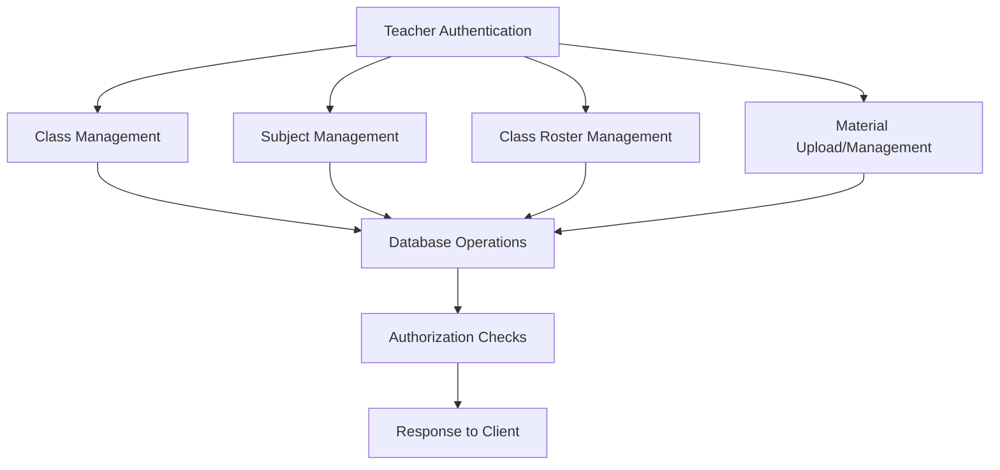

# Rangkai Edu - T1.7 Class & Content Management API Architecture

## Overview

This document outlines the architectural design for the T1.7 Class & Content Management API for the Rangkai Edu project. This API will provide teachers with the ability to manage classes, subjects, class rosters, and educational materials. The design follows the existing project patterns and integrates with the already implemented authentication (T1.4) and authorization (T1.6) systems.

## Go Struct Definitions

### Class Struct

```go
type Class struct {
    ID           string    `json:"id" db:"id"`
    SchoolID     string    `json:"school_id" db:"school_id"`
    Name         string    `json:"name" db:"name"`
    GradeLevel   int       `json:"grade_level" db:"grade_level"`
    AcademicYear string    `json:"academic_year" db:"academic_year"`
    CreatedAt    time.Time `json:"created_at" db:"created_at"`
    UpdatedAt    time.Time `json:"updated_at" db:"updated_at"`
}
```

### Subject Struct

```go
type Subject struct {
    ID          string    `json:"id" db:"id"`
    SchoolID    string    `json:"school_id" db:"school_id"`
    Name        string    `json:"name" db:"name"`
    Code        string    `json:"code" db:"code"`
    Description string    `json:"description" db:"description"`
    CreatedAt   time.Time `json:"created_at" db:"created_at"`
    UpdatedAt   time.Time `json:"updated_at" db:"updated_at"`
}
```

### Material Struct

```go
type Material struct {
    ID          string    `json:"id" db:"id"`
    ClassID     string    `json:"class_id" db:"class_id"`
    SubjectID   string    `json:"subject_id" db:"subject_id"`
    TeacherID   string    `json:"teacher_id" db:"teacher_id"`
    Title       string    `json:"title" db:"title"`
    Description string    `json:"description" db:"description"`
    FileName    string    `json:"file_name" db:"file_name"`
    FilePath    string    `json:"file_path" db:"file_path"`
    FileType    string    `json:"file_type" db:"file_type"`
    FileSize    int64     `json:"file_size" db:"file_size"`
    Visibility  string    `json:"visibility" db:"visibility"` // public, private, class_only
    CreatedAt   time.Time `json:"created_at" db:"created_at"`
    UpdatedAt   time.Time `json:"updated_at" db:"updated_at"`
}
```

### Student Enrollment Struct

```go
type StudentEnrollment struct {
    ID        string    `json:"id" db:"id"`
    ClassID   string    `json:"class_id" db:"class_id"`
    StudentID string    `json:"student_id" db:"student_id"`
    Status    string    `json:"status" db:"status"` // active, inactive, graduated
    CreatedAt time.Time `json:"created_at" db:"created_at"`
}
```

## API Endpoints

### T1.7.1 CRUD Endpoints for Classes and Subjects

#### Classes

**Create Class**
- **Endpoint**: `POST /api/classes`
- **Method**: POST
- **Authentication**: Required (Teacher or Admin)
- **Authorization**: Teachers can only create classes in their school; Admins can create classes in any school
- **Request Body**:
```json
{
  "school_id": "uuid",
  "name": "Class 1A",
  "grade_level": 1,
  "academic_year": "2024-2025"
}
```
- **Response (201 Created)**:
```json
{
  "id": "uuid",
  "school_id": "uuid",
  "name": "Class 1A",
  "grade_level": 1,
  "academic_year": "2024-2025",
  "created_at": "2024-01-01T00:00:00Z",
  "updated_at": "2024-01-01T00:00:00Z"
}
```

**Get All Classes**
- **Endpoint**: `GET /api/classes`
- **Method**: GET
- **Authentication**: Required (Teacher or Admin)
- **Authorization**: Teachers can only see classes in their school; Admins can see all classes
- **Query Parameters**: 
  - `school_id` (optional): Filter by school
  - `grade_level` (optional): Filter by grade level
  - `academic_year` (optional): Filter by academic year
- **Response (200 OK)**:
```json
[
  {
    "id": "uuid",
    "school_id": "uuid",
    "name": "Class 1A",
    "grade_level": 1,
    "academic_year": "2024-2025",
    "created_at": "2024-01-01T00:00:00Z",
    "updated_at": "2024-01-01T00:00:00Z"
  }
]
```

**Get Class by ID**
- **Endpoint**: `GET /api/classes/{id}`
- **Method**: GET
- **Authentication**: Required (Teacher or Admin)
- **Authorization**: User must belong to the same school as the class or be an admin
- **Response (200 OK)**:
```json
{
  "id": "uuid",
  "school_id": "uuid",
  "name": "Class 1A",
  "grade_level": 1,
  "academic_year": "2024-2025",
  "created_at": "2024-01-01T00:00:00Z",
  "updated_at": "2024-01-01T00:00:00Z"
}
```

**Update Class**
- **Endpoint**: `PUT /api/classes/{id}`
- **Method**: PUT
- **Authentication**: Required (Teacher or Admin)
- **Authorization**: Teacher must belong to the same school as the class; Admins can update any class
- **Request Body**:
```json
{
  "name": "Class 1A Updated",
  "grade_level": 1,
  "academic_year": "2024-2025"
}
```
- **Response (200 OK)**:
```json
{
  "id": "uuid",
  "school_id": "uuid",
  "name": "Class 1A Updated",
  "grade_level": 1,
  "academic_year": "2024-2025",
  "created_at": "2024-01-01T00:00:00Z",
  "updated_at": "2024-01-02T00:00:00Z"
}
```

**Delete Class**
- **Endpoint**: `DELETE /api/classes/{id}`
- **Method**: DELETE
- **Authentication**: Required (Admin only)
- **Authorization**: Admin only
- **Response (204 No Content)**

#### Subjects

**Create Subject**
- **Endpoint**: `POST /api/subjects`
- **Method**: POST
- **Authentication**: Required (Teacher or Admin)
- **Authorization**: Teachers can only create subjects in their school; Admins can create subjects in any school
- **Request Body**:
```json
{
  "school_id": "uuid",
  "name": "Mathematics",
  "code": "MATH101",
  "description": "Basic mathematics course"
}
```
- **Response (201 Created)**:
```json
{
  "id": "uuid",
  "school_id": "uuid",
  "name": "Mathematics",
  "code": "MATH101",
  "description": "Basic mathematics course",
  "created_at": "2024-01-01T00:00:00Z",
  "updated_at": "2024-01-01T00:00:00Z"
}
```

**Get All Subjects**
- **Endpoint**: `GET /api/subjects`
- **Method**: GET
- **Authentication**: Required (Teacher or Admin)
- **Authorization**: Teachers can only see subjects in their school; Admins can see all subjects
- **Query Parameters**: 
  - `school_id` (optional): Filter by school
- **Response (200 OK)**:
```json
[
  {
    "id": "uuid",
    "school_id": "uuid",
    "name": "Mathematics",
    "code": "MATH101",
    "description": "Basic mathematics course",
    "created_at": "2024-01-01T00:00:00Z",
    "updated_at": "2024-01-01T00:00:00Z"
  }
]
```

**Get Subject by ID**
- **Endpoint**: `GET /api/subjects/{id}`
- **Method**: GET
- **Authentication**: Required (Teacher or Admin)
- **Authorization**: User must belong to the same school as the subject or be an admin
- **Response (200 OK)**:
```json
{
  "id": "uuid",
  "school_id": "uuid",
  "name": "Mathematics",
  "code": "MATH101",
  "description": "Basic mathematics course",
  "created_at": "2024-01-01T00:00:00Z",
  "updated_at": "2024-01-01T00:00:00Z"
}
```

**Update Subject**
- **Endpoint**: `PUT /api/subjects/{id}`
- **Method**: PUT
- **Authentication**: Required (Teacher or Admin)
- **Authorization**: Teacher must belong to the same school as the subject; Admins can update any subject
- **Request Body**:
```json
{
  "name": "Advanced Mathematics",
  "code": "MATH201",
  "description": "Advanced mathematics course"
}
```
- **Response (200 OK)**:
```json
{
  "id": "uuid",
  "school_id": "uuid",
  "name": "Advanced Mathematics",
  "code": "MATH201",
  "description": "Advanced mathematics course",
  "created_at": "2024-01-01T00:00:00Z",
  "updated_at": "2024-01-02T00:00:00Z"
}
```

**Delete Subject**
- **Endpoint**: `DELETE /api/subjects/{id}`
- **Method**: DELETE
- **Authentication**: Required (Admin only)
- **Authorization**: Admin only
- **Response (204 No Content)**

### T1.7.2 Endpoints for Managing Class Rosters

**Add Student to Class**
- **Endpoint**: `POST /api/classes/{class_id}/students`
- **Method**: POST
- **Authentication**: Required (Teacher or Admin)
- **Authorization**: Teacher must be assigned to the class or be an admin
- **Request Body**:
```json
{
  "student_id": "uuid"
}
```
- **Response (201 Created)**:
```json
{
  "id": "uuid",
  "class_id": "uuid",
  "student_id": "uuid",
  "status": "active",
  "created_at": "2024-01-01T00:00:00Z"
}
```

**Get Class Roster**
- **Endpoint**: `GET /api/classes/{class_id}/students`
- **Method**: GET
- **Authentication**: Required (Teacher or Admin)
- **Authorization**: Teacher must be assigned to the class or be an admin
- **Response (200 OK)**:
```json
[
  {
    "id": "uuid",
    "class_id": "uuid",
    "student_id": "uuid",
    "student_name": "John Doe",
    "student_email": "john.doe@example.com",
    "status": "active",
    "created_at": "2024-01-01T00:00:00Z"
  }
]
```

**Remove Student from Class**
- **Endpoint**: `DELETE /api/classes/{class_id}/students/{student_id}`
- **Method**: DELETE
- **Authentication**: Required (Teacher or Admin)
- **Authorization**: Teacher must be assigned to the class or be an admin
- **Response (204 No Content)**

**Update Student Enrollment Status**
- **Endpoint**: `PUT /api/classes/{class_id}/students/{student_id}`
- **Method**: PUT
- **Authentication**: Required (Teacher or Admin)
- **Authorization**: Teacher must be assigned to the class or be an admin
- **Request Body**:
```json
{
  "status": "inactive"
}
```
- **Response (200 OK)**:
```json
{
  "id": "uuid",
  "class_id": "uuid",
  "student_id": "uuid",
  "status": "inactive",
  "created_at": "2024-01-01T00:00:00Z"
}
```

### T1.7.3 Endpoint for Uploading Teaching Materials

**Upload Teaching Material**
- **Endpoint**: `POST /api/materials`
- **Method**: POST
- **Authentication**: Required (Teacher or Admin)
- **Authorization**: Teachers can only upload materials for classes they teach; Admins can upload to any class
- **Content Type**: multipart/form-data
- **Form Fields**:
  - `class_id` (required): UUID of the class
  - `subject_id` (required): UUID of the subject
  - `title` (required): Title of the material
  - `description` (optional): Description of the material
  - `visibility` (optional): Visibility level (public, private, class_only)
  - `file` (required): The file to upload
- **Response (201 Created)**:
```json
{
  "id": "uuid",
  "class_id": "uuid",
  "subject_id": "uuid",
  "teacher_id": "uuid",
  "title": "Algebra Basics",
  "description": "Introduction to algebra concepts",
  "file_name": "algebra_basics.pdf",
  "file_path": "/uploads/materials/algebra_basics.pdf",
  "file_type": "application/pdf",
  "file_size": 1024000,
  "visibility": "class_only",
  "created_at": "2024-01-01T00:00:00Z",
  "updated_at": "2024-01-01T00:00:00Z"
}
```

**Get All Materials**
- **Endpoint**: `GET /api/materials`
- **Method**: GET
- **Authentication**: Required (Any authenticated user)
- **Authorization**: Users can see public materials; students can see materials for their classes; teachers can see materials for classes they teach; admins can see all materials
- **Query Parameters**: 
  - `class_id` (optional): Filter by class
  - `subject_id` (optional): Filter by subject
  - `teacher_id` (optional): Filter by teacher
  - `visibility` (optional): Filter by visibility
- **Response (200 OK)**:
```json
[
  {
    "id": "uuid",
    "class_id": "uuid",
    "subject_id": "uuid",
    "teacher_id": "uuid",
    "title": "Algebra Basics",
    "description": "Introduction to algebra concepts",
    "file_name": "algebra_basics.pdf",
    "file_type": "application/pdf",
    "file_size": 1024000,
    "visibility": "class_only",
    "created_at": "2024-01-01T00:00:00Z",
    "updated_at": "2024-01-01T00:00:00Z"
  }
]
```

**Get Material by ID**
- **Endpoint**: `GET /api/materials/{id}`
- **Method**: GET
- **Authentication**: Required (Any authenticated user)
- **Authorization**: Users can access public materials; students can access materials for their classes; teachers can access materials for classes they teach; admins can access all materials
- **Response (200 OK)**:
```json
{
  "id": "uuid",
  "class_id": "uuid",
  "subject_id": "uuid",
  "teacher_id": "uuid",
  "title": "Algebra Basics",
  "description": "Introduction to algebra concepts",
  "file_name": "algebra_basics.pdf",
  "file_path": "/uploads/materials/algebra_basics.pdf",
  "file_type": "application/pdf",
  "file_size": 1024000,
  "visibility": "class_only",
  "created_at": "2024-01-01T00:00:00Z",
  "updated_at": "2024-01-01T00:00:00Z"
}
```

**Update Material**
- **Endpoint**: `PUT /api/materials/{id}`
- **Method**: PUT
- **Authentication**: Required (Teacher or Admin)
- **Authorization**: Teacher must be the owner of the material or be an admin
- **Request Body**:
```json
{
  "title": "Algebra Basics Updated",
  "description": "Updated introduction to algebra concepts",
  "visibility": "public"
}
```
- **Response (200 OK)**:
```json
{
  "id": "uuid",
  "class_id": "uuid",
  "subject_id": "uuid",
  "teacher_id": "uuid",
  "title": "Algebra Basics Updated",
  "description": "Updated introduction to algebra concepts",
  "file_name": "algebra_basics.pdf",
  "file_path": "/uploads/materials/algebra_basics.pdf",
  "file_type": "application/pdf",
  "file_size": 1024000,
  "visibility": "public",
  "created_at": "2024-01-01T00:00:00Z",
  "updated_at": "2024-01-02T00:00:00Z"
}
```

**Delete Material**
- **Endpoint**: `DELETE /api/materials/{id}`
- **Method**: DELETE
- **Authentication**: Required (Teacher or Admin)
- **Authorization**: Teacher must be the owner of the material or be an admin
- **Response (204 No Content)**

**Download Material**
- **Endpoint**: `GET /api/materials/{id}/download`
- **Method**: GET
- **Authentication**: Required (Any authenticated user)
- **Authorization**: Users can download public materials; students can download materials for their classes; teachers can download materials for classes they teach; admins can download all materials
- **Response**: The file content with appropriate Content-Type and Content-Disposition headers

## Integration with Authentication/Authorization Systems

### Authentication Integration

All endpoints require a valid JWT token in the Authorization header:
```
Authorization: Bearer <token>
```

The token must be obtained through the existing authentication flow:
1. User registers via `/register` (optional password)
2. User requests OTP via `/send-otp`
3. User verifies OTP via `/verify-otp` to receive JWT token

### Authorization Integration

The API uses the existing role-based access control system with the following roles:
- `admin` - System administrators with full access
- `teacher` - Educators with access to teaching resources
- `student` - Learners with access to course materials
- `parent` - Guardians with access to student progress information

Authorization is enforced through middleware:
1. `AuthRequired()` - Validates JWT tokens and extracts user information
2. `RoleRequired(role)` - Checks if the authenticated user has a specific role
3. `RolesRequired(role1, role2, ...)` - Allows access to users with any of the specified roles

### Role-Based Access Control

| Endpoint | Required Role(s) | Notes |
|----------|------------------|-------|
| POST /api/classes | Teacher, Admin | Teachers can only create classes in their school |
| GET /api/classes | Teacher, Admin | Teachers can only see classes in their school |
| GET /api/classes/{id} | Teacher, Admin | User must belong to the same school as the class |
| PUT /api/classes/{id} | Teacher, Admin | Teachers can only update classes in their school |
| DELETE /api/classes/{id} | Admin | Admin only |
| POST /api/subjects | Teacher, Admin | Teachers can only create subjects in their school |
| GET /api/subjects | Teacher, Admin | Teachers can only see subjects in their school |
| GET /api/subjects/{id} | Teacher, Admin | User must belong to the same school as the subject |
| PUT /api/subjects/{id} | Teacher, Admin | Teachers can only update subjects in their school |
| DELETE /api/subjects/{id} | Admin | Admin only |
| POST /api/classes/{class_id}/students | Teacher, Admin | Teacher must be assigned to the class |
| GET /api/classes/{class_id}/students | Teacher, Admin | Teacher must be assigned to the class |
| DELETE /api/classes/{class_id}/students/{student_id} | Teacher, Admin | Teacher must be assigned to the class |
| PUT /api/classes/{class_id}/students/{student_id} | Teacher, Admin | Teacher must be assigned to the class |
| POST /api/materials | Teacher, Admin | Teachers can only upload materials for classes they teach |
| GET /api/materials | Any authenticated user | Access based on visibility settings |
| GET /api/materials/{id} | Any authenticated user | Access based on visibility settings |
| PUT /api/materials/{id} | Teacher, Admin | Teacher must be the owner of the material |
| DELETE /api/materials/{id} | Teacher, Admin | Teacher must be the owner of the material |
| GET /api/materials/{id}/download | Any authenticated user | Access based on visibility settings |

## Database Schema Extensions

### Materials Table

Since the existing database schema does not include a materials table, we need to add it:

```sql
CREATE TABLE materials (
    id UUID PRIMARY KEY DEFAULT gen_random_uuid(),
    class_id UUID NOT NULL REFERENCES classes(id) ON DELETE CASCADE,
    subject_id UUID REFERENCES subjects(id) ON DELETE SET NULL,
    teacher_id UUID NOT NULL REFERENCES teachers(id) ON DELETE CASCADE,
    title VARCHAR(255) NOT NULL,
    description TEXT,
    file_name VARCHAR(255) NOT NULL,
    file_path VARCHAR(512) NOT NULL,
    file_type VARCHAR(100) NOT NULL,
    file_size BIGINT NOT NULL,
    visibility VARCHAR(20) NOT NULL CHECK (visibility IN ('public', 'private', 'class_only')) DEFAULT 'class_only',
    created_at TIMESTAMP WITH TIME ZONE DEFAULT CURRENT_TIMESTAMP,
    updated_at TIMESTAMP WITH TIME ZONE DEFAULT CURRENT_TIMESTAMP
);

-- Indexes for performance
CREATE INDEX idx_materials_class ON materials(class_id);
CREATE INDEX idx_materials_subject ON materials(subject_id);
CREATE INDEX idx_materials_teacher ON materials(teacher_id);
CREATE INDEX idx_materials_visibility ON materials(visibility);
```

### Student Enrollments Table

To better manage student enrollments in classes, we'll add a dedicated table:

```sql
CREATE TABLE student_enrollments (
    id UUID PRIMARY KEY DEFAULT gen_random_uuid(),
    class_id UUID NOT NULL REFERENCES classes(id) ON DELETE CASCADE,
    student_id UUID NOT NULL REFERENCES students(id) ON DELETE CASCADE,
    status VARCHAR(20) NOT NULL CHECK (status IN ('active', 'inactive', 'graduated')) DEFAULT 'active',
    created_at TIMESTAMP WITH TIME ZONE DEFAULT CURRENT_TIMESTAMP,
    UNIQUE(class_id, student_id)
);

-- Indexes for performance
CREATE INDEX idx_student_enrollments_class ON student_enrollments(class_id);
CREATE INDEX idx_student_enrollments_student ON student_enrollments(student_id);
CREATE INDEX idx_student_enrollments_status ON student_enrollments(status);
```

## Security Considerations

1. **File Upload Security**:
   - Validate file types and extensions
   - Limit file sizes
   - Store files outside the web root
   - Sanitize file names
   - Scan uploaded files for malware

2. **Access Control**:
   - Enforce role-based access at the API level
   - Validate ownership for modification operations
   - Implement proper error handling to avoid information leakage

3. **Data Validation**:
   - Validate all input parameters
   - Use parameterized queries to prevent SQL injection
   - Implement rate limiting to prevent abuse

## Error Handling

The API follows the existing error response format:
```json
{
  "error": "Error message",
  "code": 400
}
```

Common error codes:
- `400 Bad Request` - Invalid request data
- `401 Unauthorized` - Missing or invalid authentication
- `403 Forbidden` - Insufficient permissions
- `404 Not Found` - Resource not found
- `409 Conflict` - Resource conflict
- `422 Unprocessable Entity` - Validation errors
- `500 Internal Server Error` - Server errors

## Implementation Workflow



## Assumptions and Design Decisions

1. **Material Storage**: Files will be stored on the local filesystem with paths stored in the database. For production, consider using cloud storage services.

2. **Visibility Levels**: Materials can be marked as public (accessible to anyone), private (owner only), or class_only (students in the class).

3. **File Size Limits**: Implementation will enforce reasonable file size limits to prevent abuse.

4. **File Type Restrictions**: Only allow common educational file types (PDF, DOC, PPT, images, videos).

5. **Class-Subject Relationship**: Materials are linked to both a class and subject for better organization and filtering.

6. **Teacher Ownership**: All materials are owned by a teacher, ensuring accountability and proper access control.

This architectural design provides a comprehensive foundation for the T1.7 Class & Content Management API while maintaining consistency with the existing Rangkai Edu codebase and security practices.